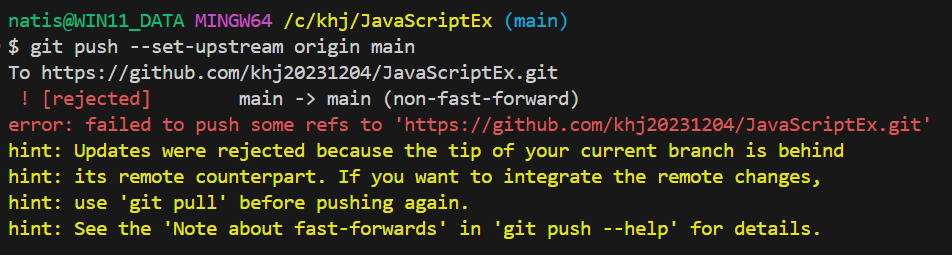
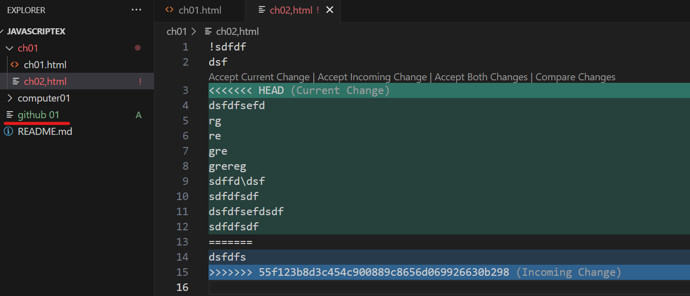
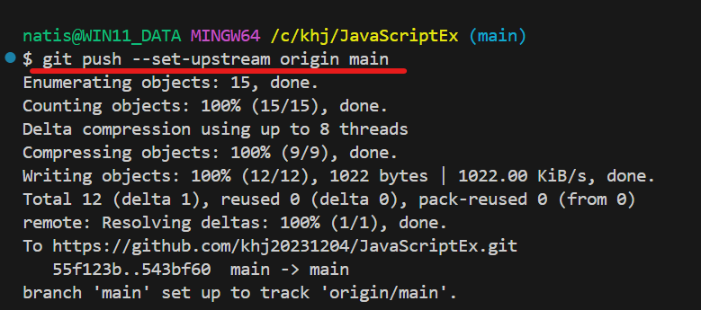
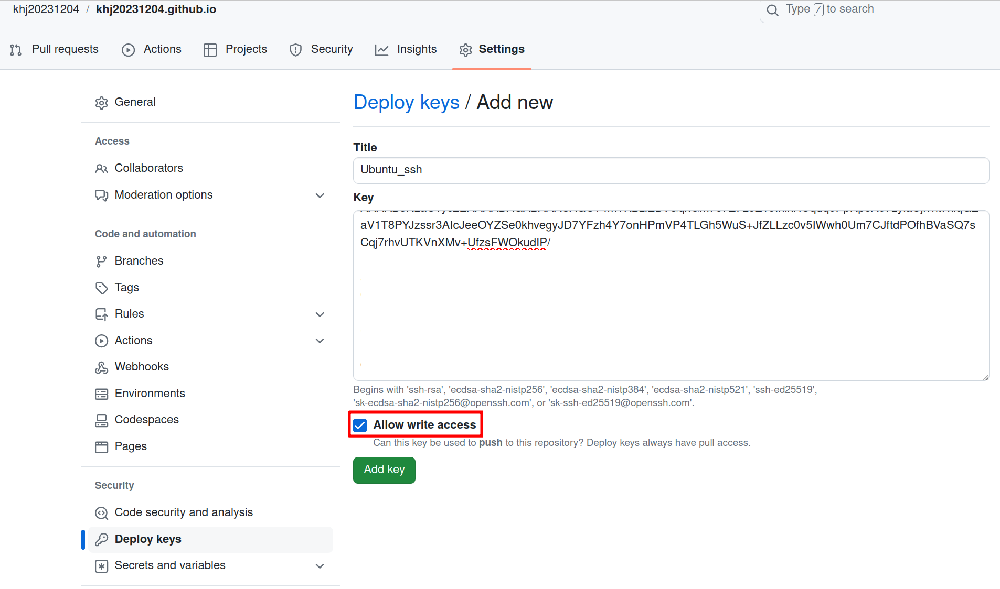

1. # src refspec main does not match any

   ```cs
      error: src refspec main does not match any
      error: failed to push some refs to 'https://github.com/khj20231204/CodingTest.git'
   ```
   처음 repository를 생성하면 branch를 만들고 최초 한번 commit을 해줘야하는데, 그 과정에서 commit을 먼저 시행 후 branch를 생성해 줘야 하는데 순서가 엉망이 되면 저런 메세지가 나왔었다. 
   init를 하면 기본적으로 연결되는 branch는 master인데 github에선 뭐;; 인종차별, 주종 관계 의미를 없애기 위해서 master대신 main을 권장하기 때문에 예제가 main으로 나와있다. 그래서 깃허브에선 친절하게 순서까지 알려줌

       

    여기 순서대로 add부터 차례대로 수행해서 문제 해결 되었음
    ```cs
      git init
      git add . #전체파일 add .(점)으로 표시 - local staing area
      git commit -m "first commit"   #local repository area
      git branch -M main   # 깃허브 branch 생성
      git remote add origin git@github.com:khj20231204/JAVA_Lecture.git  #ssh로 origin 추가
      git push -u origin main
   ```   

1. # fatal: Authentication failed
   ```java
   khj2023@khj2023-linuxUbuntu:~/IdeaProjects/CodingTest$ git push -u origin main
   Username for 'https://github.com': khj2023
   Password for 'https://khj2023@github.com': 
   remote: Support for password authentication was removed on August 13, 2021.
   remote: Please see https://docs.github.com/en/get-started/getting-started-with-git/about-remote-repositories#cloning-with-https-urls for information on currently recommended modes of authentication.
   fatal: Authentication failed for 'https://github.com/khj20231204/CodingTest.git/'
   ```
   http하지말고 ssh로한다.   

      

1. # LF will be replaced by CRLF the next time Git touches it
   ```cs
      git config --global core.autocrlf true
   ```

1. # fatal: The current branch master has no upstream branch.
   git push를 하면 나타나는 오류로 깃허브의 origin이 설정되어 있지 않거나, 충돌이 일어난 경우 발생   
   branch
   ```cs   
      fatal: The current branch master has no upstream branch.
      To push the current branch and set the remote as upstream, use

         git push --set-upstream origin master

      To have this happen automatically for branches without a tracking
      upstream, see 'push.autoSetupRemote' in 'git help config'.
   ```   
   git push --set-upstream origin master 입력

1. #  ! [rejected] main -> main (non-fast-forward)
   ```cs
      ! [rejected]  main -> main (non-fast-forward)
      error: failed to push some refs to 'https://github.com/khj20231204/JavaScriptEx.git'
   ```
   빈 폴더에 git clone을 하거나, 바로 생성한 깃허브에 파일을 올리는 경우가 아니라 로컬에도 파일이 있고 깃허브에도 파일이 있는 상태에서 바로 깃을 생성하는 경우 발생.  
   ```cs   
      git init
      git add . #전체파일 add .(점)으로 표시 - local staing area
      git commit -m "first commit"   #local repository area
      git branch -M main   # 깃허브 branch 생성
      git remote add origin git@github.com:khj20231204/JAVA_Lecture.git
      git push -u origin main
   ```   
   push를 하게 되면 github의 원격 저장소와 로컬 저장소간에 공통 연결이 없는 상태에서 병합이 이루어져서 발생하는 에러.   

   git push를 하면 
   ```cs
      fatal: The current branch master has no upstream branch.
      To push the current branch and set the remote as upstream, use

         git push --set-upstream origin master

      To have this happen automatically for branches without a tracking
      upstream, see 'push.autoSetupRemote' in 'git help config'.   
   ```   
   다음과 같은 에러가 뜨고 "git push --set-upstream origin main"을 입력할 경우 `[rejected]` 에러가 발생합니다.   
      

   이때 강제 병합을 하기 위해서   
   ```cs
      git pull origin master --allow-unrelated-histories
   ```   
   를 입력합니다. 그럼 깃허브에 있는 파일을 로컬로 가져와 병합을 하게 되는데(pull이기 때문) 같은 파일 중 원격저장소와 로컬 저장소에 서로 상이한 내용이 있는 경우는 충돌이 발생하게 됩니다.   

      
   원격에 있는 파일의 내용으로 수정 후 저장을 하고   
   ```cs
         git push --set-upstream origin master
   ```   
   입력하면 정상적으로 push가 이루어집니다.   

      

1. # git@github.com: Permission denied (publickey).   
   ```cs
      git@github.com: Permission denied (publickey).
      fatal: Could not read from remote repository.

      Please make sure you have the correct access rights
      and the repository exists.
   ```
   github에 저장되어 있는 publicSSH 키랑 현재 컴퓨터에 있는 publicSSH키 값이 다르기 때문이다. 우분투에서 key를 만들었는데 포맷 후 윈도우에서 접속하려는 key가 안 맞아서 발생하는 에러이다.
   <a href="https://khj20231204.github.io/ubuntu/Ubuntu-ssh_github_connect/">SSH키 생성</a>
   
1. # refusing to merge unrelated histories
   git pull 이나 git push를 한 경우 발생한다.   
   ```cs
      git pull origin master --allow-unrelated-histories
   ```   
   --allow-unrelated-histories : 관련 독립적인 두 프로젝트를 병할 할 때 사용하는 옵션   
   
1. # error: Your local changes to the following files would be overwritten by merge:  
   원격 저장소에 있는 파일을 가져올 때 로컬에 수정한 파일이 존재해서 발생하는 error. pull을 먼저 해야 하는데 프로젝트 수정 중 pull을 하게 될 경우 발생   

   해결
   ```cs
      git stash → git pull origin master → git stash pop
   ```

   2. # git stash   
   하던 작업을 스택에 잠시 저장할 수 있도록 하는 명령어입니다. 이를 통해 아직 완료하지 않은 일을 commit하지 않고 나중에 다시 꺼내와 마무리할 수 있다.

1. # The key you are authenticating with has been marked as read only

   ssh키 설정 시 "Allow write access" 체크해준다. 체크하지 않으면 read only로 설정된다.
      

1. # error: Your local changes to the following files would be overwritten by merge:
   A컴퓨터와 B컴퓨터가 같은 깃 리포지토리를 사용하고 있을 때, A컴퓨터가 수정 후 파일을 올렸는데 B컴퓨터가 pull을 하지 않고 파일을 수정 후 push를 하면 이미 온라인 깃허브에는 B컴퓨터가 기존에 있던 파일 내용과 달라 충돌이 발생하게 되는데 이떼 나타나는 에러.   

   ```js
      git stash
      git pull origin master //브랜치에 따라 master대신 main을 사용 해야 함
      git commit
   ```   

   *git stash란?   
   임시저장소 입니다. 현재 작업 중인 변경 사항을 임시로 저장해두는 Git 명령어입니다. 이를 통해 현재 작업을 중단하고 다른 작업을 진행한 후, 나중에 다시 원래 작업으로 돌아와 저장해둔 변경 사항을 적용할 수 있습니다.   

1. # nothing to commit, working tree clean
   이 메시지는 Git에서 아주 흔하게 볼 수 있으며, 그 의미는 간단합니다. 작업 디렉토리(working directory)가 깨끗하다. 즉, 현재 브랜치의 최신 커밋과 완전히 일치하는 상태입니다. 커밋할 변경 사항이 없습니다.   
   
