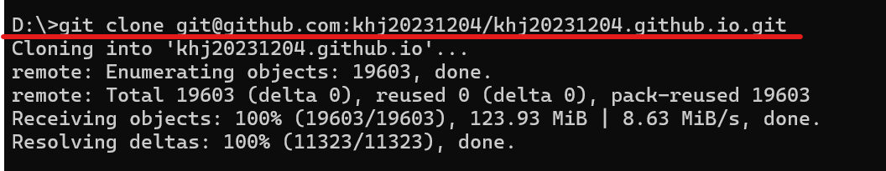
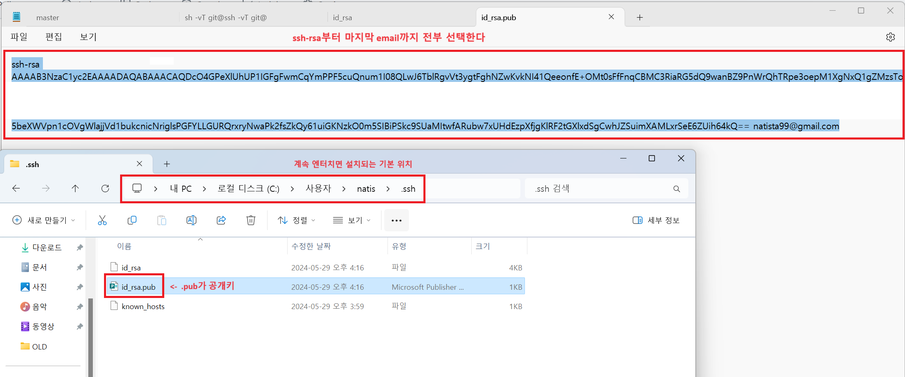
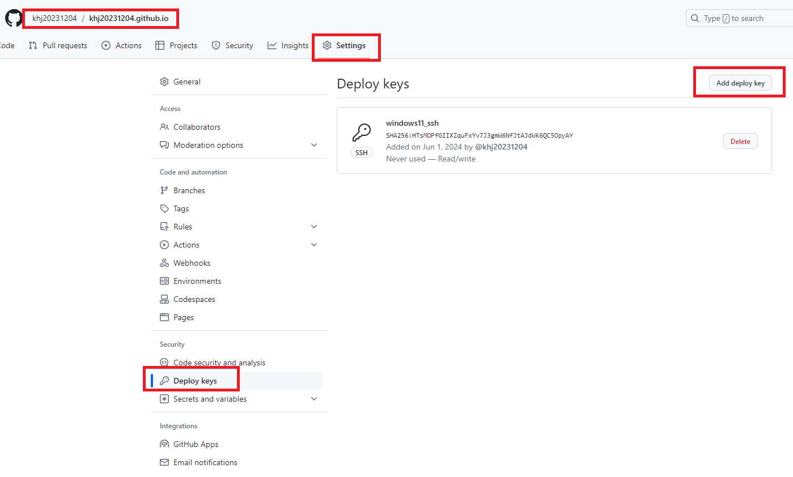
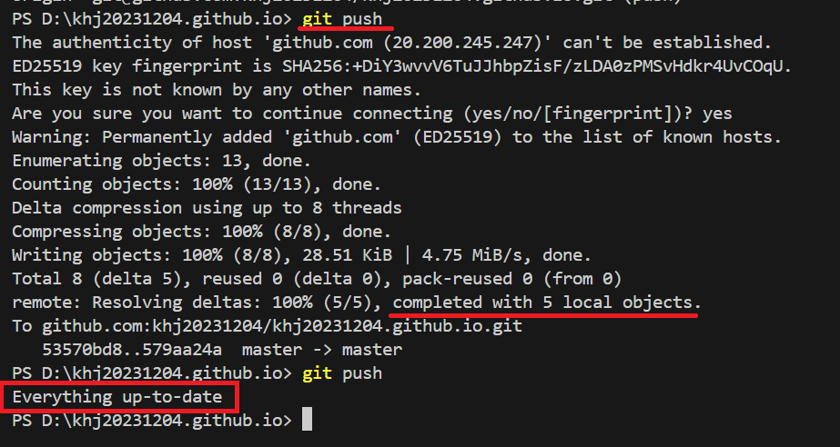

1. # window에서 수행   
   
   2. ## clone
      해당 디렉토리로 이동 후   
          
      ```s
         git clone <깃허브 ssh주소>
      ```
      ssh주소의 도메인 주소명으로 디렉토리가 생기면서 그 안에 다운을 받음   

      clone만 해도 init, branch, origin까지 설정되어 있고 add, commit까지는 가능

   2. ## config가 설정되어 있지 않으면 config 설정
      ```s
         git config --global user.name="natista"
         git config --global user.email="natista@gmail.com"
      ```

   2. ## ssh키 발급받기   
      내 컴퓨터에 퍼블릭 rsa키를 발급받은 후 이 키를 깃허브에 등록하면 계정 접속이 가능
      ```s
         ssh-keygen -t rsa -b 4096 -C "natista99@gmail.com"
      ```
          

   2. ## github Deply keys에 추가
          

   2. ## push 성공
          

   
1. # Linux에서 수행
   Windows 설치 후에 우분투에서 clone 하지 않고 D드라이브에 있는 블로그 파일로 리눅스에서 깃허브에 연결

   2. git설치   
   ```s
      sudo apt install git
   ```   

   2. branch와 origin은 이미 설정되어 있다

   2. config 설정    
   *--global 옵션 주의 : 앞에 -- 두개   

   2. ssh 발급 받은 후 github deploy keys에 추가
   *ssh 발급 받고 deploy keys로 add 해주면 윈도우와 우분투 2군데에서 접근 가능

   2. add → commit → push
   