1. # Github에 repository생성
   먼저 깃허브에 이클립스 파일을 저장할 repostiry를 생성합니다.   
   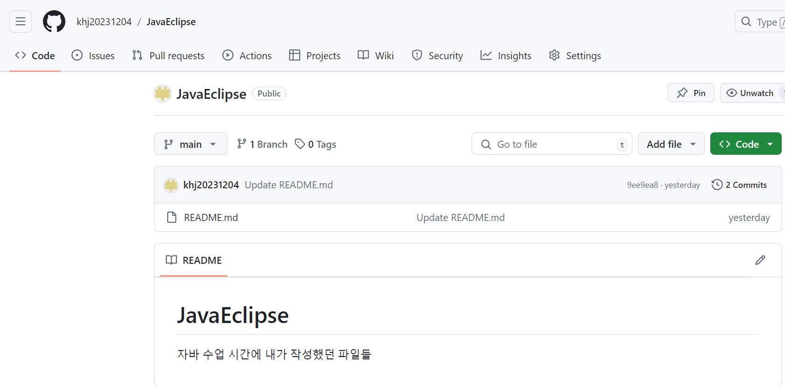   

1. # 이클립스에서 git Perspective나타내기   
   이클립스에서 git연결 명령어들을 화면에 보이게하기 위해서 git perspective를 선택합니다.   

   Window → Show View → Other
   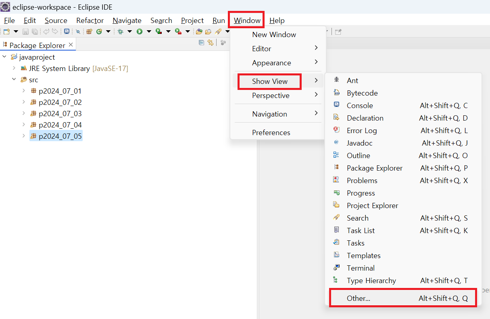   

   Git → Git Repositories   
   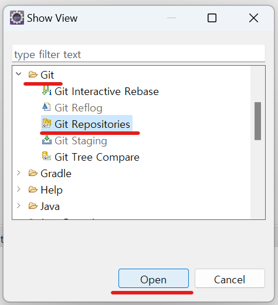   

   다음과 같이 깃 리파지토리를 생성할 수 있는 명령어들이 보입니다.   
   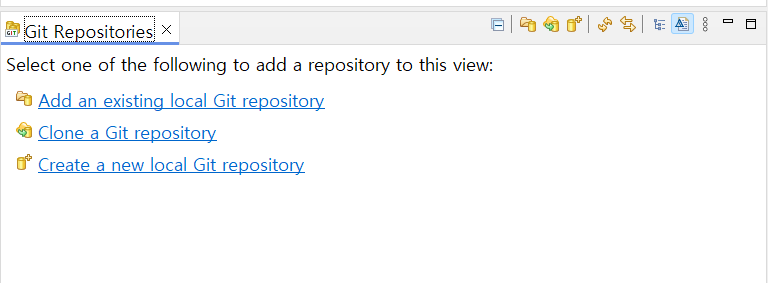   

   아니면, 화면 오른쪽 상단에서 Open Perspective를 선택한 후,   
   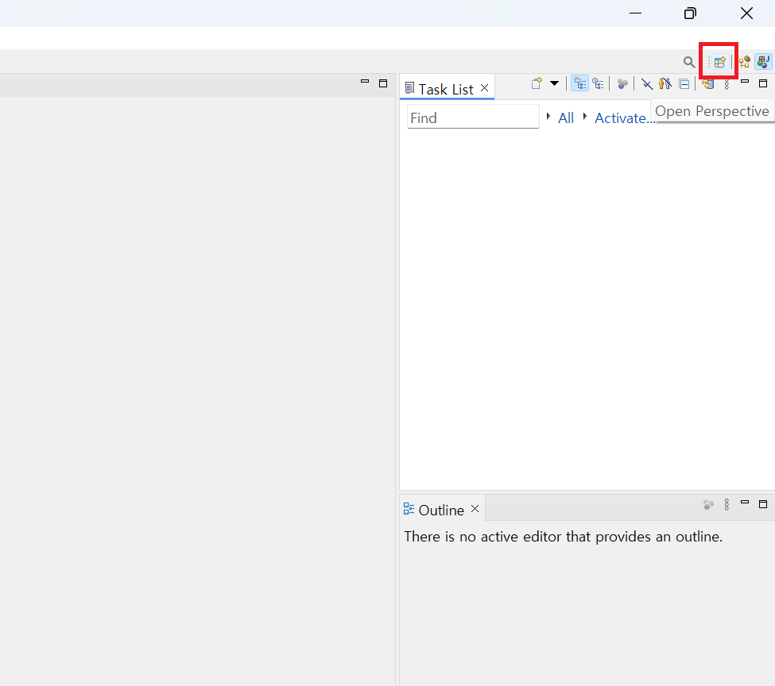   

   Git을 선택해도 됩니다.   
   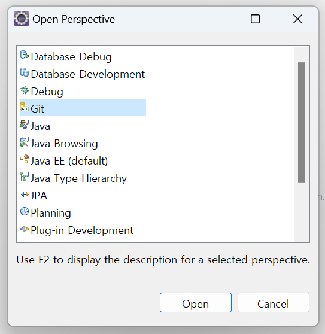   

1. # 이클립스에서 github파일을 저장할 디렉토리 생성   
   Add an existing local Git repostiroy : 로컬에 .git이 존재하는 디렉토리 연결   
   Clone a Git repository : 깃(깃허브, SVN등) 리파지토리 복사   
   Create a new local Git repository : 리파지토리가 없는 경우 로컬에 생성   

   처음 Git에 저장공간을 만들었기 때문에 "Clone a Git repository"를 선택합니다.   
   이제 Git repository에 있는 파일들을 Clone해서 저장할 디렉토리(임시 저장공간)까지 생성하게 됩니다.

   Clone URL선택   
   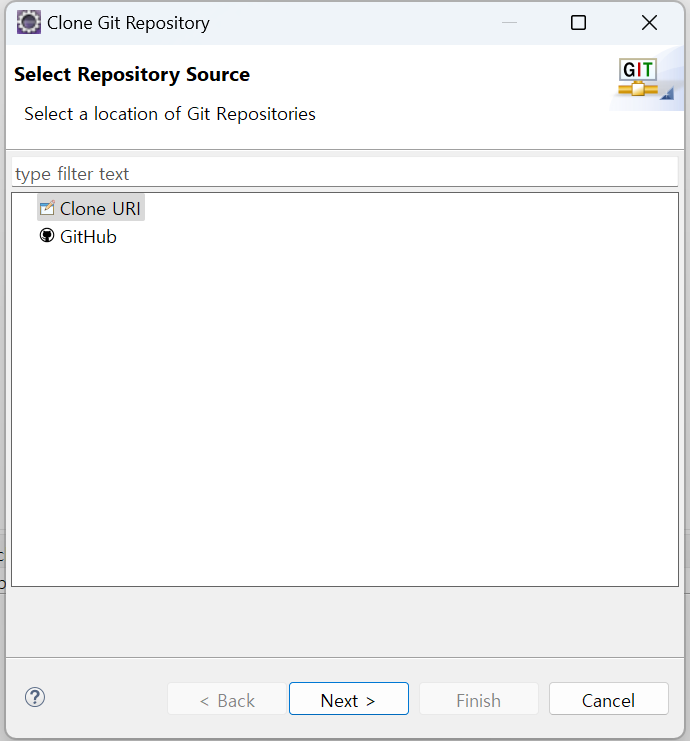   

   github에서 HTTP주속를 복사해 옵니다.   
   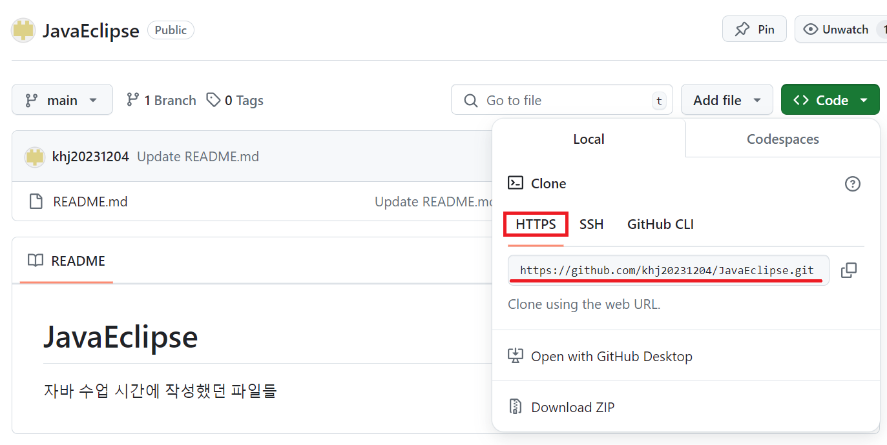   

   복사한 주소를 URI 칸에 입력하고, 깃허브 User와 Password를 입력합니다. 
   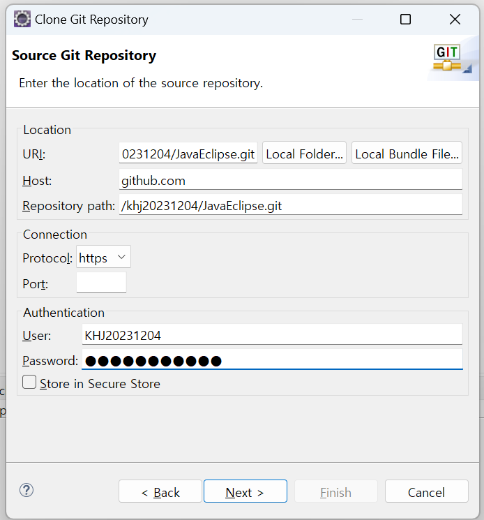   

   Directory에 디렉토리 경로를 적습니다.   
   *__빈 디렉토리__ 를 생성해야 합니다.   
   *경로는 탐색기에서 복사 후 붙여넣기 해도 됩니다.   
   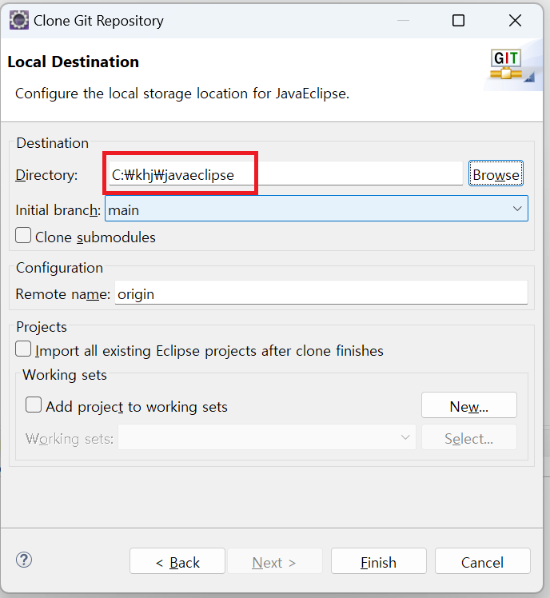   

   현재 디렉토리가 github에서 파일을 다운 받아서 저장될 디렉토리가 되고, 이제 eclipse와 현재 디렉토리를 같은 repository로 연결해줘야합니다.   
   현재 디렉토리는 eclipse와 파일을 연동하기 위한 임시저장공간이 됩니다.   
   해당 디렉토리 내에 `.git` 디렉토리가 생성되어있습니다. `.git` 디렉토리는 git에 대한 초기 설정값들과 branch, origin같은 설정 파일들이 있습니다.    
   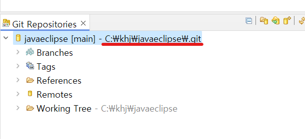   

1. # Eclipse와 github의 repository를 연동
   프로젝트명에서 오른쪽 마우스 클릭 → Team → Share Project   
   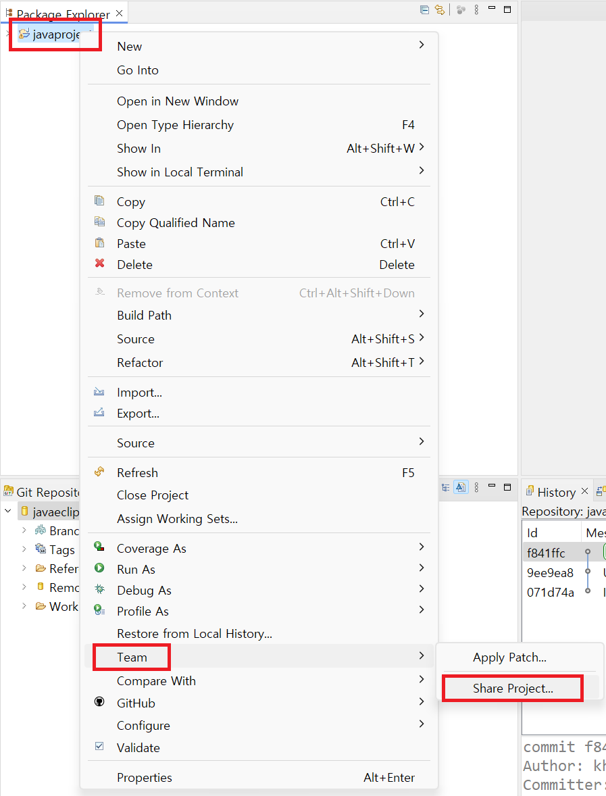   

   앞 단계에서 생성한 디렉토리 선택   
   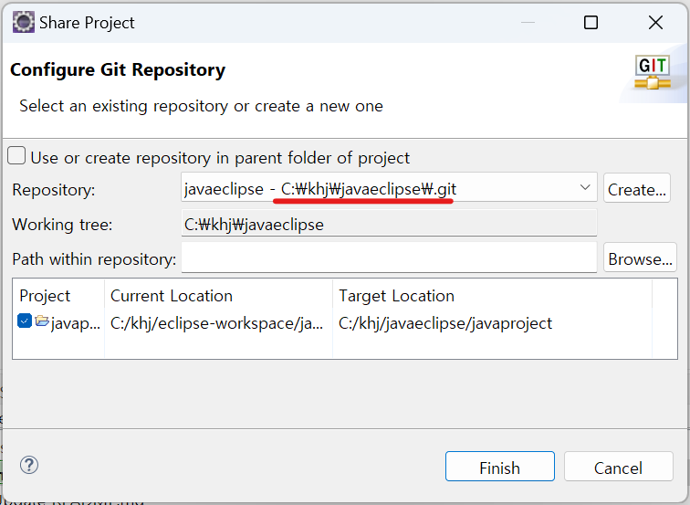   

   연동이 정상적으로 되면 프로젝트 옆에 연동된 github명과 현재 branch가 나타납니다.   
   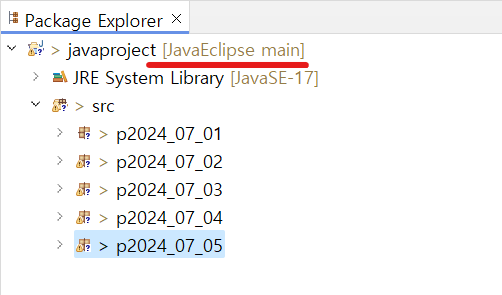   

1. # commit과 push   
   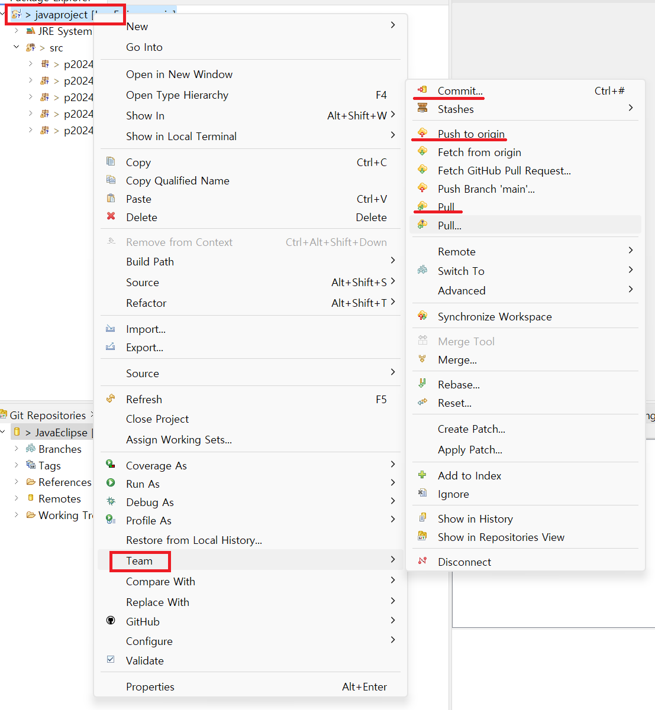   
   프로젝트명 오른쪽 마우스를 이용해서 Team메뉴를 선택하면 이전에 없었던 깃 메뉴가 추가 되어있습니다.   
   이 메뉴 중 우선적으로 사용할 건 commit과 push 그리고 pull입니다.   
   pull은 github에 있는 파일을 로컬 repository로 가져오는 것이고,
   commit은 로컬에 있는 eclipse파일을 github에 올리기 위한 준비단계,   
   push는 실행하면 로컬파일을 실제 github에 올리게 됩니다.   
   여기서 가장 먼저 수행해야할 건 github에 있는 파일을 가져오는 pull을 가장 먼저 해야 합니다.
   pull → commit → push 순으로 수행하게 됩니다.   
   
   지금은 위에 과정에서 로컬에 디렉토리를 생성할 때 github에 이미 한번 pull을 했기 때문에 commit 후 push를 하면 되지만, 이후 협업에선 pull → commit → push 순서가 됩니다. 지금은 commit을 수행하겠습니다.    
   commit을 수행하면 Unstaed Changes에 파일들이 나타나는데 필요한 파일들만 선택 후 Staged Changes로 드래그 드롭을 한 후 Commit Messgage를 작성합니다.
   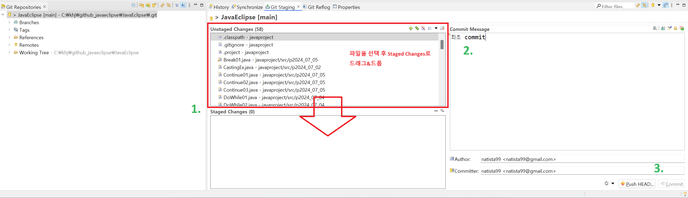   

   그러면, 하단 버튼에 Commit and Push버튼과 Commit버튼이 생성되는데 Commit and Push를 선택해서 파일이 github에 저장되도록 합니다.   
   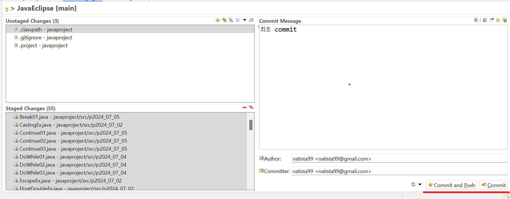   

1. # 토큰 비밀번호 생성
   commit을 하면 User와 Password입력창이 뜹니다.   
   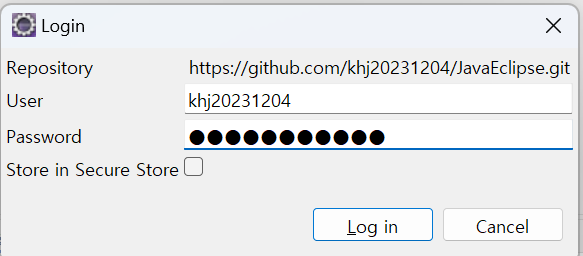   
   여기서 Password는 깃허브의 토큰값이 됩니다. 지금부터 깃허브에서 토큰 값을 생성하겠습니다.   

   가장 우측 상단에서 settings를 선택합니다.   
   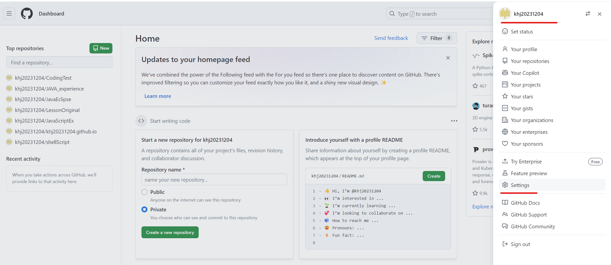   

   Developer Settings를 선택합니다.   
   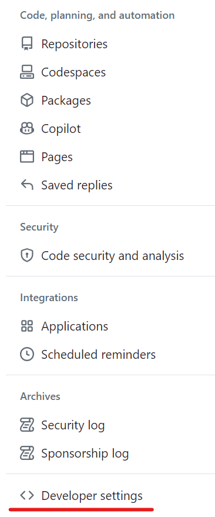   

   왼쪽 메뉴에서 Personal access tokens를 선택 후 Token(classic)메뉴를 선택합니다. 그리고 Generate New Token을 선택 후 하단에 Generate new token (classic)을 차례로 선택합니다.   
   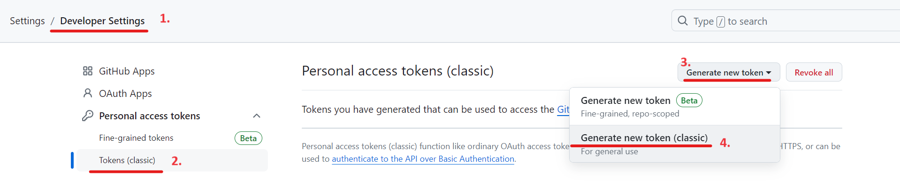   

   Note에 아무 글이나 적고 Expiration을 No expiration으로 하여 기간을 없앱니다. 그리고 repo에 체크를 합니다.   
   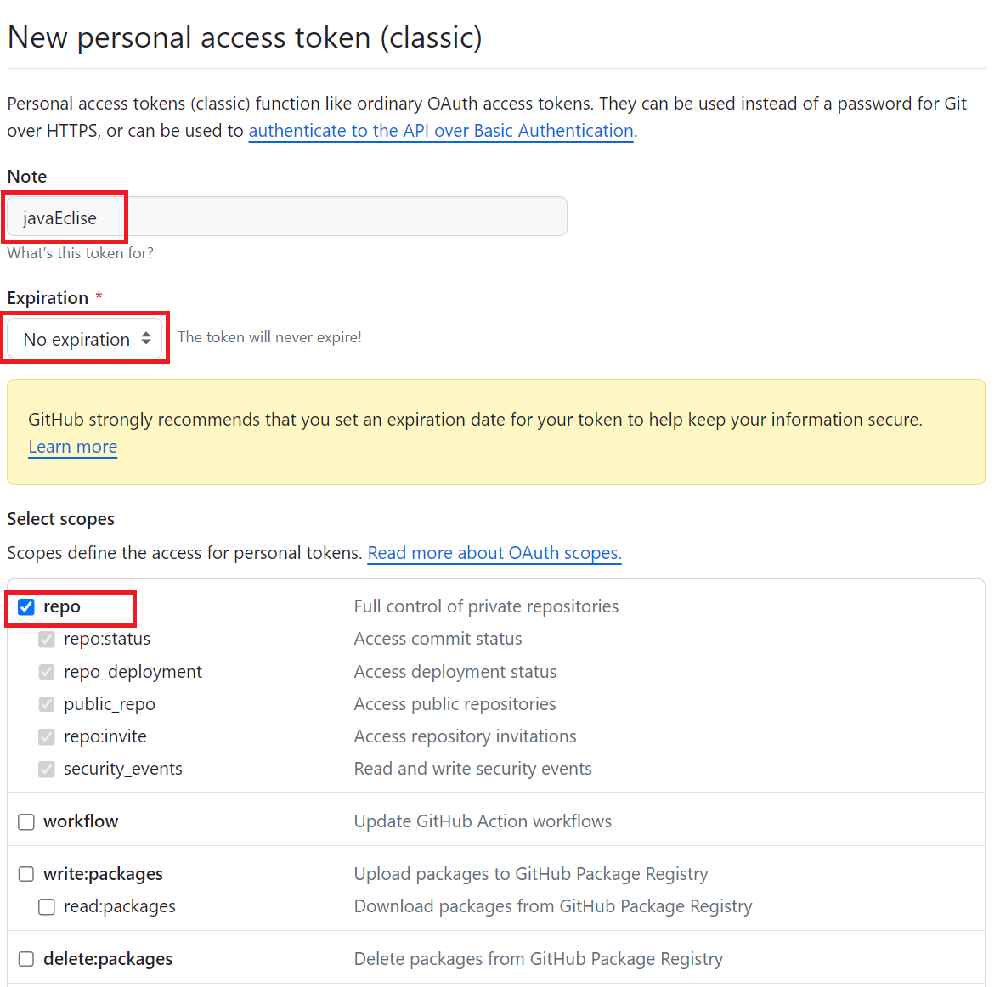   

   토큰값이 생성되면 다른 곳에 복사를 해둡니다.   
   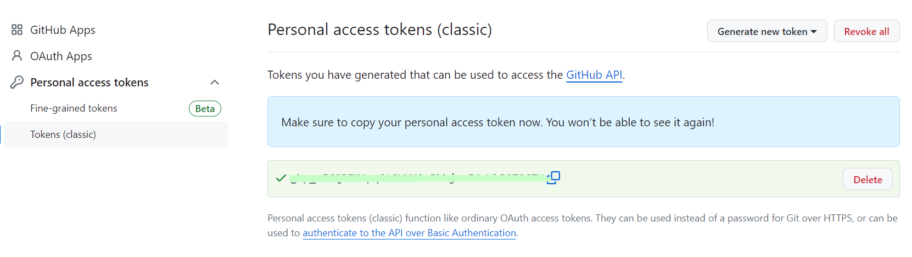   

   push가 완료된 것을 확인 할 수 있습니다.   
   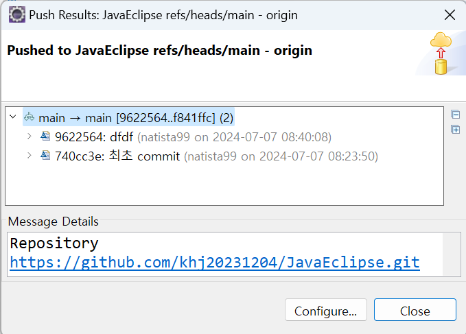   