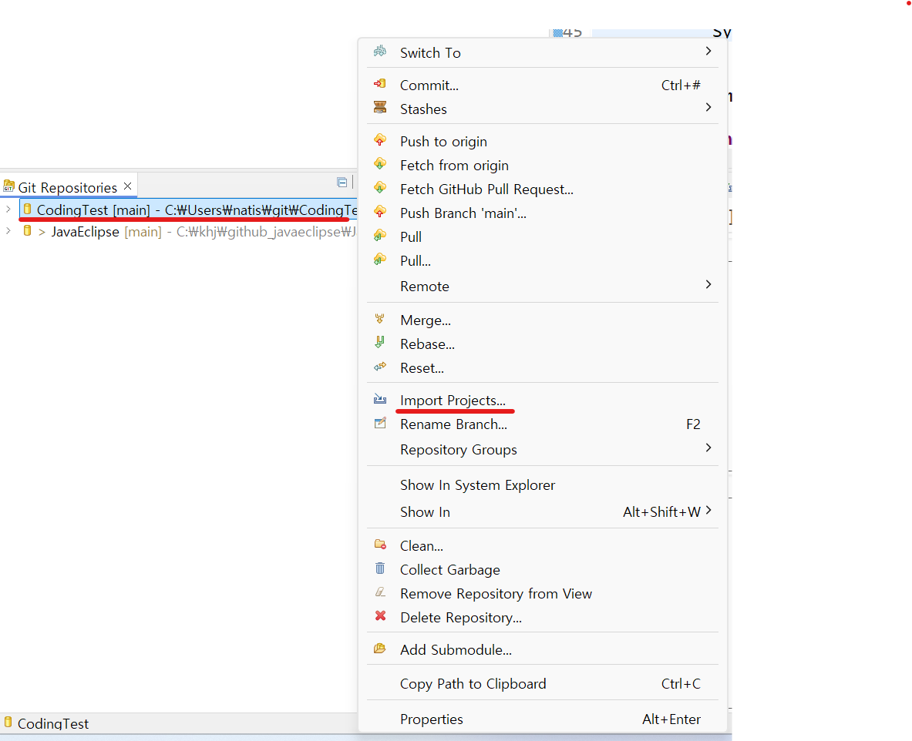

1. # 전체 순서
   Git Repository로 깃허브 프로젝트 가져오기 → 

1. # Git 복제   
   Cline a Git Repostitory를 선택합니다.   
      

   Clone URI   
      

   github에서 http주소 가져오기   
      

   주소 입력   
      

   브랜치 선택   
      

   깃허브 프로젝트를 저장할 로컬 디렉토리 선택   
      

   Coding Test란 이름의 깃허브에 있는 리파지토리 파일이 `C:\Users\natis\git\Coding Test\.git` 디렉토리에 저장된 것을 알 수 있음   
      

   실제 위치에 디렉토리가 생성되어 있음   
      

1. # 이클립스로 import
   여기까지는 이클립스에서 github로 파일을 올릴 때와 같습니다. 지금부터가 다릅니다.   
   위에서 생성한 디렉토리 안에 깃 프로젝트를 이클립스로 import합니다   

   마우스 오른쪽 버튼을 누른 후 Import Projects를 선택합니다.   
      

   앞에 단계에서 생성한 로컬의 git디렉토리가 자동으로 나타납니다.   
      

   Package Explorer에 프로젝트가 추가된 것을 확인 할 수 있습니다.   
      

