1. # reset과 revert사용시
   <span style="color:red;font-size:25px;font-weight:bold">로컬에 있는 파일 백업</span> 후 작업해야 됩니다. 로컬 파일 삭제됩니다.

1. # revert - 선택적 되돌림
   기존 커밋은 보존하면서 로그에서 선택된 커밋 값만 이전으로 돌립니다. 커밋 이후에 적용된 변경 사항은 그대로 유지됩니다. 새로운 커밋이 생성되면서 적용됩니다.   
   <span style="color:red">커밋 이력이 그대로 남기 때문에 깃허브에 올렸던 파일을 완전히 지우는데 사용하기 적절하지 않음</span>   

   1)    
   ```
      A → B → C → D (HEAD)   
   ```
   A, B, C, D는 각각의 커밋입니다.   
   현재 브랜치의 HEAD는 커밋 D에 위치   

   2)   
   ```
      git revert <B의 커밋 해시>
   ```

   3)   
   ```
      A → B → C → D → E (HEAD)
   ```
   새 커밋 E가 생성되며, 이 커밋은 B의 변경 사항을 되돌리는 작업을 수행.   
   커밋 B 이후에 생성된 커밋 C와 D는 그대로 유지.

   -명령어-   
   ```yml
      git log
      git revert <커밋 해시>
      git push origin main
   ```   
   기존 히스토리를 보존하므로 협업 시 안전합니다.   
   원치 않는 변경만 선택적으로 되돌릴 수 있습니다.   

   현재 깃허브에 2개의 커밋이 있습니다.   
   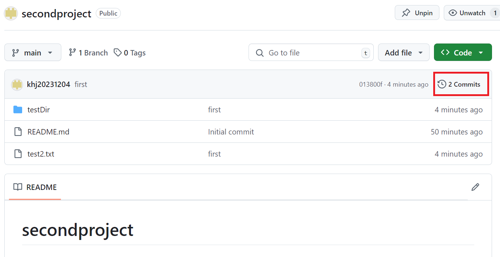    
    
   깃허브 커밋 이력입니다.   
   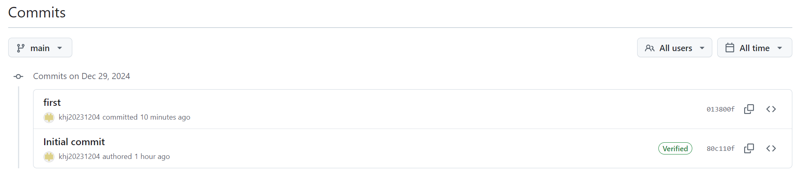   
   Initial commit에서 readme.md파일을 깃허브에서 다운 받았고,   
   first에서 testDir폴더와 test2.txt파일을 추가했습니다.   

   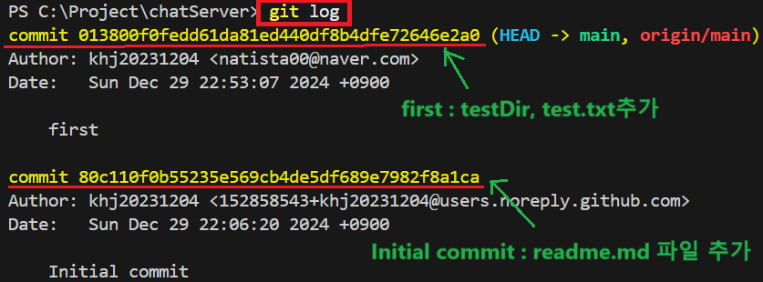   
   commit 013800f0fedd61da81ed440df8b4dfe72646e2a0 은 first로 testDir폴더와 test2.txt파일 추가   
   commit 80c110f0b55235e569cb4de5df689e7982f8a1ca 은  Initial commit로 readme.md파일 추가   

   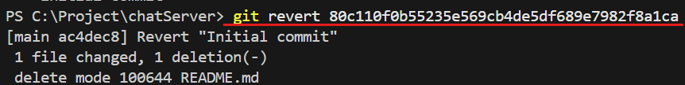   
   readme.md파일을 추가했던 80c110f0b55235e569cb4de5df689e7982f8a1ca 커밋 해쉬값에 revert를 적용합니다.   

   revert를 실행하면 다음과 같은 알림이 나타납니다. ctrl+: -> q로 빠져나옵니다.      
   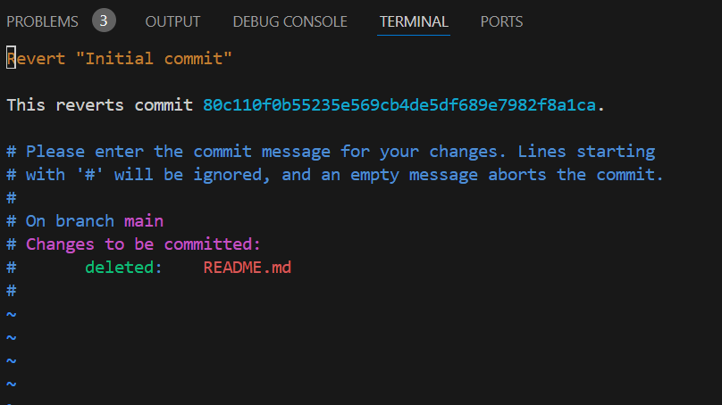   
   
   readme파일을 추가했던 80c110f0b55235e569cb4de5df689e7982f8a1ca 커밋 해쉬값으로 revert를 하게 되면 __해당 커밋 이전의 상태로만 변경__ 됩니다.   
   이후 생성되었던 __testDir폴더와 test2.txt파일은 그대로 존재__ 합니다.   
   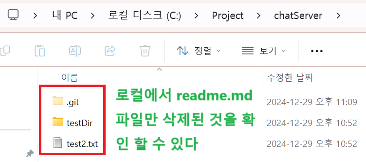   

   이때 log를 보면 revert를 한 새로운 커밋이 생성된 것을 알 수 있습니다.   
   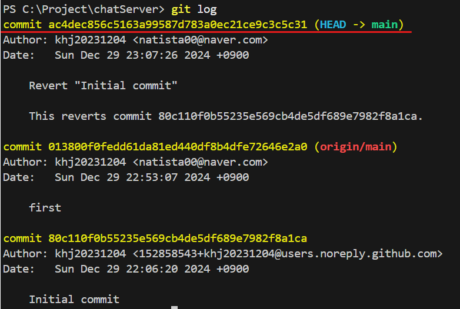   
   commit ac4dec856c5163a99587d783a0ec21ce9c3c5c31 커밋 값이 새로 생성되었습니다.   

   __여기까지는 로컬에만 해당되며 로컬에 readme.md 파일이 삭제됩니다.__   

   이제 현재 상태를 깃허브에 push를 하면 readme.md파일을 추가했던 히스토리는 Verified가 뜨고,   
   testDir폴더와 test2.txt파일을 추가했던 히스토리는 그대로 유지됩니다.   

   push실행   
   ```
      git push origin main
   ```
   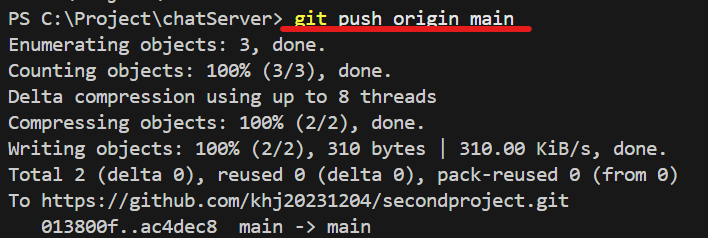   

   깃허브에 적용된 모습입니다.   
   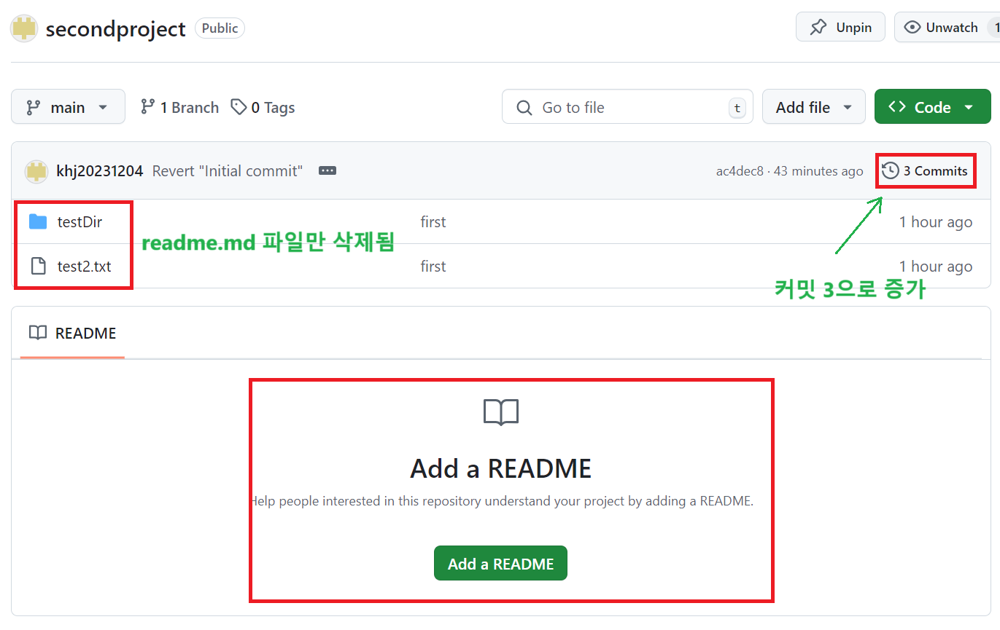   
   revert는 새로운 커밋이 생성되어 적용되기 때문에 커밋이 1 증가합니다.   
   readme.md파일만 삭제되었고 이후에 생성되었던 testDir폴더와 test2.txt파일은 그대로 존재합니다.   

   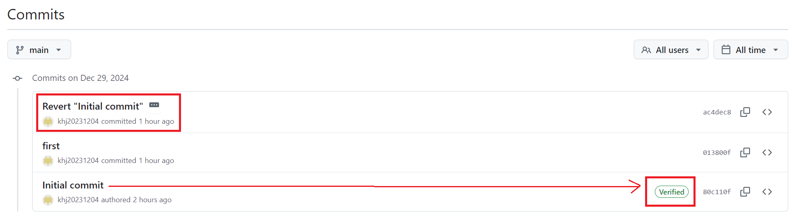   
   Revert "Initial commit"이 추가되고, 기존 Initial commit 커밋은 Verified가 표시됩니다.   

1. # reset - 깃허브에 올라간 히스토리 되돌림
   깃허브에 커밋한 히스토리 자체를 삭제합니다. 로컬에는 그대로 존재합니다. 커밋 해쉬값 이후에 생성된 모든 폴더와 파일들이 삭제됩니다. 반드시 <span style="color:red">백업</span> 이후에 실행해야 합니다.      
   <span style="color:red">깃허브의 커밋 히스토리가 완전 삭제되어 커밋 이전의 값으로 원상상복귀되므로 깃허브에 중요한 key 파일등을 올렸을 때 이를 되돌리기에 사용하기 적합합니다.</span>   

   1)    
   ```
      A → B → C → D (HEAD)   
   ```
   A, B, C, D는 각각의 커밋입니다.   
   현재 브랜치의 HEAD는 커밋 D에 위치   

   2)   
   ```
      git revert <B의 커밋 해시>
   ```

   3)   
   ```
      A → B → C → D → E (HEAD)
   ```
   B상태로 복귀되면서 C,D,E 모든 형상 이력 삭제됨   

   -명령어-   
   ```yml
      git reflog  # 목록 확인   
      git reset --hard [커밋아이디]
      git push origin main --f  # force옵션으로 강제 push를 해줌   
   ```   
  
   현재 깃허브에 2개의 커밋이 있습니다.   
       
    
   깃허브 커밋 이력입니다.   
      
   Initial commit에서 readme.md파일을 깃허브에서 다운 받았고,   
   first에서 testDir폴더와 test2.txt파일을 추가했습니다.   

   log확인   
   ```
      git reflog
   ```   
   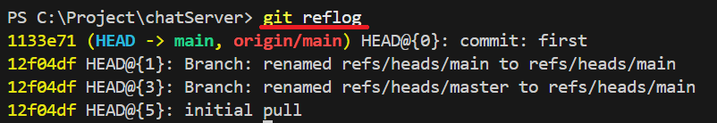   
   1133e71 (HEAD -> main, origin/main) HEAD@{0}: commit: first <span style="color:red"><-- testDir폴더와 test2.txt파일 추가</span>   
   12f04df HEAD@{1}: Branch: renamed refs/heads/main to refs/heads/main   
   12f04df HEAD@{3}: Branch: renamed refs/heads/master to refs/heads/main   
   12f04df HEAD@{5}: initial pull <span style="color:red"><-- pull로 readme.md파일 추가</span>   

   reset실행   
   ```
      git reset --hard 12f04df
   ```   
   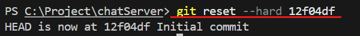   
   readme.md파일만 추가했던 커밋 상태로 reset   
   
   여기까지하면 로컬에만 적용됩니다. 폴더에는 testDir와 test2.txt파일이 삭제되어 보이지 않습니다.   
   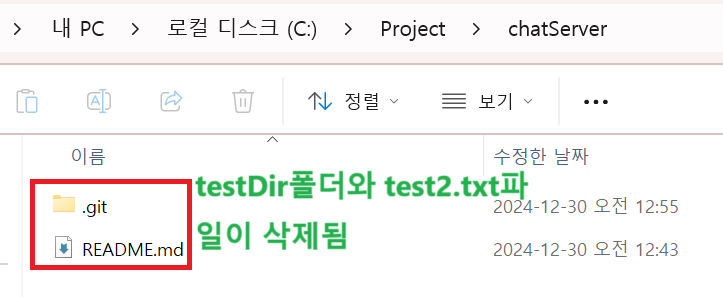   
   readme.md파일만 존재합니다. readme.md파일을 추가한 모든 디렉토리와 파일은 삭제됩니다.    

   log확인   
   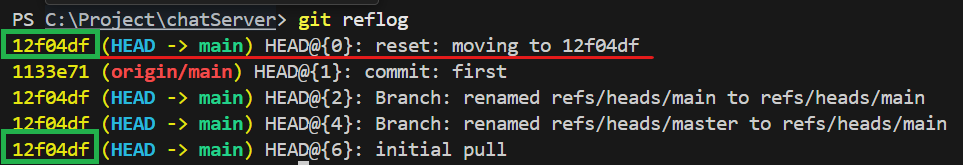   
   12f04df (HEAD -> main) HEAD@{0}: reset: moving to 12f04df  <span style="color:red"><-- 현재 12f04df 상태로 복귀함함</span>   
   1133e71 (origin/main) HEAD@{1}: commit: first   
   12f04df (HEAD -> main) HEAD@{2}: Branch: renamed refs/heads/main to refs/heads/main   
   12f04df (HEAD -> main) HEAD@{4}: Branch: renamed refs/heads/master to refs/heads/main   
   12f04df (HEAD -> main) HEAD@{6}: initial pull   

   여기까지 복구는 완료되었지만 복구 파일을 commit후 push를 하면 error발생합니다.   
   복구를 했기 때문에 1개 커밋이 뒤에 있다고 기존의 파일을 pull을 먼저하라고 메시지가 나타납니다.   
   pull을 할 경우 파일이 삭제된 상태로 되돌아 가기 때문에 force 옵션을 추가합니다.   

   push 실행   
   ```
      git push origin main -f
   ```   

   commit값이 2->1 로 변했습니다. testDir폴더와 test2.txt파일이 삭제되어 보이지 않고 readme.md파일만 보입니다.   
   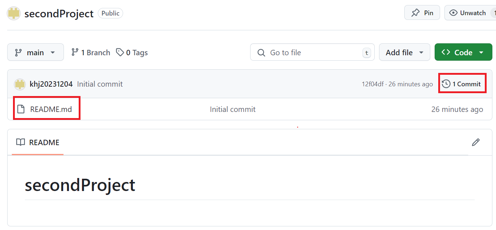   

   깃허브에 히스토리 자체가 삭제되어 이전 커밋 값으로 원상복귀됩니다.   
   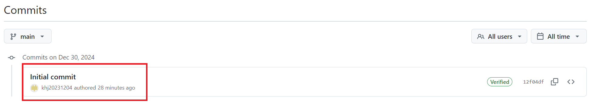      
   기존 first 커밋 히스토리가 삭제되어 보이지 않고 reset된 Initial commit 이력만 보입니다.   
   
   