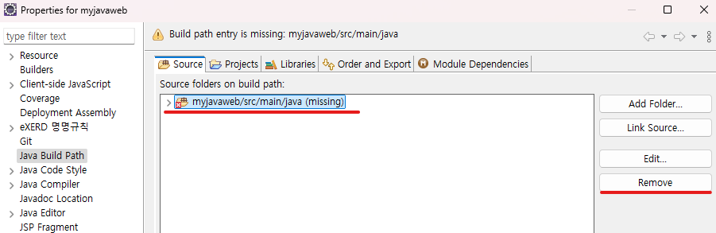

1. # 깃허브에서 Dynamic Web Project 가져오기
   최초 git clone으로 가저오면 일반 project형식으로 가져오기 때문에 Properties에서 Project Facets을 해줘야 합니다.   

   깃클론으로 깃허브에 있는 repository를 추가합니다   
      

   Local Destination 설정 부분에서   
   Clone submodules와 Import all existing Eclipse projects after clone finishes 두 항목을 선택해줍니다.   
   Clone submodules : project 구동에 필요한 서브모듈이 있을 수 있기 때문   
   Import all existing Eclipse projects after clone finishes : git clone이 끝나면 자동으로 프로젝트가 생성   
      

   myjavaweb이란 프로젝트가 git clone이 끝나면서 바로 생성됩니다.   
      
   
   하지만 느낌표가 같이 나타납니다.   
   이제 느낌표를 없애고 Project Facets을 설정해줘야 합니다.   

   프로젝트 위에서 Build Path -> Confiugre Build Path를 선택합니다.   
      

   해당 항목을 선택 후 remove를 해줍니다.   
      

   remove를 해주면 느낌표는 없어집니다. 이제 Proejct Facets에서 버전을 맞춰줍니다.   

   Properties를 선택합니다.   
      

   Project Facets메뉴에서 Dynamic Web Module버전과 Java버전을 프로젝트 생성 당시 설정한 값으로 설정합니다.   
   오른쪽 화면에 Runtimes를 선택해서 Apache Tomcat버전을 선택하고 Apply를 누릅니다.   
      