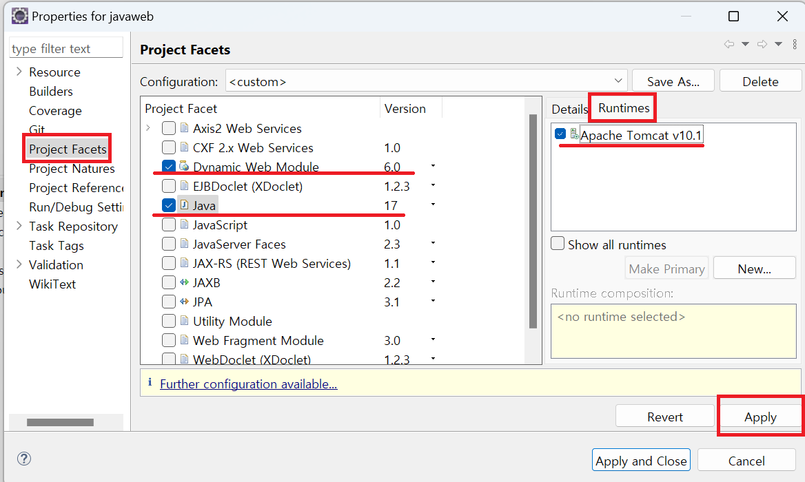

1. # 깃허브에서 Dynamic Web Project 가져오기
   최초 git clone으로 가저오면 일반 project형식으로 가져오기 때문에 Properties에서 Project Facets을 해줘야 합니다.   

   깃클론으로 깃허브에 있는 repository를 추가합니다   
      

   import projects를 선택합니다.   
      

   javaweb을 체크합니다. 밑에 'javaweb\web'은 javaweb이란 폴더없이 web폴더만 가지고 옵니다.   
      

   Project Explorer에 javaweb프로젝트가 생겼고 우클릭후 가장 하단에 properties속성을 선택합니다.   
      

   Dynamic Web Module버전과 Java버전을 프로젝트 생성당시 설정한 값 설정합니다.   
   오른쪽 화면에 Runtimes를 선택해서 Apache Tomcat버전을 선택하고 Apply를 누릅니다.   
      