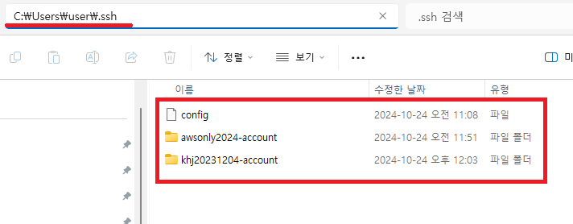
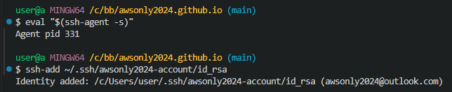
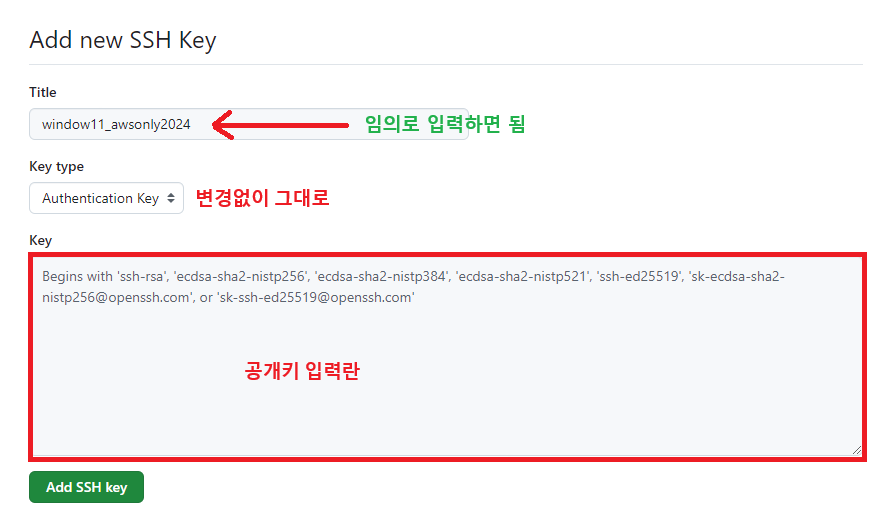
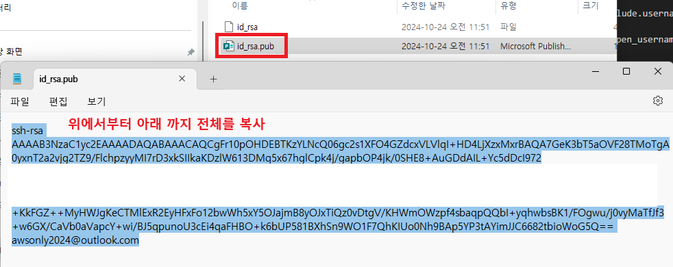
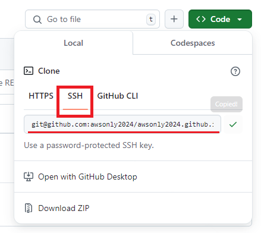
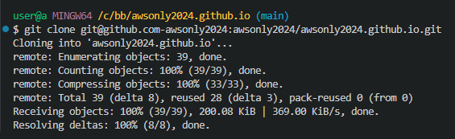

1. # 전체 개요

   하나의 컴퓨터에 여러 개정의 깃허브를 사용하기 위해서 보안 인증 수단으로 SSH을 발급받게 되는데 이 때, 계정에 따라 다른 SSH를 발급받고, 다른 디렉토리에 저장을 한 후 config 환경 설정파일을 만들어야합니다. config 설정 파일이 없는 경우, 새로 만들면 config파일을 인식하게 됩니다. 깃허브에서 ssh 파일의 기본 경로는 `C:\Users\user\.ssh`입니다.     

1. # SSH란🪞   
   SSH를 사용하려면 먼저 공개 키와 개인 키 쌍을 생성해야 합니다. 공개 키는 다른 사람에게 공개하고, 개인 키는 자신만 가지고 있어야 합니다. 깃허브에 프로젝트를 올릴 때 SSH 키를 등록하여 비밀번호 없이 안전하게 연결할 수 있습니다. 공개키를 생성해서 깃허브에 등록 후 디렉토리를 변경하면 깃허브가 비밀키를 가져오지 못 합니다.   

   공개키 : id_rsa.pub   
   비밀키 : id_rsa

1. # SSH생성🎈

   결과 화면 : 😊   
   ```java
      PS C:\khj\khj20231204.github.io> ssh-keygen -t rsa -b 4096 -C "awsonly2024@outlook.com"
      Generating public/private rsa key pair.
      Enter file in which to save the key (C:\Users\user/.ssh/id_rsa): C:\Users\user\.ssh\awsonly2024-account/id_rsa
      Enter passphrase (empty for no passphrase):       //<-- 비밀번호 입력인데 엔터치면 넘어감
      Enter same passphrase again:                      //<-- 엔터치면 넘어감
      Your identification has been saved in C:\Users\user\.ssh\awsonly2024-account/id_rsa
      Your public key has been saved in C:\Users\user\.ssh\awsonly2024-account/id_rsa.pub
      The key fingerprint is:
      SHA256:kq6UVyQAY4+nra0o96bAvqY awsonly2024@outlook.com
      The key's randomart image is:
      +---[RSA 4096]----+
      |  +..            |
      |.o . .           |
      |+     . .        |
      | +     +         |
      |+     o.S+ .     |
      |++   o.++ +      |
      |* = +.+.. .o     |
      |.+o++=oo.o...    |
      |Eoo++***o o.     |
      +----[SHA256]-----+
   ```   

   1)awsonly2024 SSH발급   
      `C:\Users\user\.ssh\awsonly2024-account` 해당 경로에 폴더를 생성합니다.   

      cmd창에서 다음을 입력합니다.   
      ```
         ssh-keygen -t rsa -b 4096 -C "awsonly2024@outlook.com"
      ```

      ssh키 저장 폴더를 설정 시 =>   
      ```java
         Enter file in which to save the key (C:\Users\user/.ssh/id_rsa): C:\Users\user\.ssh\awsonly2024-account/id_rsa   
      ```
      `C:\Users\user\.ssh\awsonly2024-account` 디렉토리에 id_rsa란 이름으로 생성이 됩니다.   
      id_rsa는 비밀키로 생성이 되고, 자동으로 id_rsa.pub 공캐키 파일도 같이 생성이 됩니다.   

   2)khj20231204 SSH발급   
   `C:\Users\user\.ssh\khj20231204-account` 폴더 생성   

   ```
      ssh-keygen -t rsa -b 4096 -C "natista00@naver.com"
   ```

   SSH 저장 경로 설정   
   ```
      C:\Users\user\.ssh\khj20231204-account/id_rsa
   ```

1. # config 파일 설정
   SSH에 따라 다른 경로의 github를 인식하도록 설정을 해줘야 합니다.   

   __-config-__   
   ```java
      Host github.com-awsonly2024      # 앞으로 사용하게 될 별명같은 것, 깃허브 ssh주소에 추가
         HostName github.com        # 고정 : github.com
         User awsonly2024-account   # 사용자 계정 이름, 보통 설명하는 식으로 작명
         IdentityFile ~/.ssh/awsonly2024-account # 계정별 ssh파일 저장 위치

      Host github.com-khj20231204	 	
         HostName github.com			   
         User khj20231204-account		   
         IdentityFile ~/.ssh/khj20231204-account		
   ```

   전체 디렉토리 화면   
       

1. # ssh-add로 비밀키 등록
   VSCode terminal에서 Git bash를 선택합니다.   

   ```cs
      eval "$(ssh-agent -s)"
   ```
   eval : ssh-agent -s 명령어의 출력 결과(환경 변수 설정 명령)를 현재 셸에서 실행합니다.   
   `$(ssh-agent -s)` :  SSH 에이전트가 백그라운드에서 실행되고, SSH 인증에 필요한 정보를 관리하는 소켓 파일이 생성됩니다.   

   비밀키 rsa경로를 ssh에 추가    
   ```cs
      ssh-add ~/.ssh/awsonly2024-account/id_rsa
   ```

      

1. # 공개키 github에 등록

      Settings → SSH and GPG keys → SSH Keys에 New SSH key 클릭   

         

      공개키 가져오기 : pub확장자를 메모장으로 열면됩니다.   

         

1. # git clone으로 가져오기
   SSH로 선택을 해야합니다.   

      

   각각 해당 주소로 클론하기   

   clone 주로소 config파일의 Host가 입력되어야 합니다.   

   ```
      git@[Host 명]:[깃 허브 주소]
   ```

   cmd창에 입력   
   ```java   
      //awsonly2024 클론
      git clone git@github.com-awsonly2024:awsonly2024/awsonly2024.github.io.git  
      
      //khj20231204 클론
      git clone git@github.com-khj20231204:khj20231204/khj20231204.github.io.git
   ```

      