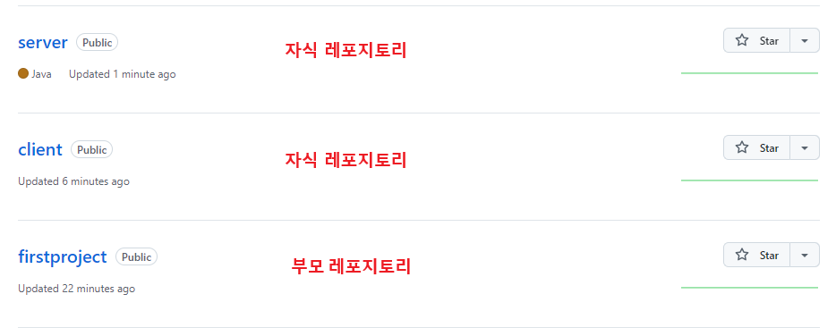
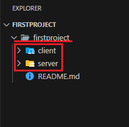
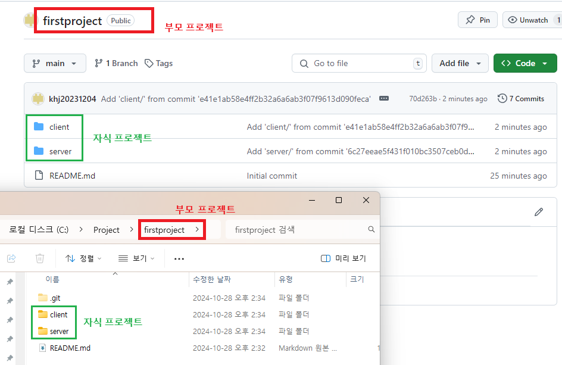

1. # 하나의 레포지토리에 다수의 프로젝트를 올리기
   깃허브에 자식 레포지토리가 따로 생성된 상태에서 시작🎯
   
   빈 부모 레포지토리 생성 -> 부모 레포지토리 clone -> 부모 레포지토리로 이동 -> subtree로 부모 레포지토리에 자식 레포지토리 추가 -> 자식 레포지토리 삭제

   이후 commit 시 부모 레포지토리에서 subtree 형식으로 커밋
   ```
      cd 부모 레포지토리 이름
      git subtree add --prefix-폴더 이름 자식 레포지토리 주소 branch 이름
      git commit -m "커밋 메시지"
      git push origin main
   ```   

1. # 레포지토리 생성

   부모 레포지토리 : firstproject   
   자식 레포지토리 : server, client   

   *부모 레포지토리에서 add를 할 때 prefix 이름으로 폴더가 새로 만들어진다.🏸   

   저장할 자식 레포지토리를 임시로 2개 만들고, 1개의 부모 레포지토리를 생성합니다.   

   *자식 레포지토리를 만들 때는 clone이 아니라 pull로 했다.🧹
      

   *clone를 한 경우 깃허브의 프로젝트 이름으로 디렉토리가 로컬에 새로 생성👌   
   *pull을 한 경우 깃허브에 있는 그 상태로 다운👌   

1. # 자식 프로젝트 깃허브에 올리기

   server와 client 프로젝트를 깃허브에 올립니다.   

   -server-   
   vscode에서 server 디렉토리로 이동합니다.   
   ```javascript
      git init
      git remote add origin https://github.com/khj20231204/server.git
      git pull origin main
      git branch -M main
      git pull origin main
      git add .
      git commit -m "server"
      git push origin main
   ```   

   -client-   
   vscode에서 client 디렉토리로 이동합니다.   
   ```javascript
      git init
      git remote add origin https://github.com/khj20231204/client.git
      git pull origin main
      git branch -M main
      git pull origin main
      git add .
      git commit -m "client"
      git push origin main
   ```
1. # 부모 레포지토리에서 자식 레포지토리 추가

   부모 디렉토리로 이동 후 git clone [부모 레포지토리 주소]
   ```javascript
      C:\Project> git clone https://github.com/khj20231204/firstproject.git
   ```
   
   firstproject란 프로젝트 이름으로 디렉토리가 새로 생성됨   

   firstproject로 이동   

   부모 디렉토리(firstproject) 위치에서 자식 레포지토리 추가 => 로컬의 레포지토리에 추가   
   git subtree add --prefix=[레포지토리 이름] [레포지토리 주소] main   
   ```javascript
      C:\Project\firstproject> git subtree add --prefix=server https://github.com/khj20231204/server.git main
      C:\Project\firstproject> git subtree add --prefix=client https://github.com/khj20231204/client.git main
   ```   
      
   로컬로 add할 server, client 레포지토리를 가져왔습니다.   
   <span style="color:red">*아직 깃허브엔 추가 전</span>입니다.   

   push하여 깃허브에 올리기   
   ```javascript
      C:\Project\firstproject\firstproject> git push origin main
   ```

      

1. # 이후 push 
   기존에 있던 로컬과 깃허브의 server와 client는 삭제를 하고 부모 프로젝트에 있는 자식 프로젝트를 VSCode에서 불러와서 사용하고 push합니다.   

   
