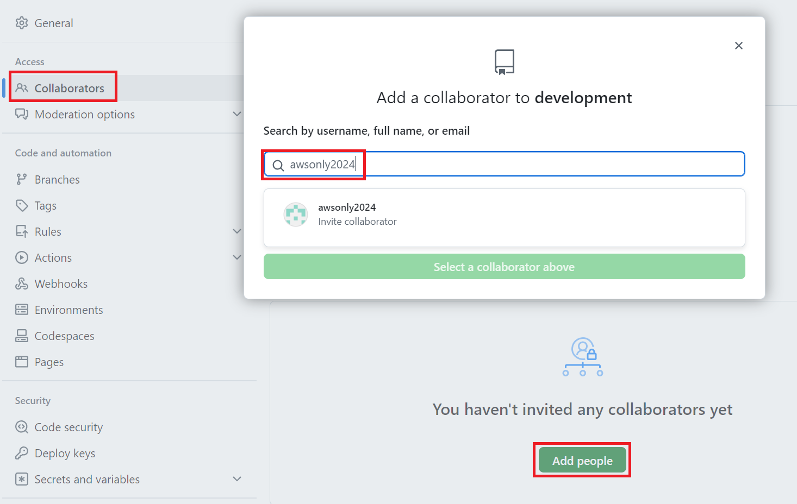
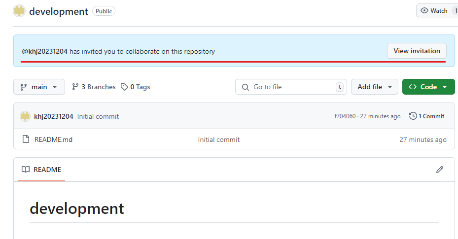
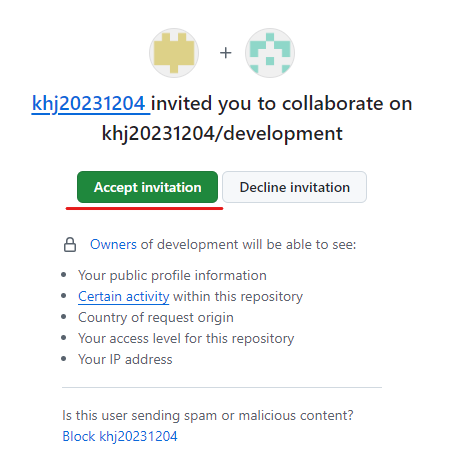
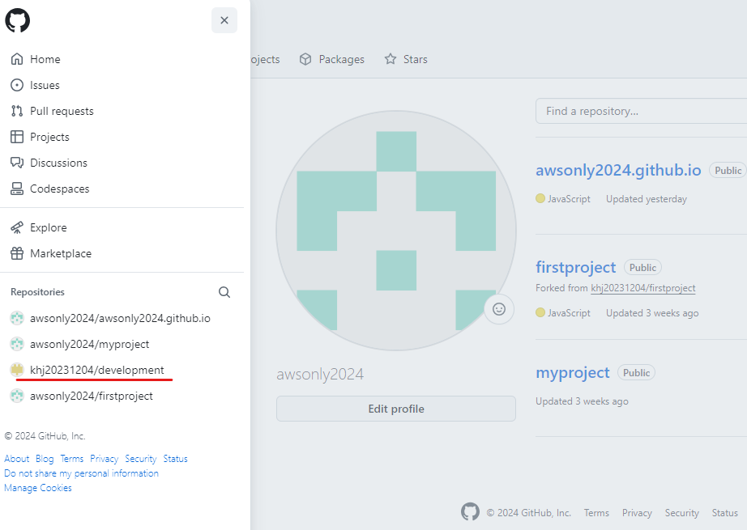
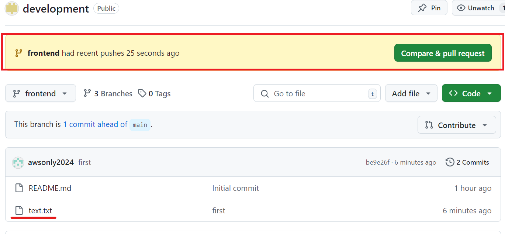
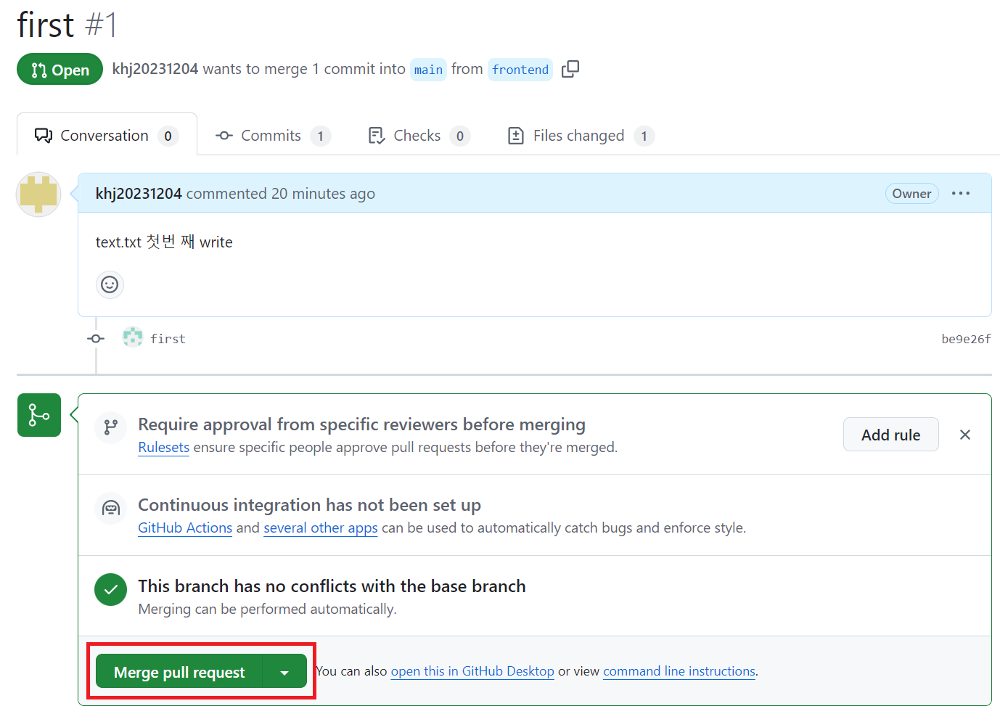

1. # 브랜치를 나누고 병합하는 과정
   2명이 각각 백엔드와 프론트엔드로 역할 분담 후 병합하는 과정

1. # 브랜치 생성과 설명
   main또는 master 브랜치 생성   
   develop브랜치를 생성   
   backend 브랜치와 frontend 브랜치를 생성   

   backend브랜치에서 백엔드 작업, frontend 브랜치에서 프론트엔드 작업   
   develop브랜치에 backend와 frontend를 병합   
   develop브랜치를 main브랜치로 병합   

   main - 배포용   
   develop - 작업 병합용   
   backend - 백엔드 작업   
   frontend - 프론트엔드 작업   

1. # Collaborators 
   main관리자가 Collaborators and teams 항목으로 backend와 frontend의 사용자를 추가   

   mina관리자 : Settings를 선택합니다   
     

   frontend개발자 :    
      

      

      

1. # 작업 리파지토리 clone / pull request 요청
   frontend 작업자:   
   ```yml
      # clone를 하면 리파지토리 전체를 가져온다. 이후 브랜치를 설정해서 해당 브랜치에서만 작업을 한다
      git clone https://github.com/khj20231204/development.git
      c:\> cd 'clone된 폴더명'
      git branch #branch 확인
      git checkout frontend #frontend 브랜치로 이동
      git pull origin frontend
      git add .
      git commit -m "first"
      git push origin frontend
   ```

   main 관리자 :   
   리파지토리에 frontend부분에서 작업한 파일이 올라와 있고 동시에 "Compare & pull request" 요청이 와 있습니다.   
      

   요청이 허가되면 merge하고 아니면 코멘트를 남겨서 frontend작업자가 계속 작업을 합니다.   

   *pull request : frontend작업자가 push를 하면 자동 request 요청이 됩니다.   

1. # 병합 과정

   merge pull request 버튼을 누르면 병합이 됩니다.   

      

1. # 브랜치 삭제

   main 관리자가 삭제 :   
   ```yml
      git push origin --delete frontend
   ```

   frontend 작업자가 삭제 :   
   ```yml
      git branch -d frontend
   ```
