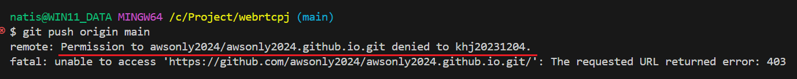
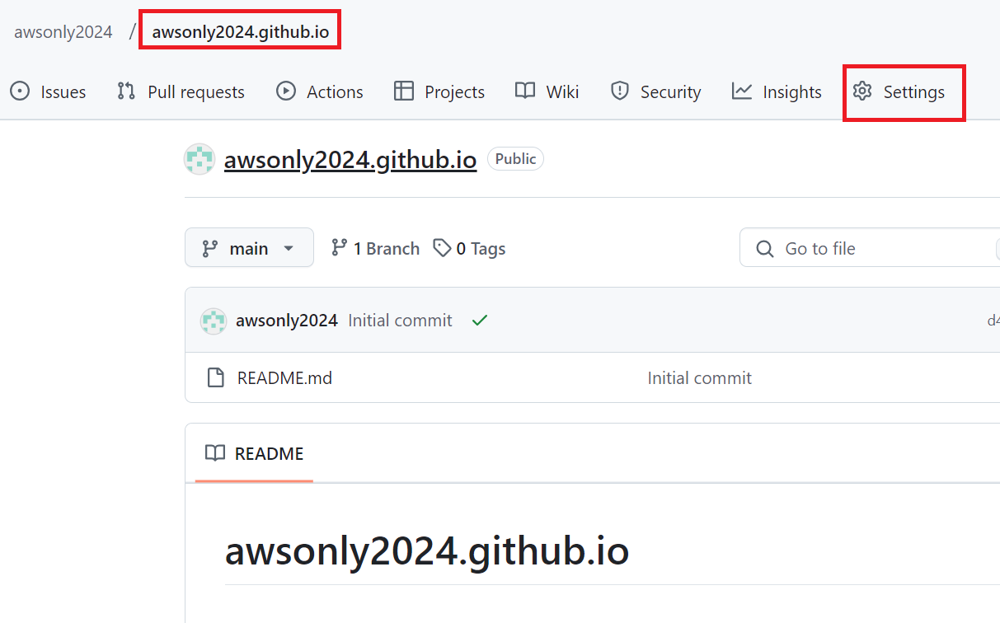
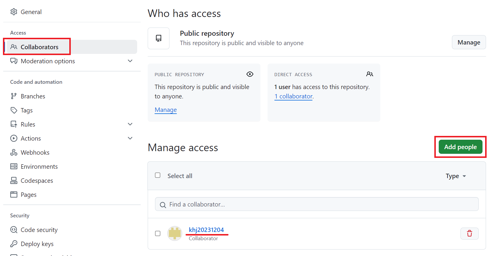
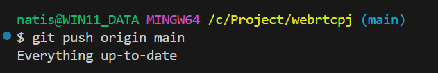

1. # permission denied 오류
   awsonly2024로 깃허브 계정으로 생성 후 git remote add origin 으로 origin을 연결 후 vscode에서 git push를 할 경우 현재 사용하는 계정이 khj20231204로 되어 있어서 권한 오류가 발생한다.   

       

1. # Collaborators 등록
   awsonly2024로 로그인 후 origin을 등록한 repository의 setting에서 Collaborators를 khj20231204로 등록해 준다.  
   
   commit할 awsonly2024의 repository로 이동 후 settings선택   
      

   Collaborators 선택 후 Add people -> khj20231204선택   
      

1. # git push 

   push 정상 실행   
      