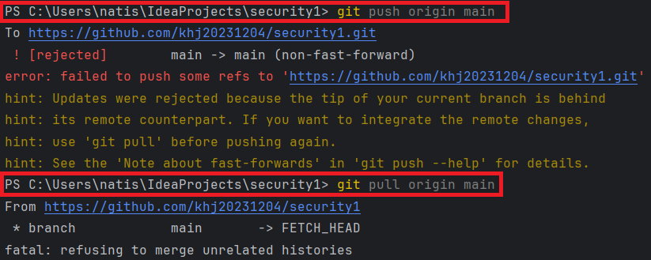

1. # 강제 병합

   기존 프로젝트에서 형상관리를 위해 commit을 한 상테에서 깃허브의 브랜치에 프로젝트를 추가할 때 주로 발생하는 에러   
      
   서로 다른 history가 존재하기 때문에 발생하는 에러   

   => 강제 병합을 시킴   


   1.원격 리포지토리와 병합   
   ```
      git pull origin main --allow-unrelated-histories
   ```   

   2.병합 충돌 해결   
   만약 충돌이 발생하면, 파일을 수정한 후 git add . → git commit -m "Fix merge conflicts" 실행   

   3.변경 사항 푸시   
   ```
      git push origin main
   ```   
   