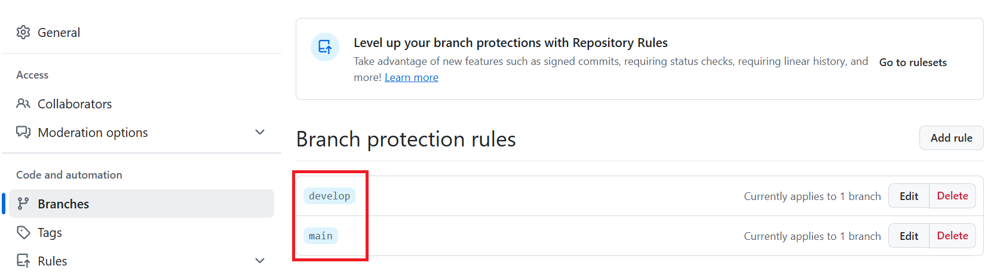

1. # Branch Protection rules

   전체 설정이 아니라 reposity Settings로 들어간다   
      

   왼쪽 Branches 메뉴에서 Add classic branch protection rule 선택   
      

   Branches에서 Branch name pattern을 정하는데 브랜치명이 온다.   
      
   하단에 Require approvals에서 pull request를 하고 나서 merge를 할 때 approval을 할 인원수를 정한다.   

   브랜치 별로 규칙이 생성된 것을 볼 수 있다.   
      