1. # project 
   GitHub Project는 이슈(Issues), 풀 리퀘스트(PR), 노트(Notes) 등을 관리하고, 팀 작업을 계획 및 추적할 수 있도록 도와주는 프로젝트 관리 도구입니다.   

   프로젝트 생성 -> 브랜치 생성   

   프로젝트 안에서 브랜치를 생성하면 브랜치의 상태에 따라 나눠지는 단계   
   Todo (할 일) – 최초 브랜치가 생성된 단계, 아직 시작되지 않은 작업   
   In Progress (진행 중) – 현재 작업이 진행 중인 항목   
   Done (완료됨) – pull request가 완료되어 merge가 된 상태, 작업이 끝난 상태    
   이렇게 3가지 단계로 나눠져서 이력이 추적됩니다.      

   GitHub에서 프로젝트 생성   
   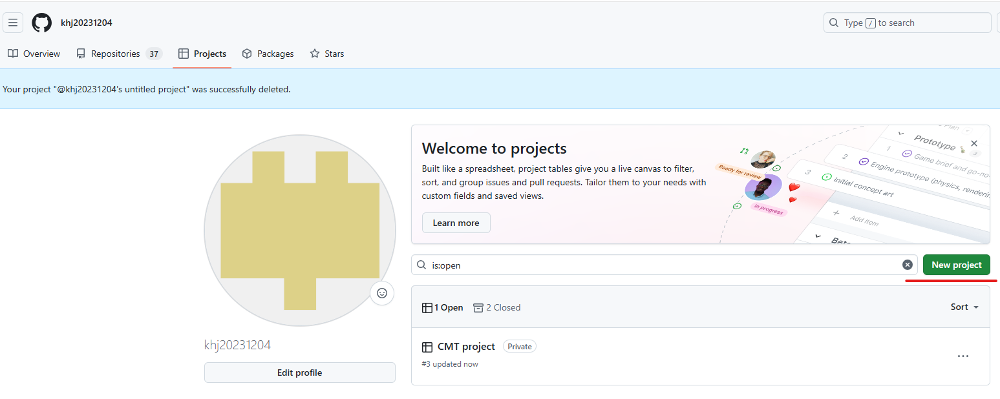   

   Todo 하단에서 Add Item을 클릭하여 Todo리스트에 Item생성   
   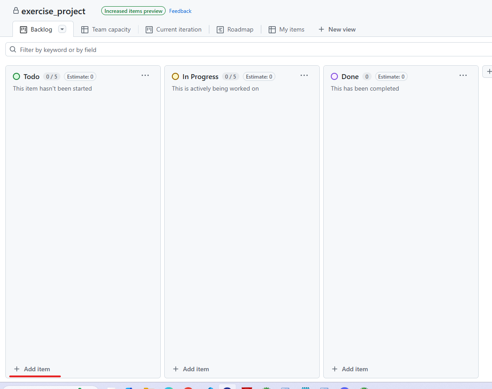   

   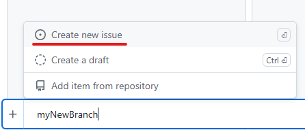   

   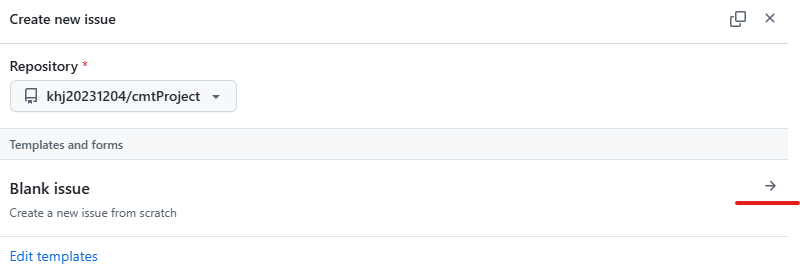   

   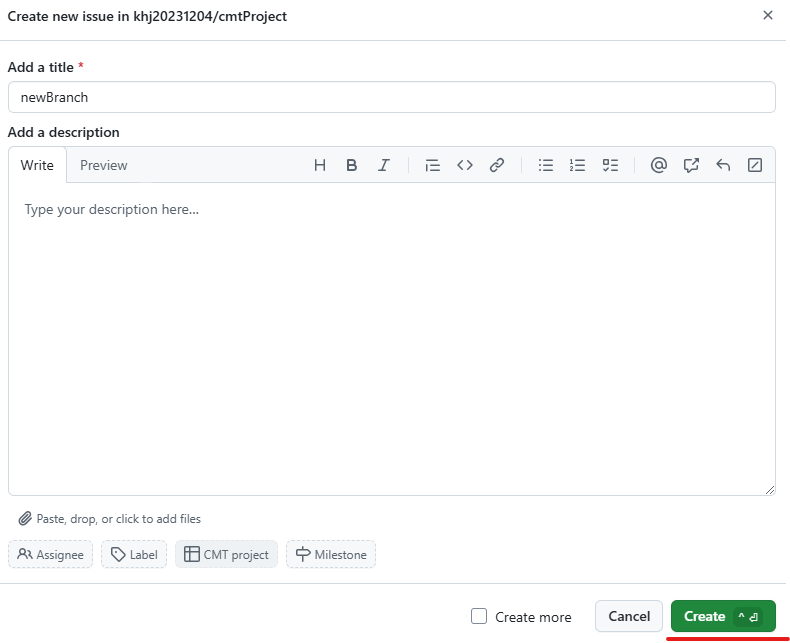   

   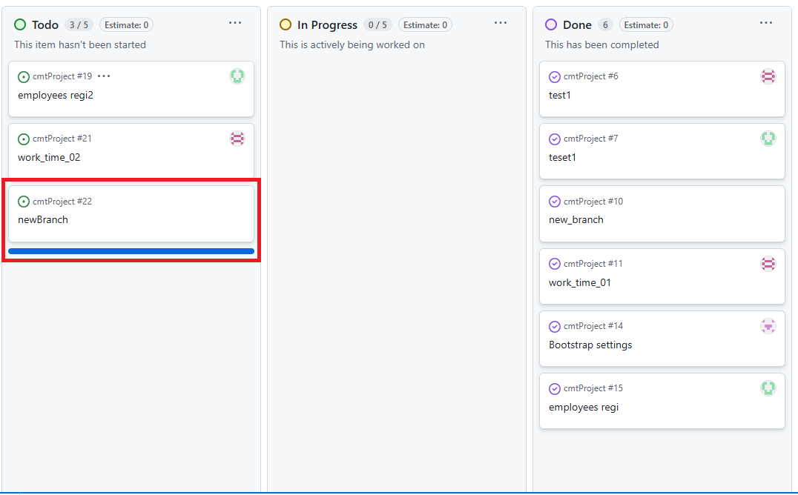   
   여기까지가 Todo에 Item을 생성하는 단계   

   생성된 Item에서 Open in new tab 클릭   
   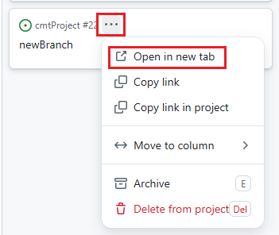   

   오른쪽 메뉴에서 Create a branch를 선택하여 branch생성   
   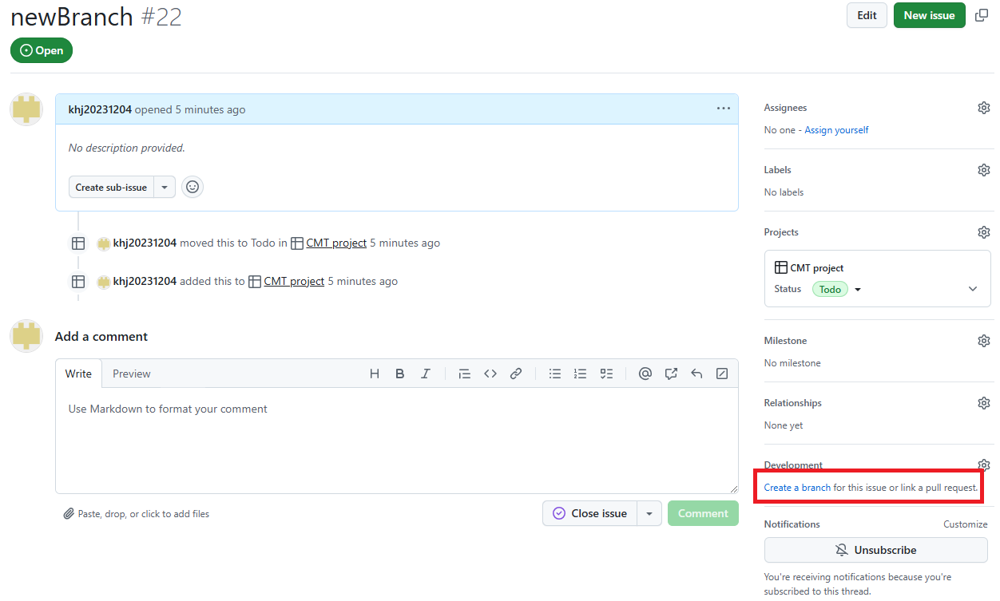   

   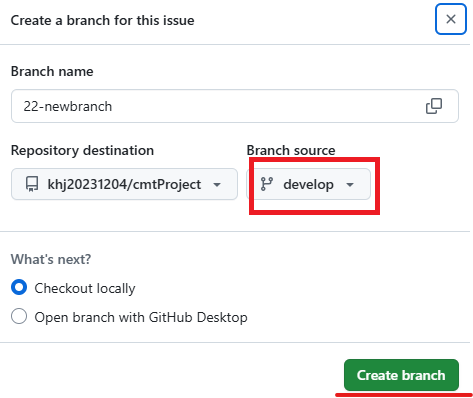   
   develop에 생성될 브랜치를 만듦

   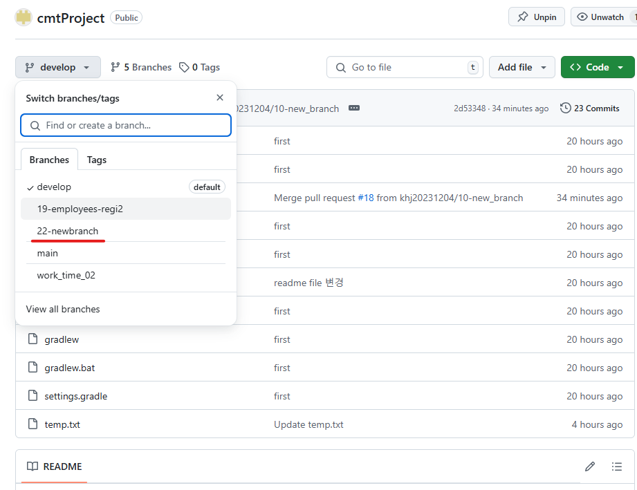   
   생성된 블랜치를 메인화면에서 확인

   __여기까지가 github에사 하는 작업들__    
   
   __이제부터는 STS4에서 하는 작업들__   

   1)github에서 새로운 리파지토리를 가져오는 경우   
   git clone -> 주소입력 -> 암호입력   
   새로운 리파지토리를 가져오는 거면 바로 가져오면 됩니다.   
   
   2)기존에 하던 작업이 있는 경우    
   기존 작업을 commit하고 push하여 develop 저장 -> github의 pull request에 목록이 나타남 -> file에서 approve 승인 후 develop에 병합 -> project에서 __다시 브랜치 생성__ -> __develop__ 브랜치에서 pull -> 생성된 브랜치로 변경   

   *로컬에 A, B 파일이 있고, 원격(GitHub)에는 A, C 파일이 존재하는 경우 git push를 하면 원격에 A,B,C파일이 생성됨. __push하면 없는 파일만 추가 됨.__   

   밑에는 2)의 경우에 해당하는 과정   

   기존에 있던 작업 commit -> push   
   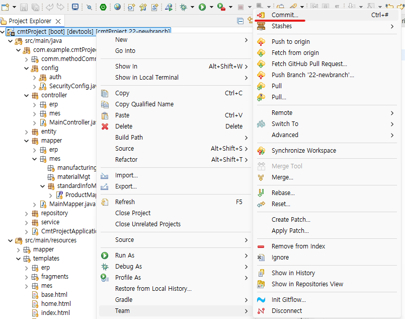   

   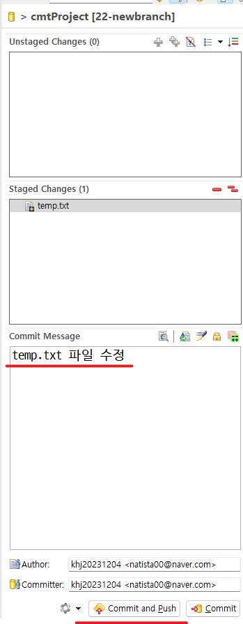   

   puhs를 하면 해당 프로젝트에 Pull requests가 뜹니다.   
   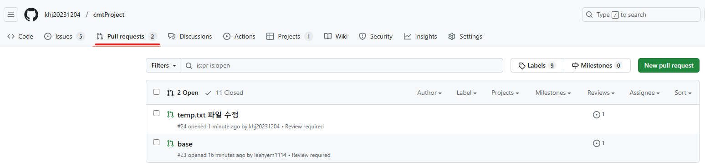   

   해당 request의 내용 안에 Files Changes에 변화된 항목이 나타납니다.   
      

   오른쪽에 Review changes버튼 클릭 -> Approve선택 -> Submit review 선택   
   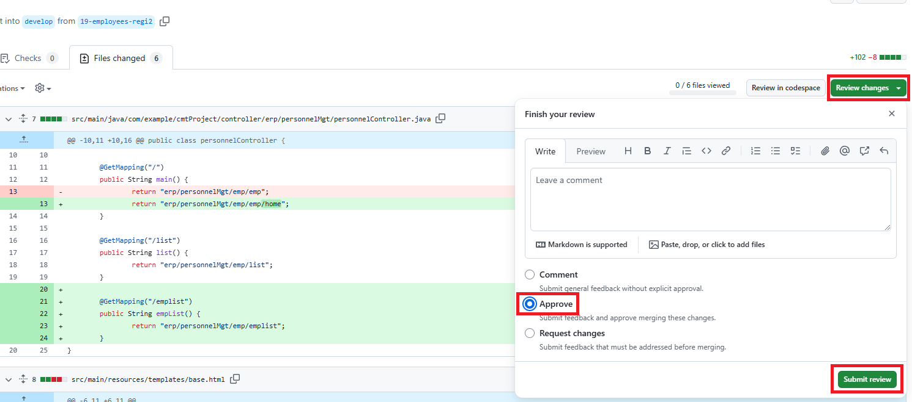   

   올라와있던 reqeust 항목에 Merge pull request 버튼이 나타난다.   
   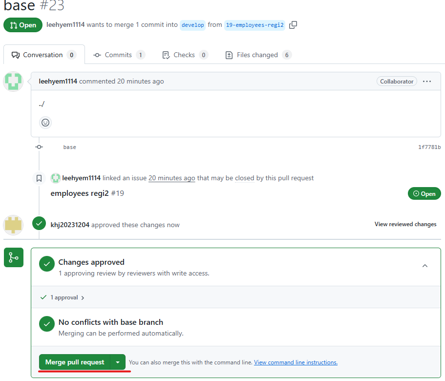   

   다시 한번 confim merge 버튼을 눌러준다.   
   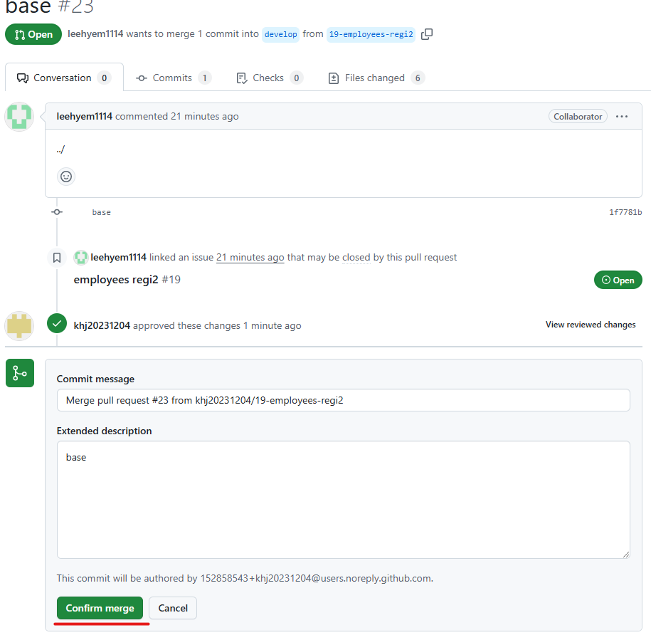   

   여기까지가 기존 작업 파일을 develop에 병합하는 과정이였습는다. 이제 project에서 새로 브랜치를 생성하고 develop로 접속해 pull 한 후 새로 생성한 브랜치로 변경하면 됩니다.   

   pull request를 처리하여 병합 되었기 때문에 기존 브랜치는 없는 상태   
   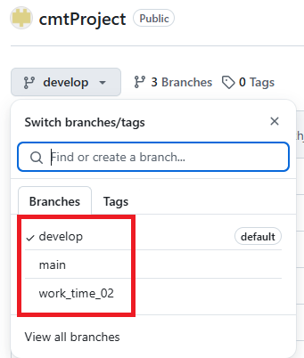   

   project에서 새로 브랜치 생성(기존 commit한 브랜치는 현재 github의 branch목록에서 없어진 상태) -> STS4에서 브랜치를 __develop로 변경 후 pull__ -> 새로 생성한 브랜치로 변경   

   develop로 변경   
   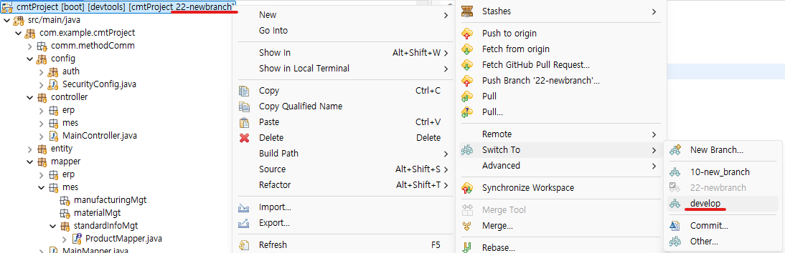   

   pull할 때 새로 받은 브랜치로 변경하기 위해서 other선택   
   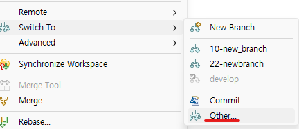   

   Remote Tracking 목록에서 새로 생성한 branch선택   
   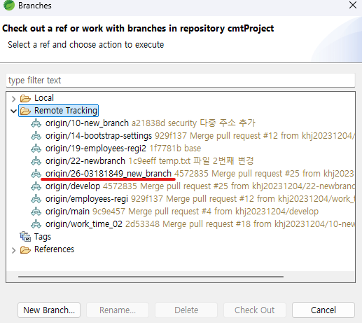   

   Check oput as New Local branch   
   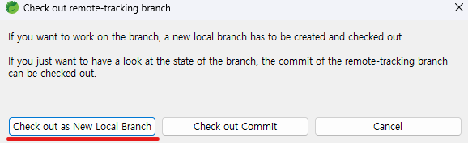   

   finish선택   
   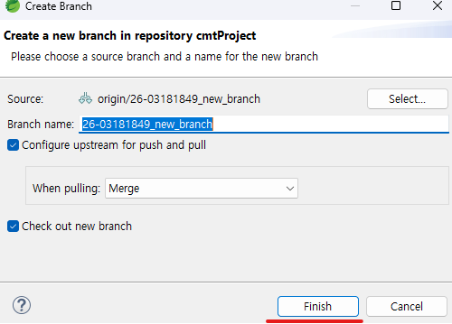   

   

