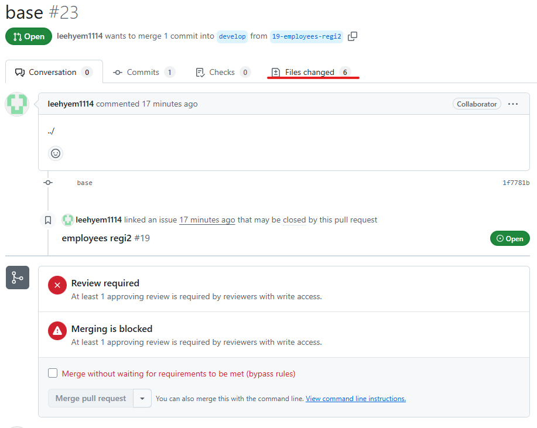

1. # project 
   GitHub Project는 이슈(Issues), 풀 리퀘스트(PR), 노트(Notes) 등을 관리하고, 팀 작업을 계획 및 추적할 수 있도록 도와주는 프로젝트 관리 도구입니다.   

   1.프로젝트 생성   
      

      

      

      

      

      

      

      

      
   develop에 브랜치 생성   

      

   여기까지가 github에사 하는 작업들   

   1)github에서 새로운 리파지토리를 가져오는 경우   
   git clone -> 주소입력 -> 암호입력   
   새로운 리파지토리를 가져오는 거면 바로 가져오면 된다.   
   
   2)기존에 하던 작업이 있는 경우 기존 작업   
   기존 작업을 commit -> branch에 기존 소스를 병합 -> github에서 pull request에 목록이 나타남 -> file에서 approve 승인 후 develop에 병합 후 __다시 브랜치 생성__ -> __develop 브랜치에서 pull__ -> 생성된 브랜치로 변경

   기존에 있던 작업 commit -> push   
      

      

   puhs를 하면 해당 프로젝트에 Pull requests가 뜬다   
      

   해당 request의 내용 안에 Files Changes에 변화된 항목이 나타난다.   
      

   오른쪽에 Review changes버튼 클릭 -> Approve선택 -> Submit review 선택   
      

   올라와있던 reqeust 항목에 Merge pull request 버튼이 나타난다.   
      

   다시 한번 confim merge 버튼을 눌러준다.   
      

   여기까지가 기존 작업 파일을 develop에 commit한 과정이다. 이제 새로 브랜치를 생성하고 develop로 접속해 pull 한 후 새로 생성한 브랜치로 변경하면 된다.   

   pull request가 처리되었기 때문에 기존 브랜치는 없는 상태   
      

   project에서 새로 브랜치 생성 -> 기존 commit한 브랜치는 현재 githuub의 branch목록에서 없어진 상태 -> 브랜치를 __develop로 변경 후 pull__ -> 새로 생성한 브랜치로 변경   

   develop로 변경   
      

   pull할 때 새로 받은 브랜치로 변경하기 위해서 other선택   
      

   Remote Tracking 목록에서 새로 생성한 branch선택   
      

   Check oput as New Local Branch선택   
      

   finish선택   
      

   

