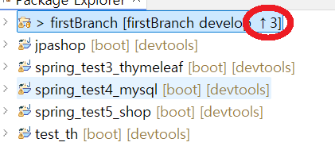
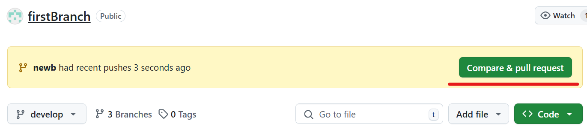
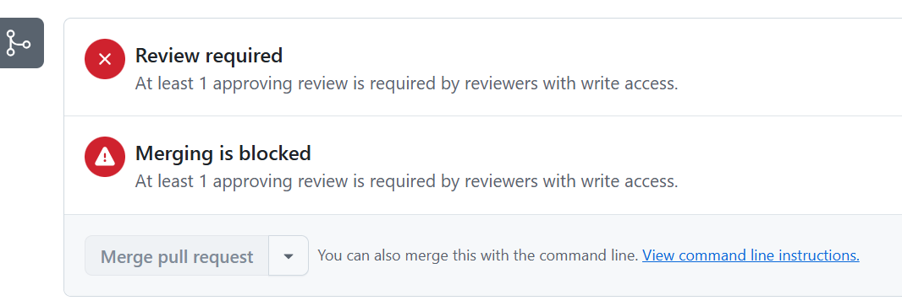
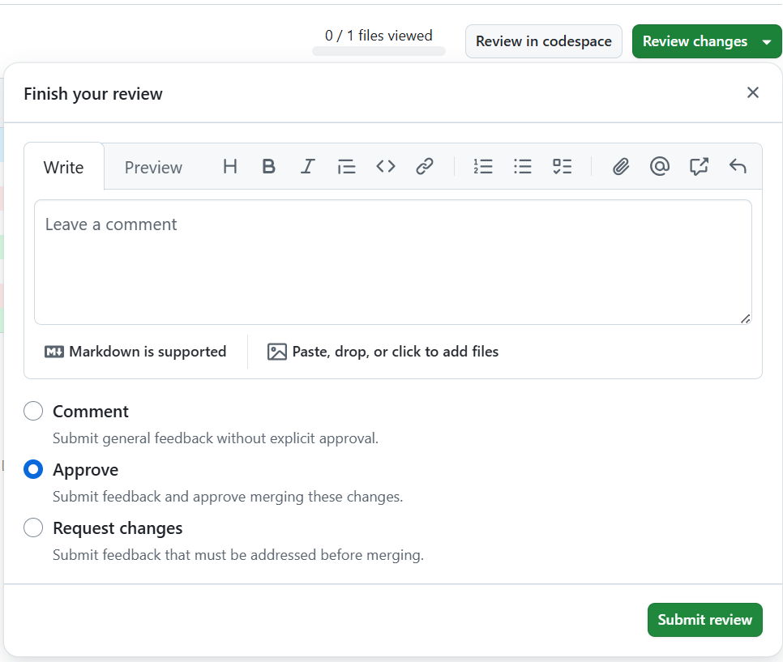
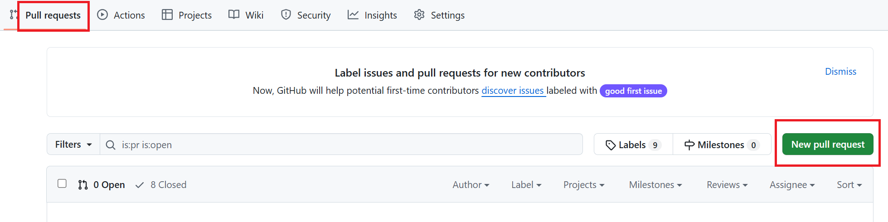
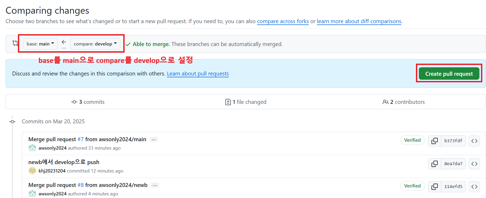
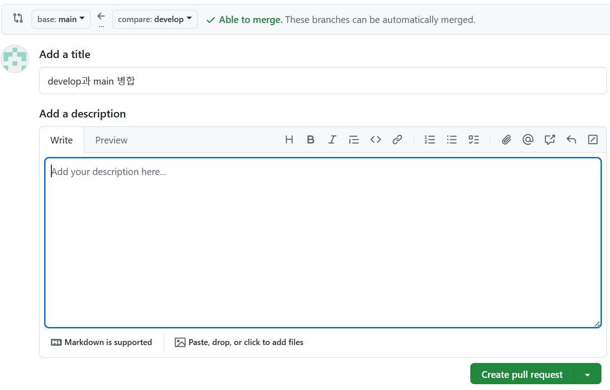
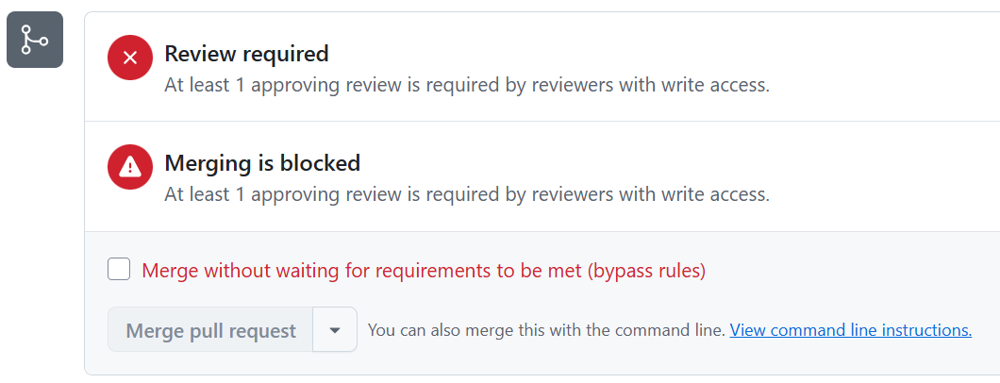
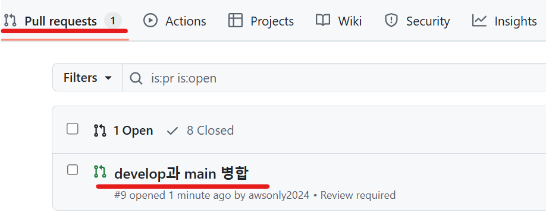

1. # 전체 설명
   배포 버전 branch - main : __branch protection rules__ 가 걸려있다.      
   default branch - develop : __branch protection rules__ 가 걸려있다.   
   일반 branch - dev1, dev2   

   branch protection rules가 걸려있기 때문에 develop에서 develop으로 push를 하지 못 한다. push를 해도 pull request가 생성되지 않기 때문에 로컬에 commit한 상태로 남아있게 된다.   
      

   develop이 일반 branch의 종착점, develop과 main은 merge 관계   

   dev1과 dev2에서 develop으로 __push__ => develop에서 main으로 __merge__   

1. # 먼저 dev1과 dev2에서 develop으로 push
   1)최초 github에서 pull을 하면 default 브랜치인 develop으로 되어있다. branch를 dev1이나 dev2로 변경 후 develop으로 push를 하면 pull request가 github에 생겨있다.   

   2)dev1에서 파일 변경 후 commit&push를 하면 pull request가 생성되어 있다.   
      
   * __develop에서 develop으로 commit&push를 하면 pull request가 생성되어 있지 않아서 로컬의 commit 상태로 걸려있게 된다.   

   3)rule이 걸려있기 때문에 다른 동료가 approval을 해줄 때까지 대기   
      

   4)Files changed에서 review changes에서 Approve   
      
   Files changed(1)이 나타나있음   

      
   여기서 review chages 버튼을 선택 후 Approve   

   다시 Pull requests 목록으로 들어가서 확인 해줌   

1. # develop에서 main으로 merge

   New pull request 생성   
      

   base: main <- compare: develop 으로 설정 이후 Create pull request   
      

   Create pull request 버튼 클릭   
      

   rules가 걸려있기 때문에 blocked 됨   
      

   다른 동료의 github로 로그인하여 Approval을 해줘야 됨   
   Pull requests의 1개 목록이 있다. 처리할 항목 선택   
      

   Filed changed 선택   
      

   Approve 선택   
      
