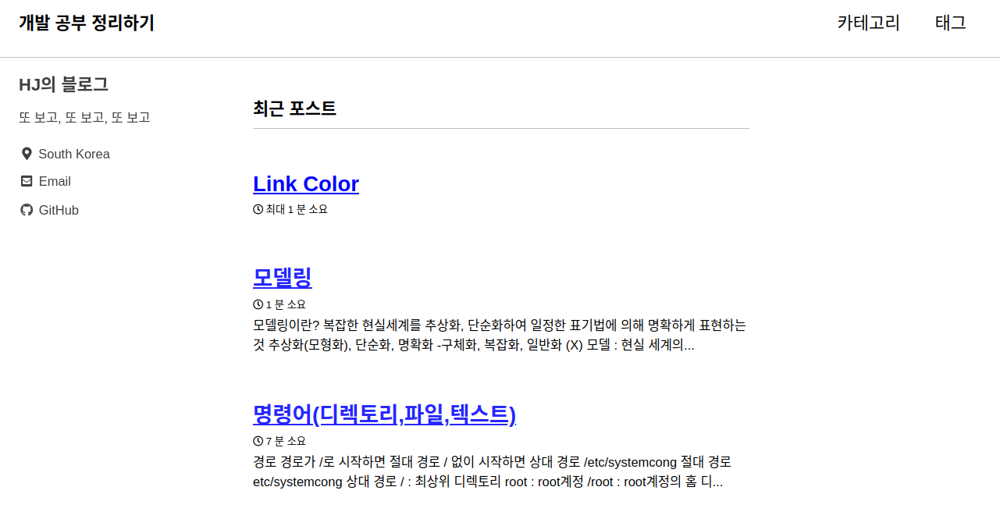
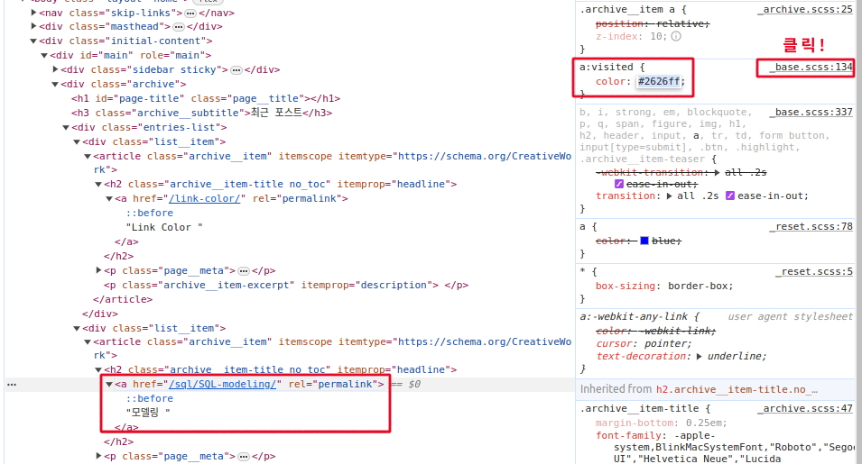
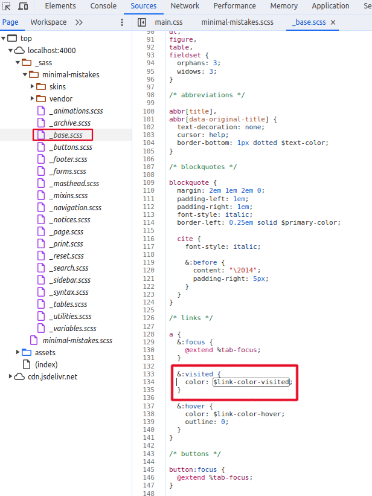
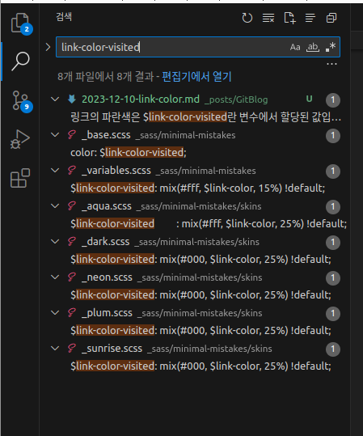
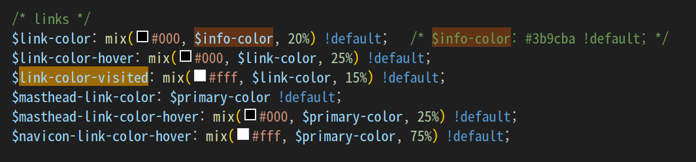

1. # 링크가 걸려있는 텍스트
	    
	Link Color, 모델링, 명령어(디렉토리,파일,테스트)가 파란색이라 바른 색으로 바꿉니다.   
	'모뎅링'이란 글자 위에서 오른쪽 마우스 클릭 후 검사를 선택합니다.   

1. # 소스 검사
	    
	영향을 미치고 있는 태그가 a 태그이고 해당 태그의 scss경로가 _base.scss 파일의 134번째 줄에 있습니다. 해당 경로를 클릭합니다.    
	
	  
	링크의 파란색은 $link-color-visited란 변수에서 할당된 값입니다.   

	  
	vscode에서 프로젝트 전체 검색을 합니다. 전체 검색 ctrl+shift+f를 누르고 link-color-visited를 검색합니다. 나온 결과 중 
	_variables.scss로 값니다. 아무래도 변수니깐 variables에 있을 거 같고, auqa, dark, neon, plum, sunrise는 전부 테마 이름인데 현재 선택한 default 테마만 따로 값이 없기 때문입니다.   

	  
	link-color-visited는 $link-color변수의 15%의 가중치로 검은색과 mix를 합니다. link-color는 다시 $info-color변수의 20%를 검정색과 혼합합니다.   

* vscode 전체 검색 : ctrl + shift + f   