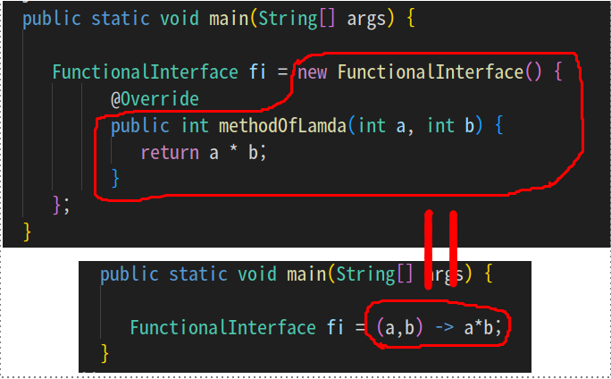
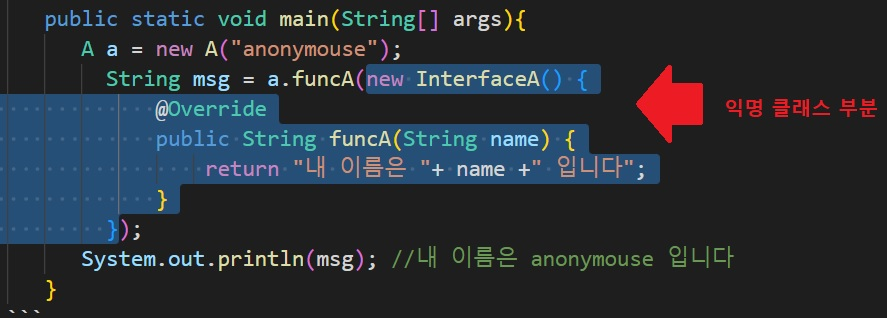

1. # 함수형 인터페이스
   오직 하나의 추상 메소드로만 이루어진 인터페이스로 람다식을 다루기 위해 만들어진 특별한 인터페이스 입니다. 람다식은 이 함수형 인터페이스의 추상 메소드를 간단히 구현한 식입니다. 즉 __"추상 메소드 구현 ≒ 람다식"__ 이 됩니다.

1. # 함수형 인터페이스 구현
   추상 메소드를 하나만 포함하는 함수형 인터페이스 구현   
   ```java
      public interface FunctionalInterface {
         public int methodOfLamda(int a, int b);
      }
   ```   
   methodOfLamda를 1개 만듭니다. 이제부터 이 메소드의 구현이 람다식이 됩니다.
   
   ```java
      public static void main(String[] args) {

         FunctionalInterface fi = new FunctionalInterface() {
               @Override
               public int methodOfLamda(int a, int b) {
                  return a * b;
               }
         };
      }
   ```   
   인터페이스의 핵심은 "추상 메소드 구현"입니다. 일반적으로 다음과 같이
   ```java
      class FunctionalClass implements FuncionalInterface{
         public int methodOfLamda(int a, int b) {
                  return a * b;
         }
      }
   ```
   클래스에서 인터페이스를 implements해서 추상 메소드를 구현할 구현 클래스를 만들게 되지만 바로 구현 객체를 선언하고 추상 메소드를 구현할 수 있습니다.   
   ```java
      FunctionalInterface fi = new FunctionalInterface() { //new 연산자로 구현객체 생성
            public int methodOfLamda(int a, int b) { //추상 메소드 정의
               ...
            }
      };
   ```   
   이때, 함수형 인터페이스의 핵심인 "추상 메소드 구현"이 람다식으로 표현이 됩니다.   
   ```java
      public static void main(String[] args) {

         FunctionalInterface fi = (a,b) -> a*b;
      }
   ```    
   즉,
       
    람다식 자체가 구현 객체의 추상 메소드를 구현한 것입니다.   

1. # 익명 클래스
   이름이 없으며 선언과 객체의 생성을 동시에 합니다. 단 한번만 사용할 수 있고 오직 하나의 객체만 생성할 수 있는 일회용 클래스입니다. 익명 클래스는 인터페이스를 구현하는 클래스의 인스턴스를 생성하기 위해 사용됩니다.   
   new 클래스이름(){   
      //선언   
   }   
   또는
   new 구현인터페이스이름(){   
      //구현   
   }      

1. # 익명 클래스와 함수형 인터페이스 작성
   #### 1)main에서 인터페이스를 상속받은 클래스를 넘겨주는 소스,
   ```java
      public class CarExam2 {
          public static void main(String[] args){
              List<Car> cars = new ArrayList<>();
              cars.add( new Car("작은차",2,800,3) );
              cars.add( new Car("봉고차",12,1500,8) );
              cars.add( new Car("중간차",5,2200,0) );
              cars.add( new Car("비싼차",5,3500,1) );

              printCar(cars, new CheckCarForBigAndNotExpensive()); //CheckCar인터페이스를 상속받은 클래스를 넘겨준다
          }

          public static void printCar(List<Car> cars, CheckCar tester){ //CheckCar인터페이스를 상속받은 클래스들은 다 받을 수 있다:다형성
              for(Car car : cars){
                  if (tester.test(car)) {
                      System.out.println(car);
                  }
              }
          }

          interface CheckCar{ //인터페이스 정의
              boolean test(Car car);
          }

          //내부클래스를 만들어서 사용합니다.
          static class CheckCarForBigAndNotExpensive implements CheckCar{ //CheckCar인터페이스를 상속받은 클래스 정의
              public boolean test(Car car){
                  return car.capacity >= 4 && car.price < 2500;
              }
          }
      }
   ```
   #### 2)main에서 인터페이스를 바로 구현하는 소스
   ```java
      //인터페이스InterfaceA
      public interface InterfaceA { //함수형 인터페이스
         public abstract String funcA(String name); //메소드 1개
      }

      //인터페이스를 매개변수로 받는 메소드가 있는 클래스A
      public class A {
          String name;
          public A(String name){
              this.name = name;
          }
          public String funcA(InterfaceA a) { //매개변수를 인터페이스로 받는다. 
              String str = a.funcA(this.name); //인터페이스엔 필수로 작성해야 하는 추상 메소드가 있기 때문에 컴파일러가 자동으로 형식을 만들어주게 된다
              return str;
          }
      }

      //main에서 클래스A fucnA메소드의 매개변수 인터페이스를 익명 클래스로 정의
      public static void main(String[] args){
         A a = new A("anonymouse");
         String msg = a.funcA(new InterfaceA() {
            @Override
            public String funcA(String name) {
                return "내 이름은 "+ name +" 입니다";
            }
         });
         System.out.println(msg); //내 이름은 anonymouse 입니다
      }
   ```
   InterfaceA를 추상 메소드가 1개 있는 함수형 인터페이스로 작성 후 클래스A의 메소드에서 매개변수로 InterfaceA를 받습니다. main에서 클래스A의 객체를 생성 후
   funcA메소드를 호출 할 때 바로 익명 클래스로 인터페이스를 구현합니다.
      