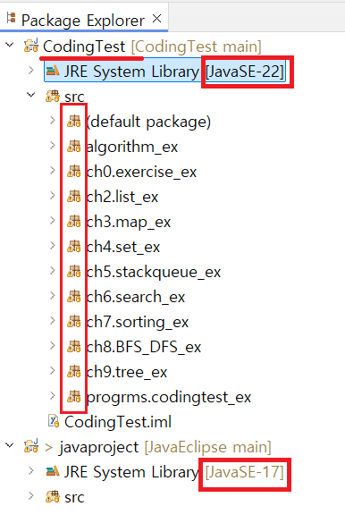

1. # 프로젝트 별로 다른 JDK설치

   깃허브에 있는 프로젝트를 import했는데 JDK버전이 달라 다음과 같이 x표시나 떴습니다.   
      

   현재 이클립스는 JDK17이고 새로 다운 받은 프로젝트의 버젼은 JDK22입니다. 충돌이 발생하는 프로젝트의 버젼을 알고 있어야 합니다. 기존 JDK17 버젼이 있는 상태에서 Coding Test프로젝트에 JDK22버젼을 설치하겠습니다.   

   프로젝트 위에서 마우스의 오른쪽 버튼을 누른 후 Properties선택   
      

   Java Build Path에서 Libraries 탭을 선택 후 Edit 선택   
      

   Java System Library의 Execution Environment에서 탭을 선택하면 스크롤에 자동으로 목록이 나옵니다. JavaSE-22(jre)를 선택합니다.   
      

   JRE System Library `[JavaSE-22]`로 바뀐 것을 확인 후 Apply and Close를 누릅니다.   
      

   Coding Test의 JRE는 JavaSE-22이고, javaproject의 JRE는 JavsSE-17인 것을 확인 할 수 있습니다. 버젼이 변경되면서 기존의 x표시가 모두 사라졌습니다.   
      
