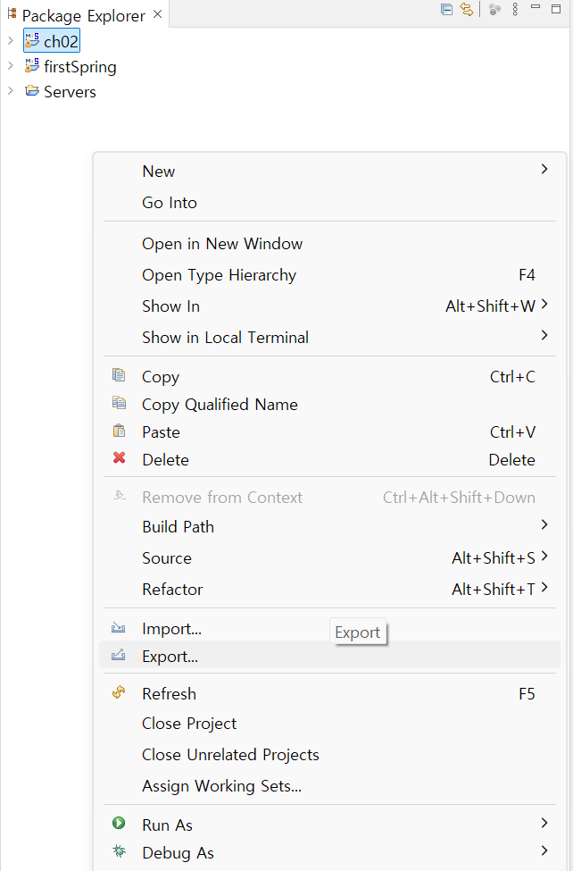
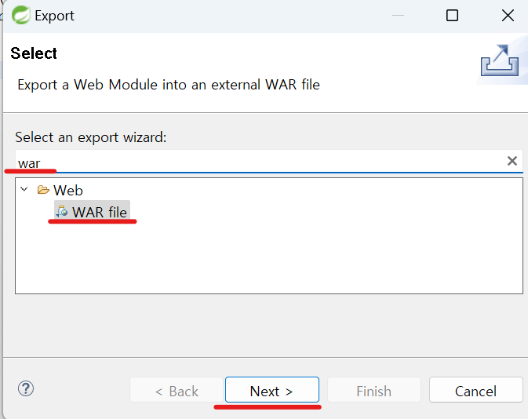
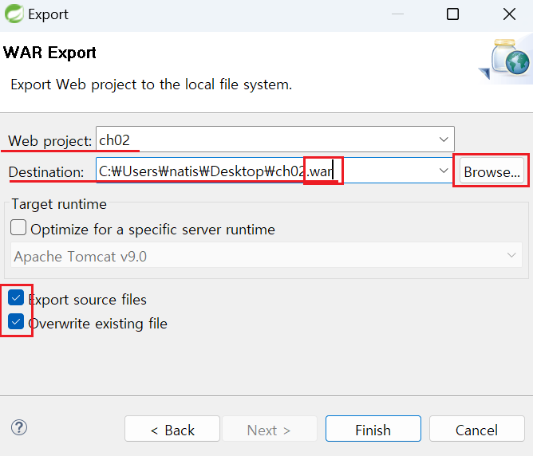
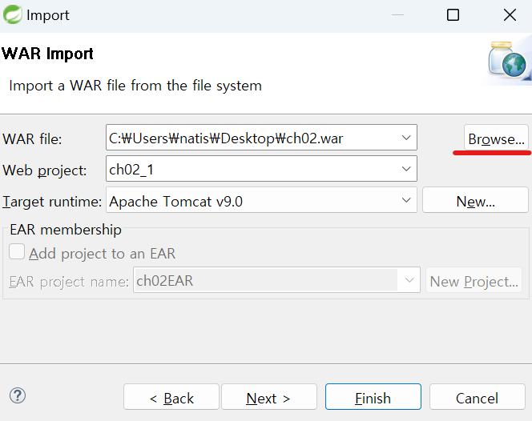

1. # Export
   Package Explorer의 빈 공간 아무곳이나 데고 마우스 오른쪽 버튼을 눌러 Export메뉴를 선택합니다.   
      

   검색창에 war이라고 치면 WAR file이랑 항목이 나타나는데 이것을 선택하고 Next를 누릅니다.   
      

   Web Project에서 Export하고 싶은 프로젝트를 선택합니다.   
   Destination은 war파일을 저장할 위치를 선택합니다. Browse..에서 위치를 선택하면 되는데 그림에서는 바탕화면을 선택했습니다. 파일명의 마지막에는 __.war__ 란 __확장자__  를 입력해줘야 합니다.   
   __밑에 2개의 체크박스를 선택합니다.__   
      

   finish를 누르면 바탕화면에 ch02.war파일이 생기는데 war파일은 Web Achieve File의 약자로 자바 프로젝트 파일을 하나의 파일로 묶어둔 형태인데 war형식과 zip형식이 같습니다. 그렇기 때문에 ch02.war를 ch02.zip로 바꿔서 내부 파일 목록을 볼 수도 있고 압축도 풀수 있습니다.   

1. # Import

   Export와 마찬가지로 Package Explorer의  빈 공간에서 마우스 오른쪽 버튼을 눌러 Import를 선택합니다.   

   검색창에 war라고 쳐서 WAR file을 선택합니다.   

   Browse..를 선택해서 파일을 선택한 후 Finish를 선택합니다.   
      

   느낌표나 엑스표가 뜨면 Build Path를 설정하거나 Properties -> Project Facets에서 버전을 맞춰줍니다.   