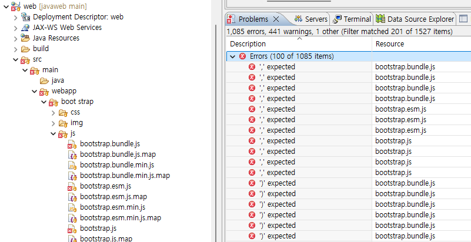
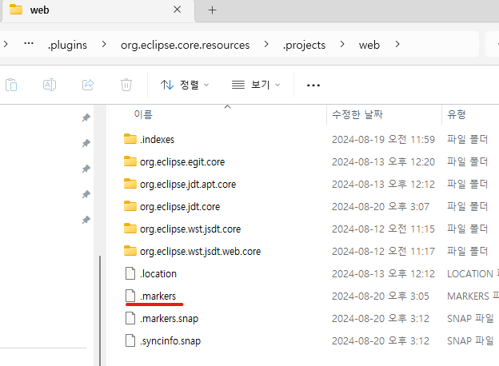
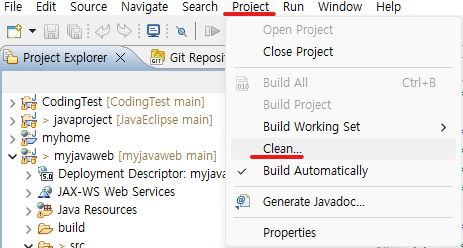
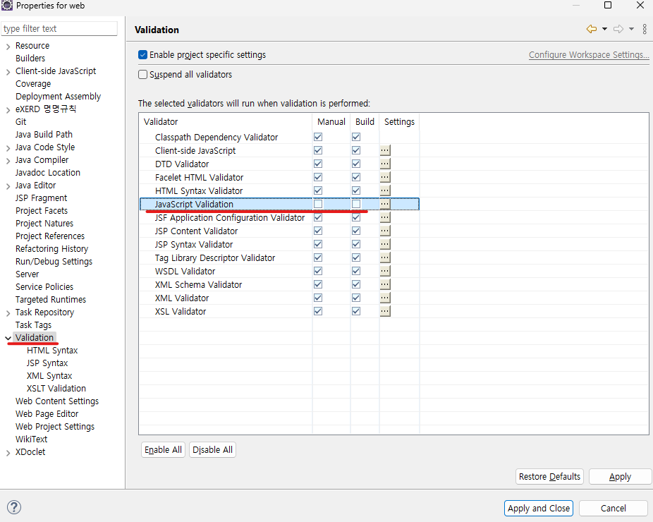
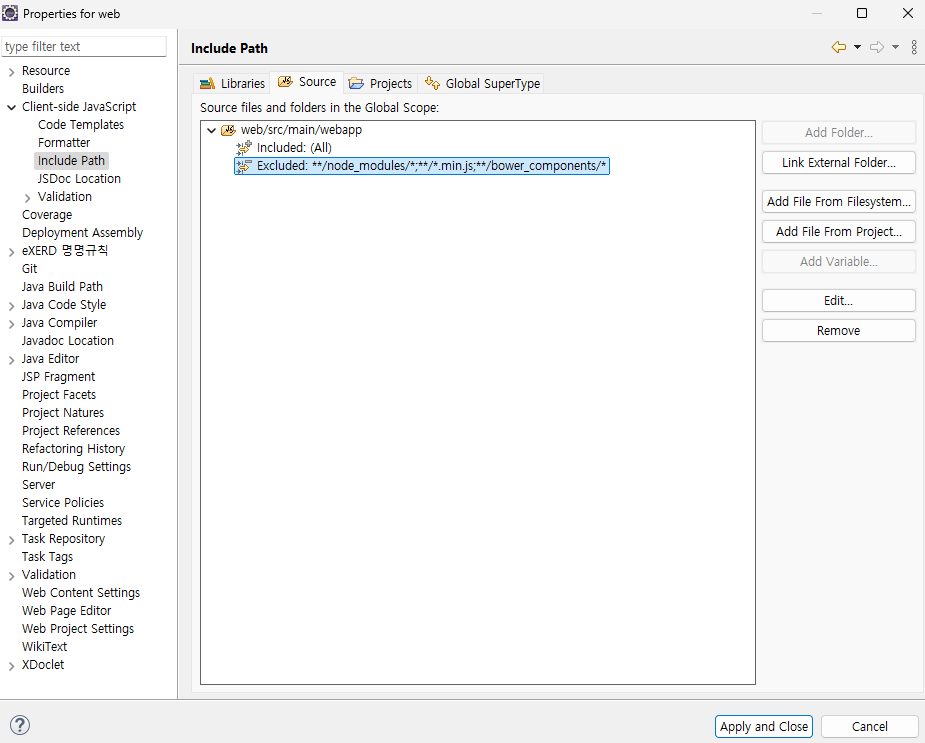

1. # 부트스트랩 사용시 자잘한 오류
   방법.1   
   부트스트랩을 이클립스로 가져오면 프로그램 실행에는 문제가 없는데 엑스표가 뜨는 경우가 종종 있습니다. Problems를 보면 `, ; { )` 의 문법 오류가 대부분 입니다. 이 오류 표시를 없애는 방법입니다.   
      

   이클립스의 eclipse-workspace\.metadata\.plugins\org.eclipse.core.resources\.projects 경로로 가면 현재 이클립스 목록에 있는 프로젝트들이 나타납니다. 오류가 발생한 프로젝트 폴더로 들어가서 .markers 파일을 삭제합니다.   
      

   clean을 해줍니다.   
      

   방법.2   
   해당 프로젝트 위에서 마우스 오른쪽 버튼 -> 가장 하단에 Properties 선택 -> Validation -> JavaScript Validation 체크 해지   
      

   방법.3   
   해당 프로젝트 위에서 마우스 오른쪽 버튼 -> 가장 하단에 Properties 선택 -> Client-side JavaScript -> Inlude Path에서 Source항목 삭제   
      
   *path설정은 중요합니다. 이렇게 하니깐 오류 표시가 없어졌고, 프로그램 실행에도 문제는 없었지만 조심해서 삭제를 해야되겠습니다.   
