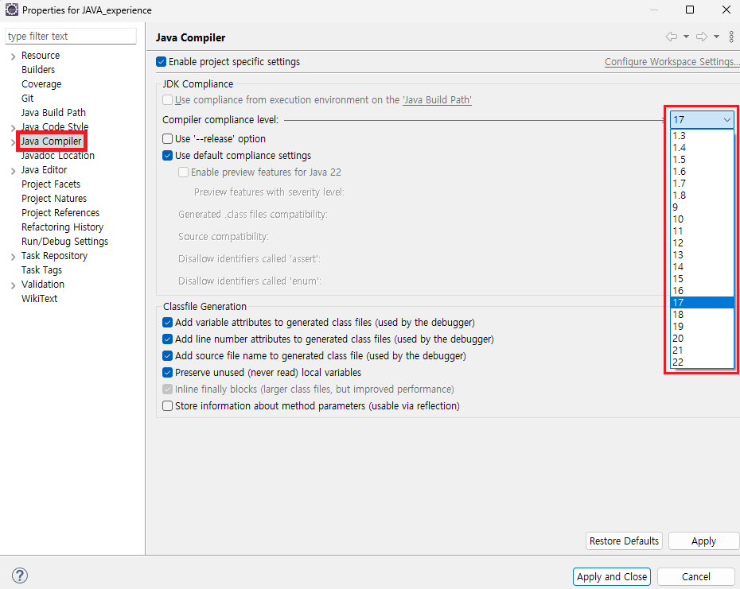

1. # Error: LinkageError occurred while loading main class

   오류 메시지   
   ```
      Error: LinkageError occurred while loading main class mycodingtest.ch07.sorting_ex._2_MakeOrderAsIwant
      java.lang.UnsupportedClassVersionError: mycodingtest/ch07/sorting_ex/_2_MakeOrderAsIwant has been compiled by a more recent version of the Java Runtime (class file version 65.0), this version of the Java Runtime only recognizes class file versions up to 61.0   
   ```
   최근 class file version이 65로 컴파일 되었었는데 현재 61버전으로 컴파일 되어서 오류가 났습니다.   
      

   오른쪽 마우스 → Properties   
      

   Java Compiler → 오른쪽 셀렉트박스에서 현재 JDK 버전 선택   
      

   오른쪽 마우스 → Build Path → Add Libaries...
      

   JRE System Library 선택   
      

   현재 컴퓨터에 설치되어 있는 default JRE 선택. 즉 class file version과 jdk version을 맞춰줘야 합니다.   
      