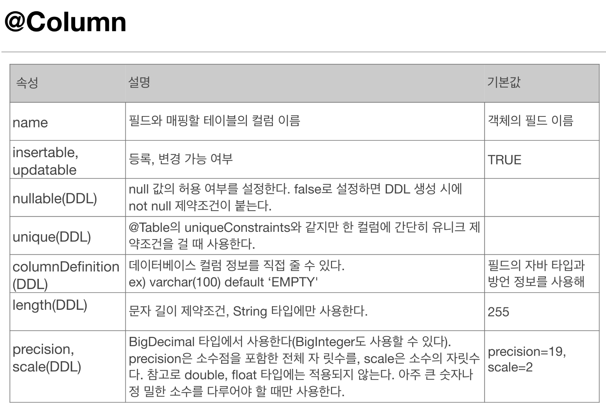

1. # 엔티티 매핑 소개   
   - 객체와 테이블 매핑 : @Entity, @Table   
   - 필드와 컬럼 매핑 : @Column   
   - 기본 키 매핑 : @Id   
   - 연관관계 매핑 : @ManyToOne, @JoinColumn   

1. # 객체와 테이블 매핑
   __@Entity__   
   - @Entity가 붙은 클래스는 JPA가 관리, 엔티티라 한다.   
   - JPA를 사용해서 테이블과 매핑할 클래스는 @Entity 필수   

   __주의__   
   - 기본 생성자 필수   
   - final클래스, enum, interface, inner 클래스에서 사용할 수 없다.   
   - 저장할 필드에 final 사용할 수 없다.   

   __@Table__   
   @Table은 엔티티와 매핑할 테이블 지정   
   |   속성   |   기능   |   기본값   |
   |:--------:|:--------:|:---------:|
   |   name  |매핑할 테이블 이름|엔티티 이름을 사용|
   | catalog | 데이터베이스 catalog 매핑|   |
   |  schema | 데이터베이스 schema 매핑|  |

1. # 데이터베이스 스키마 자동 생성
   - DDL을 애플리케이션 실행 시점에 자동 생성   
   - 테이블 중심 -> 객체 중심   
   - 데이터베이이스 방언을 활용해서 데이터베이스에 맞는 적절한 DDL생성   
   - 이렇게 생성된 DDL은 개발 장비에서만 사용   
   - 생성된 DDL은 운영서버에서는 사용하지 않거나, 적절히 다듬은 후 사용   

   ```java
      <property name="hibernate.hbm2ddl.auto" value="create"/>
   ```   
   hibernate.hbm2ddl.auto   

   |   옵션   |   설명   |
   |:---------:|:---------:|
   | create | 기본 테이블 삭제 후 다시 생성(DROP + CREATE) |
   |create-drop|create와 같으나 종료 시점에 테이블 DROP |
   |update|변경분만 반영(운영 | DB에는 사용하면 안됨) |
   |validate|엔티티와 테이블이 정상 매핑되었는지만 확인|
   | none |사용하지 않음|
   
   __*스키마 자동 생성 주의점__   
   - 운영 장비에 절대 create, create-drop, update 사용하면 안된다.   
   - 개발 초기 단계는 create 또는 update   
   - 테스트 서버는 update 또는 validate   
   - 스테이징과 운영 서버는 validate 또는 none   

1. # DDL 생성 기능(제약 조건 추가) 
   - 제약조건 추가 : 회원 이름은 필수, 10자 초과 안됨   
      => @Column(nullable=false, length=10)   
   - 유니크 제약조건 추가   
      => @Table(uniqueConstraints = (@UniqueConstraintl(name="NAME_AGE_UNIQUE",columnNames={"NAME","AGE"})))
   - DDL 생성 기능(제약 조건 추가)은 DDL을 자동 생성할 때만 사용되고 JPA의 실행 로직에는 영향을 주지 않는다.   

1. # 필드와 컬럼 매핑
   예제)   
   1.회원은 일반 회원과 관리자로 구분해야 한다.   
   2.회원 가입일과 수정일이 있어야 한다.   
   3.회원을 설명할 수 있는 필드가 있어야 한다. 이 필드는 길이 제한이 없다.   

   매핑 어노테이션 정리   
   | 어노테이션 |    설명   |
   |:---------:|:---------:|
   |  @Column  | 컬럼 매핑 |
   | @Temporal |  날짜 타입 매핑 |
   | @Enumerated | enum 타입 매핑 |
   | @Lob | blob(숫자), clob(문자) 매핑|
   | @Transient | 특정 필드를 컬럼에 매핑하지 않음(매핑 무시) |

1. # @Column
      

1. # @Enumerated
   
   |  속성  |  기본값  |
   |:------:|:------:|
   | EnumType.ORIDINAL : enum 순서를 데이터베이스에 저장 | 기본값 O |
   | EnumType.STRING : enum 이르미을 데이터베이스에 저장 | 기본값 X |

1. # 기본 키 매핑

   - 직접 할당 : @Id만 사용   

   - 자동 생성(@)

1. # 실제 예제 - 1.요구사항 분석과 기본 매핑   

1. # 연관 관계의 이해   
   JPA에서 연관관계는 영속객체(Entity)간의 관계를 의미합니다.   
   영속객체 간의 연관관계는 __방향성__ 을 가지며, 단방향, 양방향 그 특성에 따라 구분합니다.   
   연관관계는 관계의 __다중성__ 에 따라 일대일(1:1), 일대다(1:N), 다대일(N:1) 관계로 구분합니다.   
   영속객체가 테이블과 맵핑되는 것과 마찬가지로 영속객체간의 관계는 테이블간의 관계와 매핑됩니다.   
   영속객체간 관계 그리고 테이블간 관계에는 차이가 있으므로 이를 이해하고 매핑을 구성하는 것이 중요.   

1. # 연관 관계의 방향성(1/3) - @ManyToOne, @JoinColumn   
   영속객체 간의 관계는 방향성을 갖습니다. Student클래스가 Major클래스를 참조함으로 Student -> Major의 방향성을 갖습니다.   
   따라서, Student 객체는 참조하는 major를 통해 Major의 인스턴스 객체에 접근할 수 있습니다.   
   또한 하나의 Major를 다수의 Student가 참조하기 때문에 N:1의 관계를 갖습니다.   
   Student클래스는 Major클래스에 대해 ManyToOne의 관계, 그 반대의 경우에는 OneToMany의 관계가 됩니다.   

   ```java
      @Entity
      @Table(name="STUDENT_TB")
      public class Student{

         @Id
         @GeneratedValue
         private Long studentId;
         private String name;
         private String grade;

         @ManyToOne
         /*
         * Many는 Student
         * One는 Major
         * 현재클래스(Student) To 참조되는클래스(Major)
         *
         * Student 1명 - Major 1개
         * Major 1개 - Student 여러명
         *
         * 손님 1명 - 메뉴 여러개
         * 메뉴 1개 - 손님 1명
         * 주문 - 손님 여러명, 메뉴 여러개
         * 주문 테이블에 ManyToMany 관계
         * */
         @JoinColumn(name="MAJORID")
         private Major major;

         public Student(String name, String grade){
            this.name = name;
            this.grade = grade;
         }
      }
   ```   
   *ManyToMany   
   손님 1명 - 메뉴 여러개   
   메뉴 1개 - 손님 1명   
   주문 - 손님 여러명, 메뉴 여러개   
   주문 테이블에 ManyToMany 관계   

1. # JpaRepository
   ```java      
      @Repository
      public interface BoardRepository extends JpaRepository<Board, Integer>{

      //	public Board save(Board board);				// 글작성, 글수정 
      //	public long count();						// 글 갯수 
      //	public void delete(Board board);			// 글삭제 
      // public Board findByNo(int no);				// 상세 정보
         
         // JPQL
         @Query(value="select * from boards order by no desc limit :start, 10", nativeQuery = true)
         public List<Board> findAll(@Param("start")  int start);		// 전체 목록 검색	
      }
   ```   

   BoardRepository가 JpaRepository<Board, Integer>를 상속받았기 때문에   
   ```java
      //	public Board save(Board board);				// 글작성, 글수정 
      //	public long count();						// 글 갯수 
      //	public void delete(Board board);			// 글삭제 
      // public Board findByNo(int no);				// 상세 정보
   ```   
   다음을 주석처리해도 모든 기능을 수행할 수 있습니다.   

   JpaRepository<T, ID>는 CrudRepository<T, ID>와 PagingAndSortingRepository<T, ID>를 포함하며, 기본적인 CRUD 메서드를 제공합니다. JpaRepository를 상속받으면 아래와 같은 메서드들을 따로 정의하지 않아도 자동으로 사용할 수 있습니다.   

   __JpaRepository가 제공하는 주요 메서드__   
   + save(S entity): 엔티티 저장 및 수정   
   + findById(ID id): 특정 ID로 조회   
   + findAll(): 전체 조회   
   + count(): 레코드 개수 반환   
   + delete(T entity): 엔티티 삭제   
   + deleteById(ID id): ID로 엔티티 삭제   


   

   


