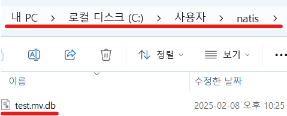
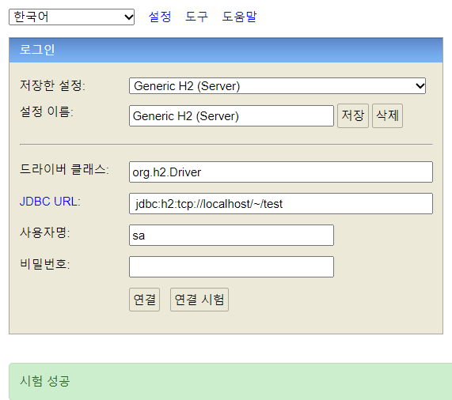

1. # H2 연결 시 에러

      

   test란 db가 없어서이다. 예전엔 db가 없으면 생성을 했지만 지금은 보안상의 이유로 직접 생성해야 한다.   

   ```
      jdbc:h2:tcp://localhost/~/test 
   ```   
   localhost의 C:/User/myuser(해당 자신의 유저폴더)에 test.mv.db파일을 생성한다.   

      

   연결 시험을 누르면 "시험 성공"이 뜬다.   

      


