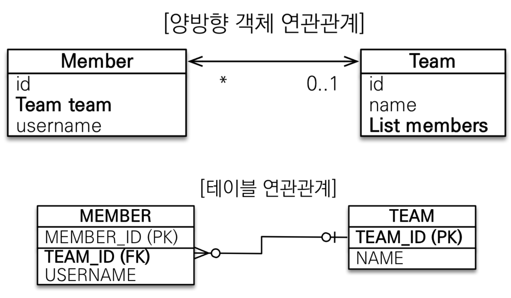
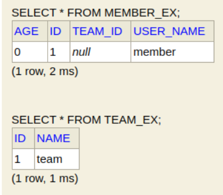
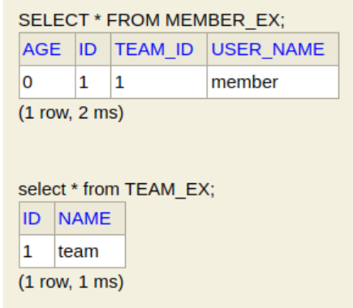

1. # 객체와 테이블 연관관계의 차이를 이해

1. # 객체의 참조와 테이블의 외래 키를 매핑

1. # 용어 이해
   방향(Direction) : 단방향, 양방향   
   다중성(Multiplicity) : 다대일(N:1), 일대다(1:N), 일대일(1:1), 다대다(N:N)   
   연관관계의 주인(Owner) : 객체 양방향 연관관계는 관리   

1. # 단방향 연관관계 예제 시나리오
   회원과 팀이 있다.   
   회원은 하나의 팀에만 소속될 수 있다.   
   회원과 팀은 다대일 관계이다.   

   ```java
      //Team객체
      @Entity
      public class Team {
         
         @Id @GeneratedValue
         private Long id;
         private String name;
      }

      //Member객체
      @Entity
      class MemberOfTeam{

         @Id @GeneratedValue
         private Long id;

         @Column(name = "USER_NAME")
         private String name;
         private int age;

         //@Column(name = "TEAM_ID")
         //private Long teamId;

         @ManyToOne //MemberOfTeam입장 To Team입장
         @JoinColumn(name = "TEAM_ID")  //Join하는 컬럼이 TEAM_ID이다. 이 TEAM_ID는 DB에 존재하는 컬럼.
         private Team team;
      }
   ```   
   팀은 1개, 멤버는 여러명 => 멤버가 팀을 포함, 멤버에서 팀을 참조   
        

   ```java
      public static void main(String[] args) {
        //basic_execute();
        //columnMapping();

        EntityManagerFactory emf = Persistence.createEntityManagerFactory("hello");
        EntityManager em = emf.createEntityManager();
        EntityTransaction tx = em.getTransaction();

        tx.begin();

        try{

            Team team = new Team();
            team.setName("TeamA");
            em.persist(team);
           
            MemberOfTeam member = new MemberOfTeam();

            member.setName("member1");
            
            //mot.setTeamId(team.getId()); //위에 persist를 하면 영속상태가 되고 자동으로 team에 id값이 입력된다. 
            
            //이제 getId로 team의 pk를 넣는게 아니라 team클래스 자체를 넣는다
            member.setTeam(team);  
            
            em.persist(member);

            /* 
            persist를 하면 영속성 컨텍스트의 캐쉬에 값이 저장된다 밑에 find로 찾은 값은 영속성 컨텍스트의 캐쉬에 있는 값이다.
            영속성 컨텍스트 말고 DB에서 바로 값을 불러오고 싶으면 다음과 같이 하면 된다
            */
            em.flush(); //sql문을 날려서 DB에 강제 저장
            em.clear(); //영속성 컨텍스 값을 초기화. 이렇게하면 영속성 컨텍스트의 캐쉬에 값이 없기 때문에 DB에서 찾아서 바로 가져온다

            MemberOfTeam findmember = em.find(MemberOfTeam.class, member.getId());
            
            //Team findteam = em.find(Team.class, findmember.getTeamId());
            //이제 findmember인 찾은 멤버에서 바로 team을 불러온다
            Team findteam = findmember.getTeam();

            System.out.println("------------------------------------"+findteam.getName());

            /*
            수정 - DB에 10번 팀이 있다고 가정하고 팀을 10번 팀으로 바꾸는 경우
            Team newTeam = em.find(Team.class, 10L);
            findmember.setTeam(newTeam); //setTeam으로 그냥 team을 입력하면 끝
            */
            tx.commit();

        } catch (Exception e) {
            tx.rollback();
            throw new RuntimeException(e);
        }finally {
            em.close();
        }
        emf.close();
    }
   ```

1. # 양방향 연관관계
    
   __1.단방향 연관 관계__   
   팀은 1개, 멤버는 여러명 => 멤버가 팀을 포함, 멤버에서 팀을 참조   
      
   SQL의 테이블 :   
   MEMBER테이블이 TEAM을 참조   

   JAVA의 객체 연관관계 :   
   Member클래스에 Team을 선언   

   __2.양방향 연관 관계__   
      
   SQL의 테이블 :   
   MEMBER테이블이 TEAM을 참조   

   JAVA의 객체 연관관계 :   
   Member클래스에 Team을 선언   
   Team클래스에 Member클래스를 List로 삽입   

   __테이블과 객체의 차이 이해__   
   테이블은 FK제약 조건을 통해 TEAM테이블에서 MEMBER테이블을 조회 가능   
   하지만, 객체는 Member클래스에서 Team을 조회는 가능하지만 Team에서 Member을 조회할 수 없음. 그래서 Team에 Member값을 List로 저장    

   테이블은 __외래 키 하나__ 로 __두 테이블__ 의 연관관계를 관리   
   ```   
      SELECT * 
      FROM MEMBER M JOIN TEAM T
      ON M.TEAM_ID = T.TEAM_ID

      SELECT *
      FROM TEAM T JOIN MEMBER M
      ON T.TEAM_ID = M.TEAM_ID
   ```   
   조인으로 MEMBER 테이블에서 TEAM 테이블에 접근 가능하고 TEAM 테이블에서도 MEMBER 테이블에 접근 가능하다.   

   __소스로 이해__   
   한명의 Member는 하나의 Team에 소속   
   하나의 Team은 다수의 Member에 포함   
   Member - many, Team - one   

   ```java

      // -- Member클래스 --
      @Entity
      class Member{

         @Id @GeneratedValue
         private Long id;

         @Column(name = "USER_NAME")
         private String name;
         private int age;

         @ManyToOne //MemberOfTeam입장 To Team입장
         @JoinColumn(name = "TEAM_ID")  //Join하는 컬럼이 TEAM_ID이다. 이 TEAM_ID는 DB에 존재하는 컬럼.
         private Team team; //member에서 team을 참조
      }

      // -- Team 클래스 --
      @Entity
      public class Team{
   
         @Id @GeneratedValue
         private Long id;
         private String name;

         /*
         @OneToMany(mappedBy = "team")에서 mappedBy = "team"의 "team"은 MemberOfTeam2 엔티티에 있는 team 필드를 의미합니다.
         즉, MemberOfTeam2 클래스 내부에 @ManyToOne 관계로 선언된 team 필드가 있어야 합니다.
         1:N 연결에서 Team2가 어디랑 연결되어 있는지 알려주는 명령어 - mappedBy
         */
         @OneToMany(mappedBy= "team") //team은 필드명   
         private List<Member> members = new ArrayList<>(); 
      }
   ```   
   Member에서 team을 참조하기 때문에 Member에 team을 포함   
   => many에서 one을 참조하기 때문에 many에 one을 포함 : 자연스러운 설계   

   Team에서 Member를 참조하기 위해서 List와 mappedBy 이용   
   => one에서 many를 참조하기 위해서 List와 mappedBy 이용   

   Many에 joinColumn, One에 mappedBy   

   __*mappedBy에 들어가는 건 필드명__   
   왜? 양방향은 자바에서 객체가 사용하기 위해서 설정하는 것   

1. # mappedBy와 주인   
   mappedBY는 주인을 지정하는 키워드입니다. By가 '~에 의해'라는 뜻이기 때문에 
   ```cs
      @OneToMany(mappedBy= "team") 
      private List<Member> members = new ArrayList<>(); 
   ```   
   이라고 하면 team에 의해 매핑된 컬럼이 members이다란 의미가 됩니다.   
   members의 주인은 team이다   

   주인이란?   
   __외래키__ 가 있는 곳이 주인, ManyToOne에서 __Many부분__    
   =>Member와 Team에서 Member테이블이 Team의 FK를 가지고 있다. FK를 가지고 있는 Member가 주인, 참조되는 Team에 mappedby를 붙임   

      

   __*mappedBy가 적혀있는 테이블은 읽기만 됨, update와 같은 수정은 되지 않음__   
   mappdeBy는 가짜 매핑! 소스로 이해하기 =>   
   ```java
      // -- Team -- : Team은 one, one에서 mappeBy설정
      @Entity
      public class Team{
         @Id @GeneratedValue
         private Long id;
         private String name;

         @OneToMany(mappedBy="team")
         private List<Member> members = new ArrayList<>();
      }

      // -- Member -- : Member은 many, many에서 one에 있는 컬럼을 가지고 있고,  FK가 되고, 주인이된다
      @Entity
      public class Member{

         @Id @GeneratedValue
         private int id;
         @Column(name="USER_NAME")
         private String name;
         private int age;

         @ManyToOne 
         @JoinColumn(name = "TEAM_ID")
         private Team team;
      }

      // -- main --
      Member member = new Member();
      member.setName("member");
      em.persist(member);

      Team team = new Team();
      team.setName("team");
      team.getMembers().add(member); //mappedBy가 있는 members를 가져와서 여기에 member을 저장
      em.persist(team);
      // => 이 경우 
   ```
   // => 이 경우 one에 해당하는 Team에서 mappedBy된 members에 member을 add했다.   
   결과는 다음과 같이 TEAM_ID컬럼에 아무런 값이 반영되지 않습니다.   
      
   (MEMBER_EX는 MEMBER와 같고, TEAM_EX는 TEAM과 같다)   
   team.getMembers()로 member를 가져와 와서 여기에 member를 add했기 때문에 team.getMembers().add(member); 이 코드는 객체의 컬렉션(List)에만 추가될 뿐, 데이터베이스에는 아무런 영향을 주지 않습니다.   
   <br>
   💡 왜 데이터베이스에 반영되지 않는가?   
   mappedBy="team"을 사용한 members 컬렉션은 연관관계의 주인이 아니기 때문입니다.   
   mappedBy="team"은 Member.team 필드가 관계의 주인이라는 뜻입니다. 즉, 외래 키(TEAM_ID) 값을 관리하는 것은 Member 엔티티의 team 필드입니다. Team.members 컬렉션을 수정해도 JPA는 이를 감지하지 않습니다.   
   team.getMembers().add(member); 이 코드는 단순히 자바 객체의 리스트에 추가하는 것일 뿐, JPA가 이를 데이터베이스에 반영하지 않습니다.   

   __수정 코드__   
   ```java
      Team team = new Team();
      team.setName("team");
      em.persist(team);

      //연관관계의 주인에 set을 입력
      Member member = new Member();
      member.setName("member");
      member.setTeam(team); //Team을 setTeam으로 입력
      em.persist(member);
   ```
   연관 관계의 주인에 데이터를 입력을 합니다.   
      

1. # 양방향 연관관계 주의점
   
   1.연관관계 편의 메소드를 생성하자   
   2.양방향 매핑시 무한 루프를 주의하자   
      ex)toString(), lombok, JSON생성 라이브러리   
   3.__단방향 매핑만으로도 이미 연관관계 매핑은 완료__    
   4.양방향 매핑은 반대 방향으로 조회(객체 그래프 탐색) 기능이 추가된 것 뿐   
   5.JPQL에서 역방향으로 탐색할 일이 많음   
   6.단방향 매핑을 잘 하고 양방방향은 필요할 때 추가해도 됨(테이블에 영향을 주지 않음)   

1. # 양방향 연관관계를 맺는 이유   
   양방향 연관 관계를 맺으로써 양쪽 엔티티에서 서로 쉽게 참조할 수 있습니다. Member에서 Team으로 접근이 가능하고 Team에서 Member로 접근이 가능합니다.   
   한번의 쿼리를 데이터를 가져올 수 있기 때문에 성능이 좋습니다.   
   객체 지향적인 설계를 유지 할 수 있습니다.   

