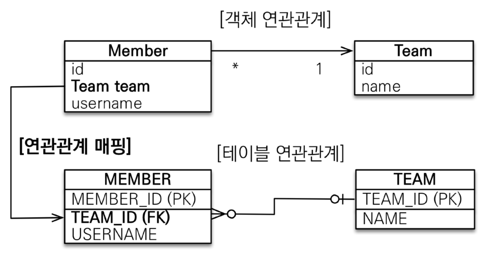
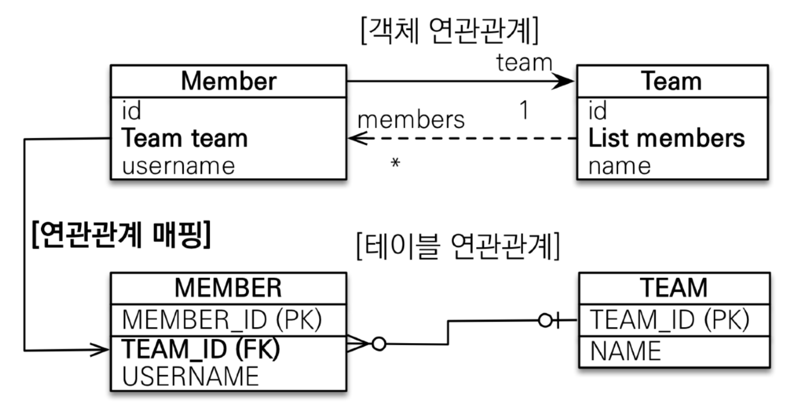
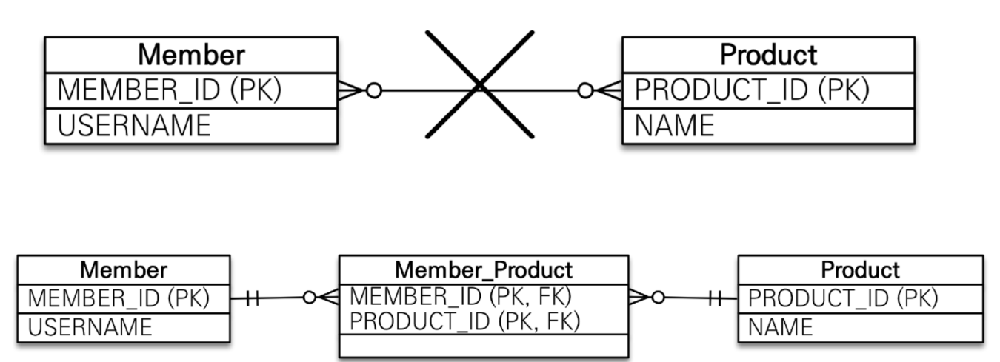
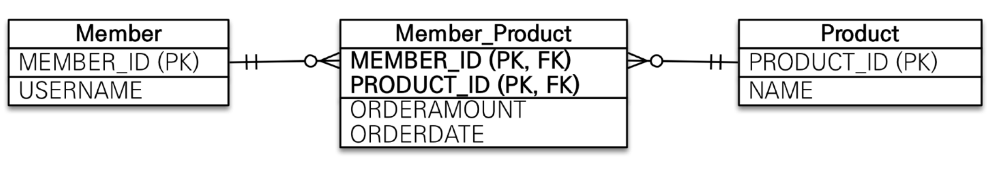
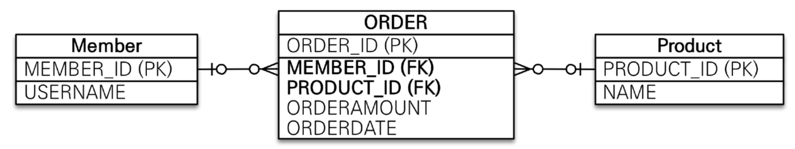

1. # 연관관계 매핑시 고려사항 
   1.다중성   
   2.단방향, 양방향   
   3.연관관계의 주인   

1. # 다중성
   1.다대일 : @ManyToOne   

   2.일대다 : @OneToMany   

   3.일대일 : @OneToOne   

   4.다대다 : @ManyToMany   

1. # 단방향, 양방향
   테이블   
   1.외래 키 하나로 양쪽 조인 가능   
   2.방향이라는 개념이 없음   

   객체   
   1.참조용 필드가 있는 쪽으로만 참조 가능   
   2.한쪽만 참조하면 단방향   
   3.양쪽이 서로 참조하면 양방향   

1. # 다대일(Many To One) 단방향

       

   ```java
      //Member클래스
      public class Member{

         @Id @GeneratedValue
         @Column(name = "MEMBER_ID")
         private Long id;

         ...

         @ManyToOne //Member이 다 : Team이 1 이된다
         @joinColumn(name = "TEAM_ID") //Team클래스의 컬럼명 => TEAM_ID, 조인 컬럼 설정
         private Team team;

         ...
      }

      //Team클래스
      public class Team{

         ...

         @Id @GeneratedValue
         @Column(name = "TEAM_ID")
         private Long id;

         ...
      }
   ```   
   Many부분에 Team의 FK를 포함

1. # 다대일(Many To One) 양방향   
        

   ```java
      //Member클래스
      public class Member{

         @Id @GeneratedValue
         @Column(name = "MEMBER_ID")
         private Long id;

         ...

         @ManyToOne //Member이 다 : Team이 1 이된다
         @joinColumn(name = "TEAM_ID") //Team클래스의 컬럼명 => TEAM_ID, 조인 컬럼 설정 
         private Team team;  

         ...
      }

      //Team클래스
      public class Team{

         ...

         @Id @GeneratedValue
         @Column(name = "TEAM_ID")
         private Long id;

         ...

         @OneToMany(mappedBy = "team")  //mappedBy의 값이 주인이 되며 필드명이다
         private List<Member> members = new ArrayList<>(); //양방향을 위해 추가. members.team이 맵핑
      }
   ```   
   단방향에서 양방향을 추가 한다고해서 테이블에 영향을 주지 않는다. 그렇기 때문에 단방향 설계를 모두한 이후에 필요에 따라 양방향으로 설정하면 된다.   
   Many부분이 FK를 포함하고 연관관계의 주인이 된다.   
   
   @OneToMany(mappedBy = "team")   
   private List<Member> members = new ArrayList<>()   
   의미 : Member엔티티의 __team필드__ 가 주인이며, 외래키 값을 관리하는 것은 Member엔티티의 team필드이다   

   이 소스 부분을 통해 Team에서도 member를 조회할 수 있다(조회만 가능)   

1. # 일대일(One To One) 단방향 

   Member와 Locker가 있을 때 한명의 멤버가 하나의 락커만 사용가능 하다고 가정   

   Member클래스에서 Locker클래스를 참조   
   ```java
      //Member클래스
      @Entity
      class Member{
         ...

         @OneToOne
         @JoinColumn(name = "LOCKER_ID")
         private Locker locker;

         ...
      }

      //Locker클래스
      @Entity
      public class Locker {
         ...

         @Id @GeneratedValue
         @Column(name = "LOCKER_ID")
         private Long id;
         ...
      }
   ```

   Locker클래스에서 Member클래스를 참조   
   ```java
      //Member클래스
      @Entity
      class Member{
         
         @Id @GeneratedValue
         @Column(name = "MEMBER_ID")
         private Long id;
         
         ...
      }

      //Locker클래스
      @Entity
      public class Locker {
         ...
         
         @OneToOne
         @joinColumn(name = "Member_id")
         private Member member;
         ...
      }
   ```

1. # 일대일(One To One) 양방향 

   ManyToOne 방식과 같이 단방향 방식에서 양방향 List가 필요한 컬럼에 추가하면 됩니다.   

   Member클래스에서 Locker클래스를 참조한 구조에서의 양방향   
   ```java
      //Member클래스
      @Entity
      class Member{
         ...

         @OneToOne
         @JoinColumn(name = "LOCKER_ID")
         private Locker locker;

         ...
      }

      //Locker클래스
      @Entity
      public class Locker {
         ...

         @Id @GeneratedValue
         @Column(name = "LOCKER_ID")
         private Long id;
         ...

         @OneToOne(mappedBy = "locker")
         private List<Member> members = new ArrayList<>(); //이걸 추가해주므로 Locker에서도 member에 접근 가능
      }
   ```

1. # 다대다(Many To Many)
   관계형 데이터 베이스는 정규화된 테이블 2개로 다대다 관계를 표현 할 수 없습니다. 연결 테이블을 추가해서 일대다, 다대일 관계로 풀어내야 합니다.   

       

   Member테이블과 Product테이블의 관계는 한명의 회원이 여러개의 상품을 선택할 수 있고, 하나의 상품을 여러명의 회원이 선택할 수 있기 때문에 다:다 관계입니다. 하지만 RDBMS에서 다:다 관계는 실무에서 사용할 수 없기 때문에 다:다 관계를 중간에 테이블을 하나 생성해 일대다 와 다대일로 나눠야합니다. 이때 새로 생성하는 테이블의 PK를 설정하는 방식에는 2가지가 있습니다.   

       
   다음과 같이 Member와 Product를 합쳐 하나의 PK를 생성할 수 있고

       
   다음과 같이 새로운 ORDER_ID란 PK를 생성할 수 있습니다.   

   실무에서는 한번 테이블을 만들면 오랜기간 변경을 할 수 없기 때문에 좀 더 유연하고 활용성이 뛰어난 ORDER_ID컬럼을 새로 만들어서 PK를 생성할 것을 권합니다.   

   Member과 Product테이블에 ORDER테이블을 생성하여 다:다에서 일:다 와 다:일로 변경해보겠습니다.   

   ```java
      // -- MEMBER --
      @Entity
      public class Member {

         @Id @GeneratedValue
         @Column(name = "MEMBER_ID")
         private int id;

         //객체는 username, DB명은 name
         @Column(name="USERNAME")
         private String name;

         @OneToMany(mappedBy = "member")
         private List<Order> order = new ArrayList<>();
      }

      //-- PRODUCT --
      @Entity
      public class Product {
         
         @Id @GeneratedValue
         @Column(name = "PRODUCT_ID")
         private Long id;

         private String name;

         @OneToMany(mappedBy = "product")
         private List<Order> order = new ArrayList<>();
      }

      //-- ORDER --
      @Entity
      public class Order {
         
         @Id @GeneratedValue
         @Column(name = "ORDER_ID")
         private Long id;

         @ManyToOne
         @JoinColumn(name = "MEMBER_ID")
         private Member member;

         @ManyToOne
         @JoinColumn(name = "PRODUCT_ID")
         private Product product;
      }
   ```   
   


   

