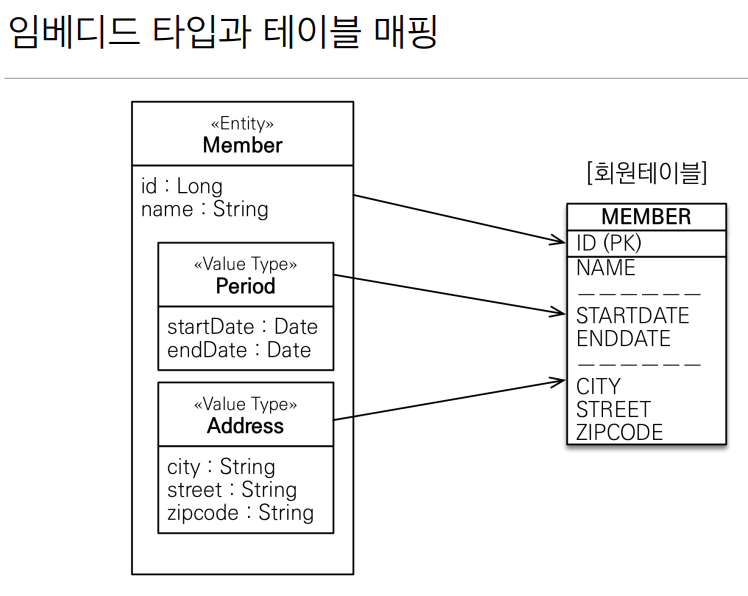
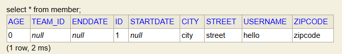

1. # 엔티티 타입
   @Entity로 정의하는 객체   
   데이터가 변해도 식별자로 지속해서 추적 가능   
   예)회원 에티티의 키나 나이 갓ㅂ을 변경해도 식별자로 인식 가능   

1. # 값 타입    
   int, Integer, String처럼 단순히 값으로 사용하는 자바 기본 타입이나 객체   
   식별자가 없고 값만 있으므로 변경시 추적 불가   
   예)숫자 100을 200으로 변경하면 완전히 다른 값으로 대체   

1. # 기본값 타입
   자바 기본 타입(int, double)   
   래퍼 클래스(Integer, Long)   
   String

1. # 임테디드 타입(embedded type, 복합 값 타입)
   새로운 값 타입을 직접 정의할 수 있음   
   JPA는 임베디드 타입(embedded type)이라 함   
   주로 기본 값 타입을 모아서 만들어서 복합 값 타입이라고도 함   
   int, String과 같은 값 타입   

      
   오른쪽 회원테이블은 모든 값을 다 가지고 있지만 왼쪽 객체는 필드별, 메소드별로 구분하기 위해서 클래스 별로 종류를 나눈다.   

   클래스 분류 없이 모두 집어넣은 경우   
   기간 startDate와 endDate   
   주소 city, street, zipcode   
   를 하나의 테이블에 모두 삽입   
   ```java
      @Entity
      public class Member {
         
         @Id @GeneratedValue
         private Long id;
         private String username;
         private int age;

         //기간 Period
         private LocalDateTime startDate;
         private LocalDateTime endDate;

         //주소 Address
         private String city;
         private String street;
         private String zipcode;
      }

      //테이블 생성 결과
      Hibernate: 
         create table Member (
            age integer not null,
            TEAM_ID bigint,
            endDate timestamp(6),
            id bigint not null,
            startDate timestamp(6),
            city varchar(255),
            street varchar(255),
            username varchar(255),
            zipcode varchar(255),
            primary key (id)
         )
   ```   

   @Embeddable : 값 타입을 정의한 곳에 표시   
   @Embedded : 값 타입을 사용하는 곳에 표시   
   기본 생성자 필수   

   Period.java를 따로 생성   
   ```java
      //- Period.java - 
      @Embeddable //정의 하는 곳의 어노테이션
      public class Period {
         private LocalDateTime startDate;
         private LocalDateTime endDate;
      }

      public Period() {}

      public Period(LocalDateTime endDate, LocalDateTime startDate) {
         this.endDate = endDate;
         this.startDate = startDate;
      }

      //- Address.java -
      @Embeddable
      public class Address {
         private String city;
         private String street;
         private String zipcode;
      }

      public Address() {}
      
      public Address(String city, String street, String zipcode) {
         this.city = city;
         this.street = street;
         this.zipcode = zipcode;
      }

      //- Member.java -
      @Entity
      public class Member {
         
         @Id @GeneratedValue
         private Long id;
         private String username;
         private int age;

         @Embedded //사용할 때는 embedded 사용
         private Period period;

         @Embedded
         private Address address;
      }

      //- main.java -
      public static void main(String[] args) {
         EntityManagerFactory emf = Persistence.createEntityManagerFactory("hello");
         EntityManager em = emf.createEntityManager();
         EntityTransaction tx = em.getTransaction();

         tx.begin();

         try{
            Member member = new Member();
            member.setUsername("hello");
            member.setAddress(new Address("city", "street", "zipcode"));
            member.setPeriod(new Period());

            em.persist(member);
            tx.commit();

         }catch (Exception e){
            e.printStackTrace();
            tx.rollback();
         }finally {
            em.close();
         }
         emf.close();
      }

      //테이블 생성 결과
      Hibernate: 
         create table Member (
            age integer not null,
            TEAM_ID bigint,
            endDate timestamp(6),
            id bigint not null,
            startDate timestamp(6),
            city varchar(255),
            street varchar(255),
            username varchar(255),
            zipcode varchar(255),
            primary key (id)
         )
   ```   
      
   테이블 생성 결과는 Embedded를 설정하기 전과 후가 같다. Embedded는 __객체를 구분__ 하기 위해서 사용   
   임베디드 타입을 사용하기 전과 후에 __매핑하는 테이블은 같다__.   

1. # 컬렉션 값 타입(collection value type)