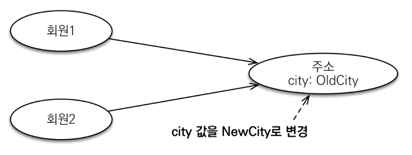
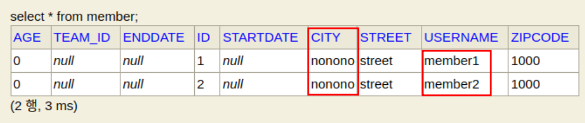
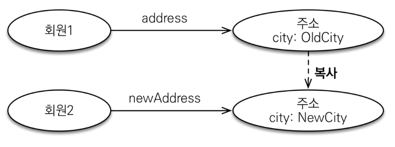
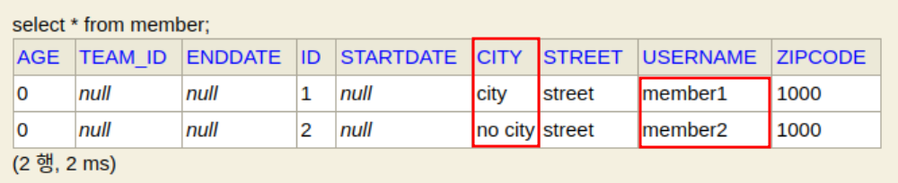

1. # 값 타입이란
   값 타입은 복잡한 객체 세상을 조금이라도 단순화하려고 만든 개념이다. 따라서 값 타입은 단순하고 안전하게 다룰 수 있어야 한다.   

    1)__기본값 타입__   
   (1)자바 기본 타입(int, double)   
   (2)래퍼 클래스(Integer, Long)   
   (3)String   

   2)__임베디드 타입(embedded type, 복합 값 타입)__   

   3)__컬렉션 값 타입(Collection Value Type)__   

1. # 값 타입 공유 참조
   임베디드 타입 같은 값 타입을 여러   엔티티에서 공유하면 위험함   

        
   회원1과 회원2가 동시에 city를 참조하고 있는 경우 회원2에서 city를 변경하면  회원1의 출력값에도 변경된 값이 나오게 된다.   

   ```java
      Address address = new Address("city", "street", "1000");
                    
      Member member1 = new Member();
      member1.setUsername("member1");
      member1.setAddress(address);
               
      Member member2 = new Member();
      member2.setUsername("member2");
      member2.setAddress(address);
               
      member2.getAddress().setCity("nonono");
   ```   
   address를 member1과 member2가 같이 참조했기 때문에 member1의 값이 member2에 의해 바뀐다.   
        

1. # 값 타입 복사
   값 타입의 실제 인스턴스인 값을 공유하는 것은 위험   
   대신 값(인스턴스)를 복사해서 사용   
   위의 예제에 address처럼 값을 member1에도 넣고 member2에도 넣어서 __공유__ 하는 것이 아니라 __복사__ 를 해서 입력해야한다.   

      

   ```java
      Address address = new Address("city", "street", "1000");
                  
      Member member1 = new Member();
      member1.setUsername("member1");
      member1.setAddress(address);
      
      Address copyAddress = new Address(address.getCity(), address.getStreet(), address.getZipcode()); //copyAddress를 새로 생성

      Member member2 = new Member();
      member2.setUsername("member2");
      member2.setAddress(copyAddress);
   ```   
   address값을 get으로 가져와서 새로운 copyAddress를 새로 생성   

       

1. # 객체 타입의 한계
   항상 값을 복사해서 사용하면 공유 참조로 인해 발생하는 부작용을 피할 수 있다.   
   문제는 임베디드 타입처럼 직접 정의한 값 타입은 자바의 기본 타입이 아니라 객체 타입이다.   
   자바 기본 타입에 값을 대입하면 값을 복사한다.  
   객체 타입은 참조 값을 직접 대압하는 것을 막을 방법이 없다.  
   객체의 공유 참조는 피할 수 없다.   

1. # 객체 타입의 한계
   기본 타입(primitive type)
   ```java
      int a = 10;
      int b = a; //기본 타입은 값을 복사
      b = 4;
   ```   

   객체 타입   
   ```java
      Address a = new Address("Old");
      Address b = a; //객체 타입은 참조를 전달
      b.setCity("New");
   ```   

1. # 불변 객체
   객체 타입을 수정할 수 없게 만들면 부작용을 원천 차단   
   값 타입은 불변 객체(immutable object)로 설계해야 함   
   불변 객체 : 생성 시점 이후 절대 값을 변경할 수 없는 객체   
   생성자로만 값을 설정하고 수정자(Setter)를 만들지 않으면 됨   
   참고 : Integer, String은 자바가 제공하는 대표적인 불변 객체   

   __불변은 일종의 제약(무엇인가를 제한함)__   
   =>Setter를 만들지 않는 것   
   ```java
      Address address = new Address("city", "street", "1000");
                    
      Member member1 = new Member();
      member1.setUsername("member1");
      member1.setAddress(address);
               
      Member member2 = new Member();
      member2.setUsername("member2");
      member2.setAddress(address);
               
      member2.getAddress().setCity("nonono"); //Address엔티티에 set자체를 없앤다
   ```   

   그럼 Setter를 만들지 않고 어떻게 값을 변경하나?   
   ```java
      Address address = new Address("city", "street", "1000");
                  
      Member member1 = new Member();
      member1.setUsername("member1");
      member1.setAddress(address);
      
      //생성자에서 새로운 값을 입력하고
      Address copyAddress = new Address("no city", address.getStreet(), address.getZipcode()); //copyAddress를 새로 생성

      Member member2 = new Member();
      member2.setUsername("member2");
      //member2의 setAddress에 입력
      member2.setAddress(copyAddress);
   ```   
   Address를 새로 생성해서 생성자에 변경 값을 입력하여 새로 만들고 member2에 대입한다.   
   
1. # 값 타입의 비교   
   값 타입 : 인스턴스가 달라도 그 안에 값이 같으면 같은 것으로 봐야 한다.   

   기본 타입   
   ```java
      int a = 10;
      int b = 10;
   ```   

   객체 타입   
   ```java
      Address a = new Address("서울시");
      Address b = new Address("서울시");
   ```   

1. # 값 타입의 비교
   동일성(identity) 비교 : 인스턴스의 참조 값을 비교, == 사용   

   동등성 비교(equivalence) : 인스턴스의 값을 비교, equals() 사용   

   값 타입은 a.equals(b)를 사용해서 동등성 비교를 해야 함   

   값 타입의 equals() 메소드를 적절하게 재정의(주로 모든 필드 사용)   

   예제)Address의 equals를 Override
   ```java
      @Override
      public boolean equals(Object obj) {
         if (this == obj) {
               return true;
         }
         if (obj == null) {
               return false;
         }
         if (getClass() != obj.getClass()) {
               return false;
         }
         final Address other = (Address) obj;
         if (!Objects.equals(this.city, other.city)) {
               return false;
         }
         if (!Objects.equals(this.street, other.street)) {
               return false;
         }
         return Objects.equals(this.zipcode, other.zipcode);
      }
   ```

