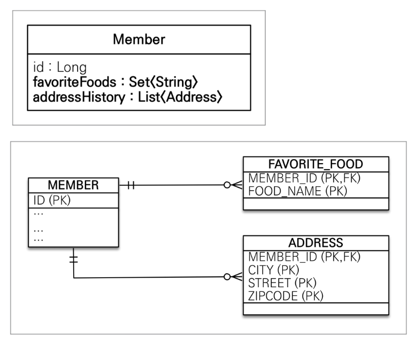

1. # 값 타입 컬렉션
   값 타입이란 엔티티 타입이 아닌 그 이외 타입인 기본 타입과 임베디드 타입을 일컫는 말이다.   

   값 타입 = 기본 타입(String,int,long 등) + 임베디드 타입   

   ```java
      //기본 타입 
      @Entity
      public class Member {
         @Id @GeneratedValue
         private Long id;
         
         private String name; // 기본 값 타입
         private int age;     // 기본 값 타입
      }

      //임베디드 타입
      @Embeddable
      public class Address {
         private String city;
         private String street;
      }
   ```    

   그렇다면 값 타입 컬렉션이란 기본타입 컬렉션과 임베디드타입 컬렉션을 말한다. 기본 타입이나 임베디드를 제네릭으로 사용하는 컬렉션이 된다.   

   값 타입 컬렉션 = 기본타입 컬렉션 + 임베디드타입 걸렉션
   
   ```java
      //기본 타입 컬렉션
      @Entity
      public class Member {
         @Id @GeneratedValue
         private Long id;
         
         private String name;
         
         @ElementCollection
         @CollectionTable(name = "member_favorite_foods", 
                           joinColumns = @JoinColumn(name = "member_id")) 
         @Column(name = "food_name") // 컬렉션의 값이 저장될 컬럼명 지정
         private List<String> favoriteFoods = new ArrayList<>();
      }


      //임베디드 타입 컬렉션
      @Embeddable
      public class Address {
         private String city;
         private String street;
      }

      @Entity
      public class Member {
         @Id @GeneratedValue
         private Long id;

         private String name;

         @ElementCollection
         @CollectionTable(name = "member_address", 
                           joinColumns = @JoinColumn(name = "member_id")) 
         private List<Address> addresses = new ArrayList<>();
      }
   ```   
   
   값 타입을 하나 이상 저장할 때 자바 자료구조의 Collection 인터페이스 List, Set, Map 등을 사용할 수 있다.   

1. # @ElementCollection, @CollectionTable 사용   
   @ElementCollectio은 @OneToMany 같은 엔티티 연관관계가 아니라, **값 타입(Value Type)**을 저장하는 컬렉션을 관리할 때 사용하는데, 값 타입 컬렉션은 별도의 엔티티 테이블이 아니라, 부모 엔티티와 함께 저장된다. @Entity로 새로운 테이블을 만드는 것이 아니라 부모 엔티티 내부의 필드에서 __어노테이션을 통해 테이블을 생성__ 하게 된다.   
   어노테이션을 통해 값 타입 컬렉션을 저장할 별도 테이블을 생성하는데, 이를 **컬렉션 테이블(Collection Table)**이라고 하고 @CollectionTable를 사용한다.   

   => 데이터베이스는 컬렉션을 같은 테이블에 저장할 수 없다. 컬렉션을 저장하기 위한 별도의 테이블이 필요하다.   

1. # 예시
         

      Member테이블에 favoriteFoods와 addressHistory란 이름의 Collection필드를 생성   

      Collection타입의 필드는 1:다의 개념이기 때문에 테이블을 새로 생성해야하는데 @Entity로 생성하는 것이 아니라 필드에서 바로 @CollectionTable로 생성한다.   

      ```java
         @Embeddable
         public class Address {
            private String city;
            private String street;
            private String zipcode;
         }

         @Entity
         public class Member2 {
            
            @Id @GeneratedValue
            private Long id;
            private String username;

            @Embedded
            private Address homeAddress; 

            @ElementCollection  //값 타입 컬렉션을 선언
            @CollectionTable(name    = "FAVORITE_FOOD", joinColumns = @JoinColumn(name = "MEMBER_ID"))  //DB테이블명은 FAVORITE_FOOD이다. 
            @Column(name = "FOOD_NAME")  //기본타입이 1개인 경우 컬럼명을 지정할 수 있다. 컬럼명은 FOOD_NAME
            private Set<String> favoriteFoods = new HashSet<>();

            @ElementCollection  //Address를 사용하는 임베디드 타입, 값 타입 컬렉션 선언
            @CollectionTable(name = "ADDRESS", joinColumns = @JoinColumn(name = "MEMBER_ID")) 
            private List<Address> addressHistory = new ArrayList<>();
         }
      ```   
      
      테이블 생성 결과   
      ```java
         Hibernate: 
            create table Member2 (
               id bigint not null,
               city varchar(255),      //homeAddress 
               street varchar(255),    //homeAddress 
               username varchar(255),
               zipcode varchar(255),   //homeAddress 
               primary key (id)
            )

         Hibernate: 
            create table ADDRESS (
               MEMBER_ID bigint not null,
               city varchar(255),
               street varchar(255),
               zipcode varchar(255)
            )

         Hibernate: 
            create table FAVORITE_FOOD (
               MEMBER_ID bigint not null,
               FOOD_NAME varchar(255)
            )
      ```   

1. # 값 타입 컬력션의 사용
   ```java
      public static void main(String[] args) {
        EntityManagerFactory emf = Persistence.createEntityManagerFactory("hello");
        EntityManager em = emf.createEntityManager();
        EntityTransaction tx = em.getTransaction();

        tx.begin();

        try {

            Member2 m2 = new Member2();
            m2.setUsername("member1");
            m2.setHomeAddress(new Address("city", "street", "zipcode"));
            
            //favoriteFoods collection에 입력
            m2.getFavoriteFoods().add("치킨");
            m2.getFavoriteFoods().add("피자");
            m2.getFavoriteFoods().add("족발");

            //addressHistory collection에 입력
            m2.getAddressHistory().add(new Address("old1", "street1", "zipcode1"));
            m2.getAddressHistory().add(new Address("old2", "street2", "zipcode2"));

            em.persist(m2);

            em.flush();
            em.clear();

            System.out.println("========== 값 조회 ============");
            Member2 findMember = em.find(Member2.class, m2.getId()); 
            /* 여기까지의 쿼리문
            
            Hibernate: 
               select
                  m1_0.id,
                  m1_0.city,
                  m1_0.street,
                  m1_0.zipcode,
                  m1_0.username 
               from
                  Member2 m1_0 
               where
                  m1_0.id=?
            
            find로 조회를 하면 Member엔티티만 조회를 하고 FAVORITE_FOOD는 조회를 하지 않는다. 이말은 지연 로딩이란 뜻이다.   
            city, street, zipcode가 있는 ADDRESS가 조회되는 것은 homeAddress때문에 조회가 된 것이다.
            FAVORITE_FOOD는 밑에서 findMember.getFavoriteFoods로 직접 검색을 하면 이때 조회를 하게 된다.
            */

            List<Address> addressHistory = findMember.getAddressHistory();
            for(Address a : addressHistory){
                System.out.println(a.getCity());
            }
            /*
            Hibernate: 
               select
                  ah1_0.MEMBER_ID,
                  ah1_0.city,
                  ah1_0.street,
                  ah1_0.zipcode 
               from
                  ADDRESS ah1_0 
               where
                  ah1_0.MEMBER_ID=?
            old1
            old2
            */

            Set<String> favoriteFoods = findMember.getFavoriteFoods();
            for(String s : favoriteFoods){
                System.out.println(s);
            }
            /*
            Hibernate: 
               select
                  ff1_0.MEMBER_ID,
                  ff1_0.FOOD_NAME 
               from
                  FAVORITE_FOOD ff1_0 
               where
                  ff1_0.MEMBER_ID=?
            족발
            치킨
            피자  
            */

            System.out.println("========== 값 수정 ============");


            tx.commit();
        }catch (Exception e){
            e.printStackTrace();
            tx.rollback();
        }finally {
            em.close();
        }
        emf.close();
        
      }
   ```


1. # 값 타입 컬렉션 특징
   값 타입 컬렉션은 영속성 전이(Cascade)와 고아 객체 제거 기능을 필수로 가진다고 볼 수 있다.   

   __"값 타입 컬렉션은 영속성 전이(Cascade)를 필수로 가진다"의 의미__   
   => 값 타입 컬렉션의 요소는 독립적인 엔티티가 아니기 때문에, __부모 엔티티가 영속화될 때 함께 저장__ 된다.   
   CascadeType.ALL이 자동 적용되어, __부모 엔티티를 저장하면 값 타입 컬렉션도 자동으로 저장__ 된다.   
   ```java
      Member member = new Member();
      member.setName("홍길동");
      member.getAddresses().add(new Address("Seoul", "Gangnam"));
      member.getAddresses().add(new Address("Busan", "Haeundae"));

      em.persist(member); // 부모만 persist해도 addresses 컬렉션 자동 저장
   ```   
   @ElementCollection을 사용하면 별도로 persist()를 호출하지 않아도 부모 엔티티를 저장할 때 함께 저장된다.   
   이것이 Cascade 기능이 자동 적용됨을 의미한다.   

   __"고아 객체 제거 기능을 필수로 가진다"의 의미__   
   => 값 타입 컬렉션의 요소들은 __부모 엔티티가 변경되거나 삭제되면 자동으로 삭제__ 된다. 즉, 값 타입 컬렉션에서 요소를 제거하면 해당 데이터는 데이터베이스에서도 삭제된다.   
   ```java
      member.getAddresses().remove(0); // 첫 번째 주소 삭제
   ```   
   값 타입 컬렉션은 엔티티가 아니므로, 별도의 remove() 메서드 없이 컬렉션에서 삭제하는 것만으로도 자동 제거된다. 부모 엔티티가 삭제되면 자식(값 타입 컬렉션)도 자동 삭제된다.   

1. # 값 타입 컬렉션의 제약사항
   값 타입은 엔티티와 다르게 식별자 개념이 없다.   

   값은 변경하면 추적이 어렵다.   

   값 타입 컬렉션에 변경 사항이 발생하면, 주인 엔티티와 연관된 모든 데이터를 삭제하고, 값 타입 컬렉션에 있는 현재 값을 모두 다시 저장한다.   

   값 타입 컬렉션을 매핑하는 테이블은 모든 컬럼을 묶어서 기본 키를 구성해야 함 : null 입력X, 중복 저장X   

1. # 값 타입 컬렉션 대안 
   실무에서는 상황에 따라 값 타입 컬렉션 대신에 일대다 관계를 고려   

   일대다 관계를 위한 엔티티를 만들고 여기에서 값 타입을 사용   

   영속성 전이(Cascade) + 고아 객체 제거를 사용해서 값 타입 컬렉션 처럼 사용   

   EX)AddressEntity

1. # 정리
   __엔티티 타입의 특징__   
   식별자 O   
   생명 주기 관리   
   공유   

   __값 타입의 특징__   
   식별자 X   
   생명 주기를 엔티티에 의존   
   공유하지 않는 것이 안전(복사해서 사용)   
   불변 객체로 만드는 것이 안전   