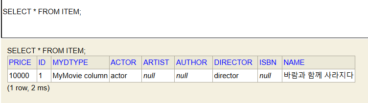
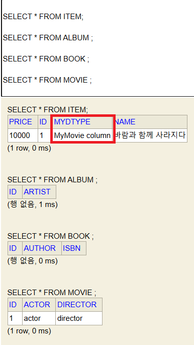

1. # 상속관계 매핑
   
   통합 테이블로 변환 -> 단일 테이블 전략   
   각각 테이블로 변환 -> 조인 전략   
   서브타입 테이블로 변환 -> 구현 클래스마다 테이블 전략   

1. # 주요 어노테이션 
   @Inheritance(strategy = InheritanceType.XXX)   
      SINGLE_TABLE : 단일 테이블 전략(default값)   
      JOINED : 조인 전략   
      TABLE_PER_CLASS : 구현 클래스마다 테이블 전략   

   @DiscriminatorColumn(name = "DTYPE")

   @DiscriminatorValue("XXX")

1. # 단일 테이블 전략
      
   한 테이블에 모든 아이템 값들을 다 넣고 DTYPE으로 구별만 해줌 - Inheritance의 default 전략   

   ```java
      //Item테이블
      @Entity
      @Inheritance(strategy=InheritanceType.SINGLE_TABLE) //Inheritance를 사용해도 되고 하지 않아도 defulat로 적용, 사용한 경우 strategy는 SINGLE_TABLE이 된다.
      public class Movie extends Item{
         private String director;
         private String actor;
      }

      //Book테이블
      @Entity
      public class Book extends Item{
         private String author;
         private String isbn; 
      }

      //Movie테이블
      @Entity
      public class Movie extends Item{
         private String director;
         private String actor;
      }

      //Album테이블
      @Entity
      public class Album extends Item{
         private String artist;   
      }

      //결과
      Hibernate:
      create table Item (
         price integer not null,
         id bigint not null,
         DTYPE varchar(31) not null,
         actor varchar(255),
         artist varchar(255),
         author varchar(255),
         director varchar(255),
         isbn varchar(255),
         name varchar(255),
         primary key (id)
      )
   ```   
   @Inheritance(strategy = InheritanceType.XXX)어노테이션에 어떤 옵션도 사용하지 않을 때 기본으로 설정되는 전략은 단일 타입 전략입니다.   
   Book테이블, Movie테이블, Album테이블이 모두 상속 받은 Item테이블 하나에 모든 컬럼으로 생성됩니다.    
      
   *Book테이블, Movie테이블, Album테이블은 테이블 자체가 생성되지 않는다.    

   -데이터 입력-   
   ```java
      Movie movie = new Movie();
      movie.setDirector("director");
      movie.setActor("actor");
      movie.setName("바람과 함께 사라지다");
      movie.setPrice(10000);
      
      em.persist(movie);

      em.flush();
      em.clear();
   ```   
      
   데이터를 입력한 경우 Item테이블의 해당 컬럼에만 데이터가 입력된다.   

   __*단일 테이블 전략은 DiscriminatorColumn옵션이 없어도 기본적으로 DTYPE 컬럼이 생성 됨__   

1. # 조인 전략
      

   Item테이블에 @Inheritance(strategy=InheritanceType.JOINED) 추가   

   ```java
      //Item테이블
      @Entity
      @Inheritance(strategy=InheritanceType.JOINED) //InheritanceType를 JOINED로 설정
      public class Movie extends Item{
         private String director;
         private String actor;
      }

      //Book테이블
      @Entity
      public class Book extends Item{
         private String author;
         private String isbn; 
      }

      //Movie테이블
      @Entity
      public class Movie extends Item{
         private String director;
         private String actor;
      }

      //Album테이블
      @Entity
      public class Album extends Item{
         private String artist;   
      }

      //결과
      Hibernate: 
         create table Album (
            id bigint not null,
            artist varchar(255),
            primary key (id)
         )
      Hibernate:
         create table Book (
            id bigint not null,
            author varchar(255),
            isbn varchar(255),
            primary key (id)
         )
      Hibernate:
         create table Item (
            price integer not null,
            id bigint not null,
            name varchar(255),
            primary key (id)
         )
      Hibernate:
         create table Movie (
            id bigint not null,
            actor varchar(255),
            director varchar(255),
            primary key (id)
         )
   ```   
   Item을 상속받은 테이블 Album, Book, Movie테이블이 각각 생성됩니다.   
      

   -테이터를 입력한 상태-   
   ```java
      Movie movie = new Movie();
      movie.setDirector("director");
      movie.setActor("actor");
      movie.setName("바람과 함께 사라지다");
      movie.setPrice(10000);
      
      em.persist(movie);
   ```   
      
   Actor와 Director는 Moive테이블에, Name과 Price는 Item테이블에 각각 입력됩니다.   

   -데이터를 가져올 때-   
   ```java
      em.flush();
      em.clear();

      Movie findMovie = em.find(Movie.class, movie.getId());
      System.out.println(findMovie);

      //결과
      Hibernate: 
      select
         m1_0.id,
         m1_1.name,
         m1_1.price,
         m1_0.actor,
         m1_0.director
      from
         Movie m1_0
      join
         Item m1_1
               on m1_0.id=m1_1.id
      where
         m1_0.id=?
   ```
   Item테이블과 상속받은 Movie테이블을 join을 해서 데이터를 가져오게 됩니다.   

1. # @DiscriminatorColumn(name=“DTYPE”)
   DiscriminatorColumn을 사용하면 어떤 테이블에서 가져왔는데 DTYPE으로 파악 가능. DTYPE란 이름은 바꿀 수 있음   

   ```java
      // Item 테이블
      @Entity
      @Inheritance(strategy=InheritanceType.JOINED)
      @DiscriminatorColumn(name = "MYDTYPE")  //DiscriminatorColumn 추가
      public class Item {

         @Id @GeneratedValue
         private Long id;
         private String name;
         private int price;
      }
   ```   
      
   Item테이블에 MYDTYPE이 추가 됨. MYDTYPE에 입력되는 값은 해당 Entity.   

   Item테이블에 입력되는 Entity명을 변경하고 싶으면 @DiscriminatorValue를 이용합니다.   
   ```java
      // Movie 테이블
      @Entity
      @DiscriminatorValue("MyMovie column")  //상속 받은 Entity에서 DiscriminatorValue 이용
      public class Movie extends Item{
         private String director;
         private String actor;
      }
   ```   
      
   MYDTYPE 입력 값이 DiscriminatorValue에서 설정한 MyMovie column이 됨   


