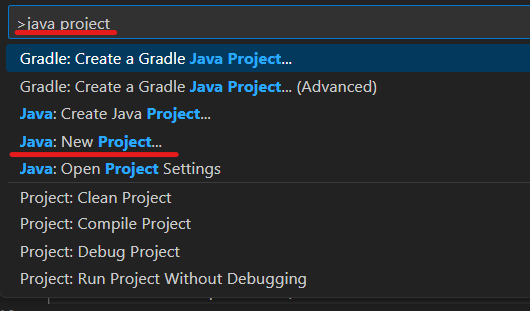
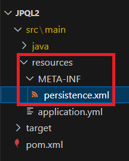
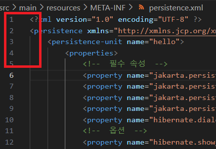
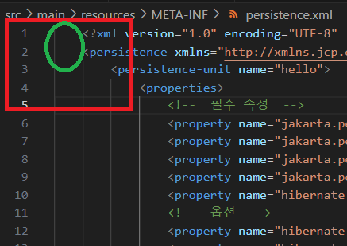
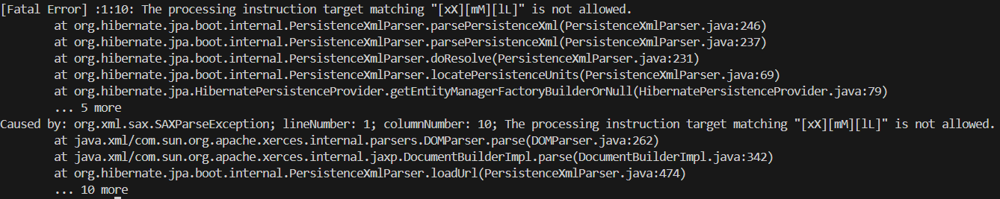

1. # 프로젝트 생성
   
   1.Shift + ctrl + p : 프로젝트 생성   
   
   2.java project로 검색   
      

   3.Java:New Project 선택   

   4.빌드 도구 선택   
   Java with Maven     
   Java with Gradle   
   2가지 중 선택할 수 있는 목록이 나타나는데 Maven으로 선택   

   5.directory위치 설정   

   6.Artifact Id와 프로젝트명 설정

1. # pom.xml
   java로 생성하면 아무런 값이 없다

   pom.xml   
   ```XML
      <?xml version="1.0" encoding="UTF-8"?>
      <project xmlns="http://maven.apache.org/POM/4.0.0" xmlns:xsi="http://www.w3.org/2001/XMLSchema-instance" xsi:schemaLocation="http://maven.apache.org/POM/4.0.0 http://maven.apache.org/xsd/maven-4.0.0.xsd">
         <modelVersion>4.0.0</modelVersion>
         <groupId>myjpql</groupId>
         <artifactId>jpql2</artifactId>
         <version>1.0-SNAPSHOT</version>
         <properties>
            <project.build.sourceEncoding>UTF-8</project.build.sourceEncoding>
            <maven.compiler.release>17</maven.compiler.release>
            <exec.mainClass>myjpql.Jpql2</exec.mainClass>
         </properties>

         <dependencies>
            <!--  JPA 하이버네이트  -->
            <dependency>
               <groupId>org.hibernate</groupId>
               <artifactId>hibernate-core</artifactId>
               <version>6.4.2.Final</version>
            </dependency>
            <dependency>
               <groupId>javax.xml.bind</groupId>
               <artifactId>jaxb-api</artifactId>
               <version>2.3.1</version>
            </dependency>
            <!--  H2 데이터베이스  -->
            <dependency>
               <groupId>com.h2database</groupId>
               <artifactId>h2</artifactId>
               <version>2.2.224</version>
            </dependency>
         </dependencies>

      </project>
   ```   
   dependencies 추가   

1. # persistence.xml
   src/main/java - 기존에 존재   
   src/main/resources/META-INF/persistence.xml - 내가 생성   
   자바로 프로젝트를 생성했다면 resources 폴더가 없을 수 있다.   
   main 폴더 안에 resources 폴더를 생성하고 META-INF 폴더 생성   

   persistence.xml   
   ```XML
      <?xml version="1.0" encoding="UTF-8" ?>
      <persistence xmlns="http://xmlns.jcp.org/xml/ns/persistence" xmlns:xsi="http://www.w3.org/2001/XMLSchema-instance" version="2.2" xsi:schemaLocation="http://xmlns.jcp.org/xml/ns/persistence http://xmlns.jcp.org/xml/ns/persistence/persistence_2_2.xsd">
         <persistence-unit name="hello">
            <properties>
                  <!--  필수 속성  -->
                  <property name="jakarta.persistence.jdbc.driver" value="org.h2.Driver"/>
                  <property name="jakarta.persistence.jdbc.user" value="sa"/>
                  <property name="jakarta.persistence.jdbc.password" value=""/>
                  <property name="jakarta.persistence.jdbc.url" value="jdbc:h2:tcp://localhost/~/test2"/>
                  <property name="hibernate.dialect" value="org.hibernate.dialect.H2Dialect"/>
                  <!--  옵션  -->
                  <property name="hibernate.show_sql" value="true"/>
                  <property name="hibernate.format_sql" value="true"/>
                  <property name="hibernate.use_sql_comments" value="true"/>
                  <property name="hibernate.jdbc.batch_size" value="10"/>
                  <property name="hibernate.hbm2ddl.auto" value="create"/>
            </properties>
         </persistence-unit>
      </persistence>
   ```
   
      
   위치 확인   

   <span style="color:red">xml파일의 최상위 경로는 제일 앞에 위치 시켜야 한다</span>   
      
   다음과 같이 `<?xml ~` 과 `<persistence ~` 의 위치가 가장 앞에 와야한다. 앞에 빈칸이 있으면 안 된다.   

   다음과 같이 앞에 빈칸이 있는 경우 에러가 발생한다.   
      
   
   에러 내영은 다음과 같다.   
      

1. # 샘플 데이터

   Member.java   
   ```java
      @Entity
      public class Member {
         
         @Id @GeneratedValue
         private Long id;
         private String username;
         private int age;

         @ManyToOne
         @JoinColumn(name="TEAM_ID")
         private Team team;
      }
   ```

   Team.java   
   ```java
      @Entity
      public class Team {
         
         @Id @GeneratedValue
         private Long id;
      
         private String name;

         @OneToMany(mappedBy= "team")
         private List<Member> members = new ArrayList<>();
      }
   ```

1. # main실행 소스

   ```java
      public static void main(String[] args) {
         System.out.println("Hello World!");

         EntityManagerFactory emf = Persistence.createEntityManagerFactory("hello");
         EntityManager em = emf.createEntityManager();
         EntityTransaction tx = em.getTransaction();

         tx.begin();

         try{

         }catch (Exception e){
            e.printStackTrace();
            tx.rollback();
         }finally {
            em.close();
         }
         emf.close();
      }
   ```   
   여기까지 하면 h2에 테이블이 생성된다.   