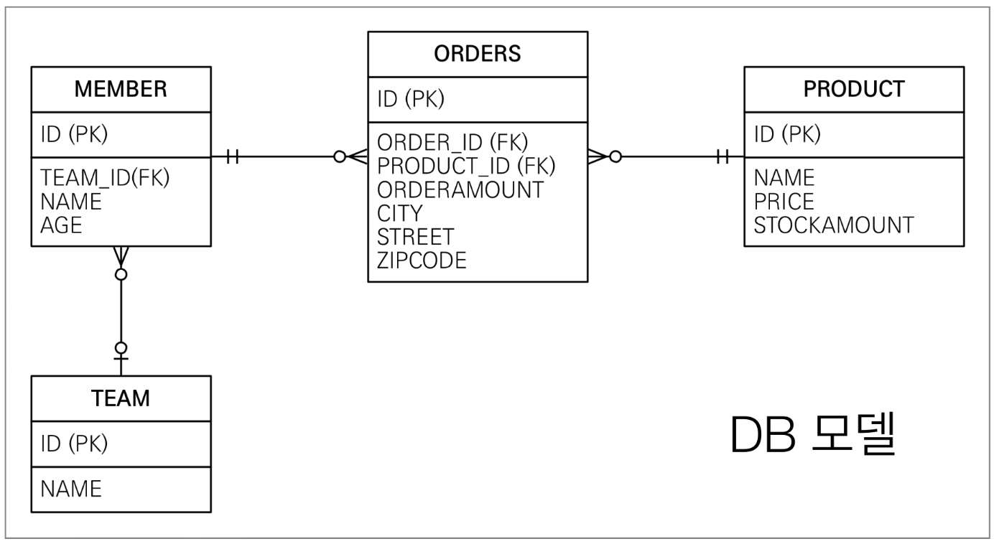

1. # JQPL소개
   JPQL은 객체지향 쿼리 언어다. 따라서 테이블을 대상으로 쿼리 하는 것이 아니라 엔티티 개체를 대상으로 쿼리한다.   
   JPQL은 SQL을 추상화해서 특정 테이터베이스 SQL에 의존하지 않는다.   
   JPQL은 결국 SQL로 변환된다.   

1. # 예제
       
      
      

1. # JPQL문법
   ```
      select 문 :: =
         select 절
         from 절
         [where 절]
         [group by 절]
         [having 절]
         [order by 절]

      update 문 :: = update 절 [where 절]
      delete 문 :: = delete 절 [where 절]
   ```   

   1.select m from __Member__ as m where m.__age__ > 18   
   2.엔티티와 속성은 대소문자 구분 O (Member, age)   
   3.JPQL 키워드는 대소문자 구분 X (Select, FROM, where)   
   4.엔티티 이름 사용, 테이블 이름이 아님(Member)   
   ```java
      @Entity  
      public class Member{
         ...
      }
      //=> 엔티티 이름은 Member

      @Entity(name = "M")
      public class Member{
         ...
      } 
      //=> 엔티티 이름은 M
   ```
   5.별칭은 필수(m) (as는 생략 가능)   

1. # 집합과 정렬
   ```java
      select 
         COUNT(m), //회원수
         SUM(m.age), //나이 합
         AVG(m.age), //평균 나이
         MAX(m.age), //최대 나이
         MIN(m.age) //최소 나이
      from Member m
      Group by ...
      Having ... 
      Order by ...
   ```   
   SQL문과 같이 모두 사용 가능   

1. # TypeQuery, Query
   TypedQuery : 반환타입이 명확할 때 사용   
   ```
      TypedQuery<Member> query = em.createQuery("Select m from Member m", Member.class);
   ```   
   반환타입이 Member의 전체로 Member클래스가 된다. Member.class   

   Query : 반환 타입이 명확하지 않을 때 사용   
   ```
      Query query = em.createQuery("Select m.username, m.age from Member m")
   ```   
   반환타입이 username은 String, age는 int가 된다. 반환타입이 다를 때 사용   

1. # 결과 조회 API
   query.getResultList() : 결과가 하나 이상일 때, 리스트 반환   
      -결과가 없으면 빈 리스트 반환   
   
   query.getSingleResult() : 결과가 정확히 하나, 단일 객체 반환   
      -결과가 없으면 : javax.persistence.NoResultException   
      -둘 이상이면 : javax.persistence.NonUniqueResultException   

   ```java
      public static void main(String[] args) {

        EntityManagerFactory emf = Persistence.createEntityManagerFactory("hello");
        EntityManager em = emf.createEntityManager();
        EntityTransaction tx = em.getTransaction();

        tx.begin();

        try{

            Member member = new Member();
            member.setUsername("hello");
            member.setAddress(new Address("city", "street", "zipcode"));
            member.setPeriod(new Period());

            em.persist(member);

            TypedQuery<Member> query = em.createQuery("select m from Member m", Member.class);
            List<Member> resultList = query.getResultList(); //결과 값이 여러개, getResultList

            TypedQuery<Member> query2 = em.createQuery("select m from Member m where m.id=10", Member.class);
            Member resultOne = query2.getSingleResult();  
            //결과 값이 반드시 한개, getSingleResult
            //없거나 한개 이상이면 exception 발생
            System.out.println(resultOne); //현재는 id=10이란 데이터가 없기 때문에 Exeption발생

            tx.commit();

        }catch (Exception e){
            e.printStackTrace();
            tx.rollback();
        }finally {
            em.close();
        }
        emf.close();
      }
   ```   

1. # 파라미터 바인딩 - 이름 기준 
   ```
      SELECT m FROM Member m where m.username=:username
      query.setParameter("username", usernameParam);
   ```   

   파라미터를 설정하고 파라미터에 검색 값을 입력   
   활용)   
   ```java
      TypedQuery<Member> query3 = em.createQuery("SELECT m FROM Member m where m.username = :username", Member.class);
      query3.setParameter("username", "member1"); //where username = 'member1' 과 같은 의미
      Member resultQuery3 = query3.getSingleResult();
      System.out.println(resultQuery3);

      //또는
      Member query3 = em.createQuery("SELECT m FROM Member m where m.username = :username", Member.class)
                     .setParameter("username", "member1")
                     .getSingleResult();
   ```   
   
1. # 벌크 연산
   벌크 연산은 영속성 컨텍스트를 무시하고 데이터베이스에 직접 쿼리   

   벌크 연산을 먼저 실행   
   벌크 연산 수행 후 영속성 컨텍스트 초기화   