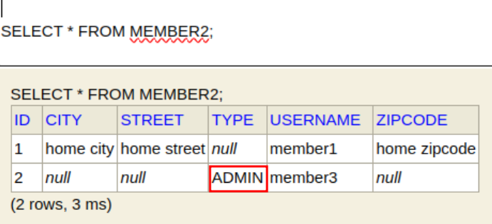

1. # JPQL 타입 표현
   · 문자 : 'HELLO', 'She''s'   

   · 숫자 : 10L(Long), 10D(Double), 10F(Float)   

   · Boolean : TRUE, FALSE  

   · ENUM : jpabook.MemberType.Admin (패키지명 포함)   
      :enum사용시에는 자바 패키지명까지 전부 포함해서 사용해야한다.   
   ```java
      //-- enum type 생성 --
      package myjpql;

      public enum MemberType {
         ADMIN, USER
      }

      //-- Member2.java에 Enum type 추가 --
      @Entity
      public class Member2 {
         ...

         @Enumerated(EnumType.STRING)
         private MemberType type;   

         ...
      }

      //-- Main에서 사용하기 --
      String query4 = "select m.username, 'HELLO', true from Member2 m " +
            "where m.type = myjpql.MemberType.ADMIN";
                        
      List<Object[]> result8 = em.createQuery(query4).getResultList();

      for(Object[] o  : result8){
         System.out.println("Object[0]:"+ o[0]); //member3
         System.out.println("Object[0]:"+ o[1]); //HELLO
         System.out.println("Object[0]:"+ o[2]); //true
      }   

      //-- 결과 --
      Hibernate: 
         /* select
            m.username,
            'HELLO',
            true 
         from
            Member2 m 
         where
            m.type = :userType */ select
                  m1_0.username,
                  'HELLO',
                  true 
            from
                  Member2 m1_0 
            where
                  m1_0.type=?
      Object[0]:member3
      Object[0]:HELLO
      Object[0]:true
   ```   
   1.select의 결과 값들이 많을 때 `List<Object[]>`로 받는다   
   
   2.문자열은 `' '`를 씌우고, Boolean 값도 가져온다.   
   
   3.`@Enumerated(EnumType.STRING)` EnumType을 STRING으로 해줘야 0,1이 아니라 AMIN, USER이란 문자열이 저장된다.   
     
   
   4.Enum은 "where m.type = myjpql.MemberType.ADMIN"로 패키지 전체 경로를 다 가져와서 사용한다. 
   
   Enum의 쿼리문을 나눠서 다음과 같이 한다.   
   ```java
      String query4 = "select m.username, 'HELLO', true from Member2 m " +
            "where m.type = :userType"; //userType이란 변수 사용
                        
      List<Object[]> result8 = em.createQuery(query4)
               .setParameter("userType", MemberType.ADMIN) //파라미터값으로 userType에 패키지경로 MemberType.ADMIN입력
               .getResultList();
   ```   
   파라미터를 둬서 경로를 나타낼 수 있다.   

   · 엔티티 타입 : TYPE(m) = Member (상속 관계에서 사용)   

1. # JPQL 기타
   · SQL과 문법이 같은 식   
   · EXISTS, IN   
   · AND, OR, NOT   
   · =, >, >=, <, <= , <>   
   · BETWEEN, LIKE, IS NULL   

1. # 조건식 - CASE 식
   __기본 CASE 식(조건식)__   
   ```sql
      select
         case when m.age <= 10 then '학생요금'
               when m.age >= 60 then '경로요금'
               else '일반요금'
         end
      from Member m
   ```   

   __단순 CASE 식(값 일치)__   
   ```sql
      select
         case t.name
            when '팀A' then '인센티브110%'
            when '팀B' then '인센티브120%'
            else '인센티브105%'
         end
      from Team t
   ```   

   CASE 예제   
   ```java
      Member member4 = new Member();
      member4.setUsername("member4");
      member4.setAge(23);

      em.persist(member4);

      String query5 = "select "
      + " case when m.age <= 10 then '학생요금'"
      + "      when m.age >=60 then '경로요금'"
      + "      else '일반요금'"
      + " end"
      + " from Member m";

      List<String> resultList2 = em.createQuery(query5, String.class).getResultList();

      for(String s : resultList2){
            System.out.println(s);
      }

      //-- 결과 --
      Hibernate: 
         /* select
            case 
                  when m.age <= 10 
                     then '학생요금'      
                  when m.age >=60 
                     then '경로요금'      
                  else '일반요금' 
            end 
         from
            Member m */ select
                  case 
                     when m1_0.age<=10 
                        then '학생요금' 
                     when m1_0.age>=60 
                        then '경로요금' 
                     else '일반요금' 
                  end 
            from
                  Member m1_0
      일반요금
   ```

1. # 조건식 - CASE 식
   · COALESCE : 하나씩 조회해서 null이 아니면 반환   
   => 사용자 이름이 없으면 이름 없는 회원을 반환   
   ```sql
      select coalesce(m.username, '이름 없는 회원') from Member m
   ```   
      
   · NULLIF : 두 값이 같으면 null반환, 다르면 첫번째 값 반환    
   => 사용자 이름이 '관리자'면 null을 반환하고 나머지는 본인의 이름을 반환   
   ```sql
      select NULLIF(m.username, '관리자') from Member m
   ```   

1. # JPQL 기본 함수
   · CONCAT   
   · SUBSTRING   
   · TRIM   
   · LOWER, UPPER   
   · LENGTH   
   · LOCATE   
   · ABS, SQRT, MOD   
   · SIZE, INDEX(JPA용도)   

1. # JPQL 사용 예제 설명명

   ```java
      @Query("""
	 		SELECT e FROM Employees e
	 		WHERE e.deptNo = :deptNo
	 		AND e.positionNo = :positionNo
	 		""")
      List<Employees> getEmpName(@Param("deptNo") Long deptNo,
            @Param("positionNo") Long positionNo);
      
      /*
      SELECT e.empName FROM Employees e
            WHERE e.deptNo = :deptCode
            AND e.positionNo = :postCode
            
      Employees : entity의 Employees.java
      empName : Employees entity의 필드명
      deptNo : Employees entity의 필드명
      positionNo : Employees entity의 필드명
      DB의 테이블과 컬럼명이 아님
      */
      
      /*
      Employees getEmpName(@Param("deptNo") Long deptNo,
      @Param("positionNo") Long positionNo); 
      @Param("deptNo") : deptNo는 Employees entity의 필드명
      @Param("positionNo") : positionNo는 Employees entity의 필드명
      
      Long deptNo : deptNo는 Employees entity의 필드명
      Long positionNo : positionNo는 Employees entity의 필드명
      */
   ```