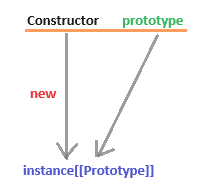

 
1. # 프로토타입
   프로토타입은 자바스크립트에서 객체들이 공유하는 속성과 메서드를 저장하는 특별한 객체입니다. 마치 클래스 기반 언어에서 클래스가 객체들의 청사진 역할을 하는 것처럼, 자바스크립트에서는 프로토타입이 객체 생성의 틀이 되어줍니다.   

   생성자함수를 이용해 new연산자로 객체의 인스턴스를 생성하면 이 인스턴스 내부에 constructor의 'prototype'이라고 하는 프로퍼티의 내용이 `[[Prototype]]`라고 하는 프로퍼티로 참조를 전달하게 됩니다.   

   *constructor   
   객체를 생성하는데 가장 먼저 호출되는 메소드   
   
   Constructor.prototype와 instance[[prototype]]이 같은 객체를 가리킵니다. 하지만 [[prototype]]는 접근가능한 것이 아니라 정보를 보여주기만 할 뿐으로 실제 동작상으로는 instance와 동일시가 됩니다.   
  
       

   왼쪽 - 생성자, 오른쪽 - 생성자의 prototype   
   아래쪽 - 인스턴스   

   Constructor의 prototype이 intance를 생성하면 instance의 [[Prototype]]의 프로퍼티로 값을 출력하게 됩니다.   
   `[[Prototype]]`은 값을 출력하는 값이지 해당 값을 가져와서 이용하지는 못 합니다.   

   Constructor의 prototype -> [[Prototype]] -> instance   

   instance에서 Prototype으로 접근하는 방법   
   ```
      instance.__proto__
      Object.getPrototypeOf(instance);
   ```   
   Object.getPrototypeOf를 사용하는 것을 공식문서에서는 추천하고 있습니다.   
   
   ```js
      var evens1 = new Array(1,2,3,4);  //Array 생성자 함수로 배열 생성
      var evens2 = [1,2,3,4];           //리터럴로 배열 생성
      console.dir(evens1);
      console.dir(evens2);
      console.dir(Array);
   ```   
   Array생성자로 배열을 생성하든 리터럴로 배열을 생성하든 내부 작동방식은 Array생성자로 생성한 배열과 같습니다.   

      

   Array의 prototype의 프로퍼티가 evens1과 evens2에 모두 상속이 됩니다.   

   Array생성자와 배열 뿐만 아니라 일만 숫자 리터럴과 문자 리터럴도 적용이 됩니다.

   ```js
      var num = 10;
      console.log(num.) //변수 num 하고 . 을 찍으면..
   ```   
   num을 하고 .을 찍으면   
       
   변수 num에서 사용할 수 있는 메소드 목록이 나타나는데 이것들은 Number.prototype에 있는 메소드 목록입니다.   
   자바스크립트가 변수 num에 대한 인스턴스를 자동 생성 후, 해당 인스턴스의 메소드들을 적용해 원하는 결과를 얻게 하고 다시 인스턴스를 제거하는 방식으로 동작을 합니다.   

   ```js
      var str = 'abc';  //primitive 타입
      var str2 = new String('abc'); //object 객체
      
      console.dir(String.prototype);
   ```   
   str처럼 기본형 타입의 데이터들도 메소드들(subStr, subString, trim, toUpperCase,.. 등)을 사용할 수 있는데, 이는 내부적으로 str2방식의 object객체를 만들어 인스턴스를 생성 후 메소드들을 사용하고 다시 인스턴스를 해제하는 방식으로 작동하게 됩니다.   

   한편, 참조형 데이터(객체, 배열, 함수, 데이터, 정규표현식)들은 처음부터 인스턴스이기 때문에 내부적으로 따로 인스턴스를 생성하지 않고 바로 메소드들을 사용할 수 있습니다.   

   