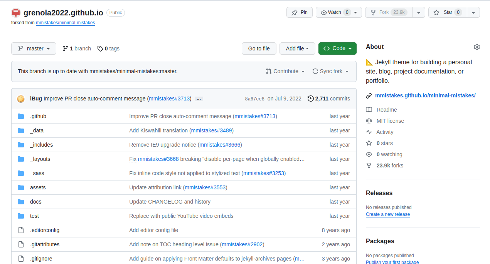
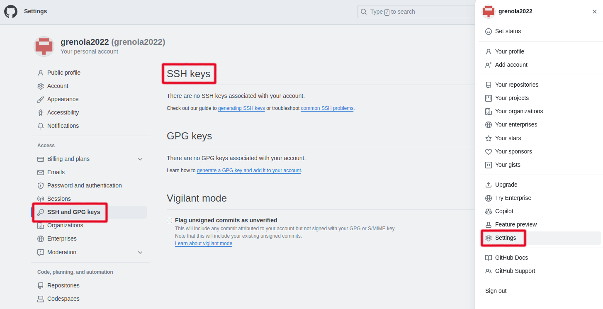
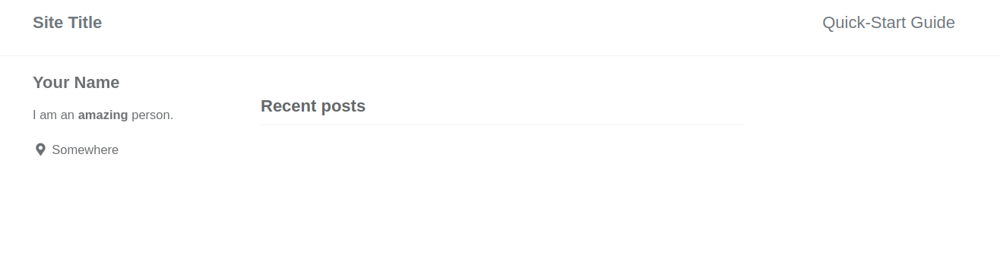
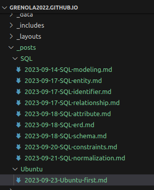
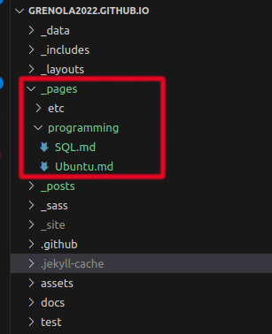
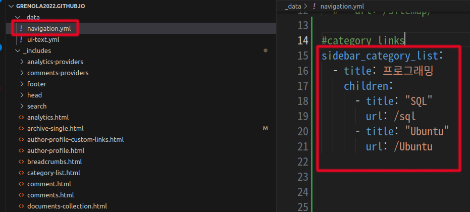
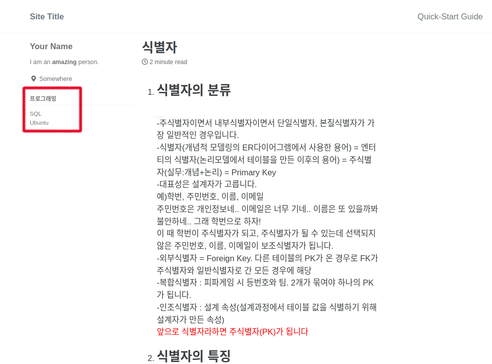
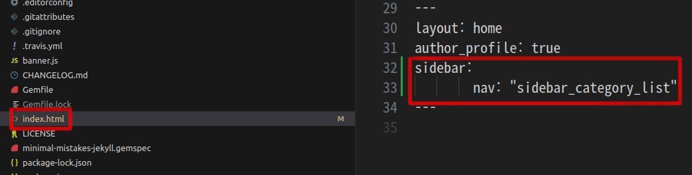
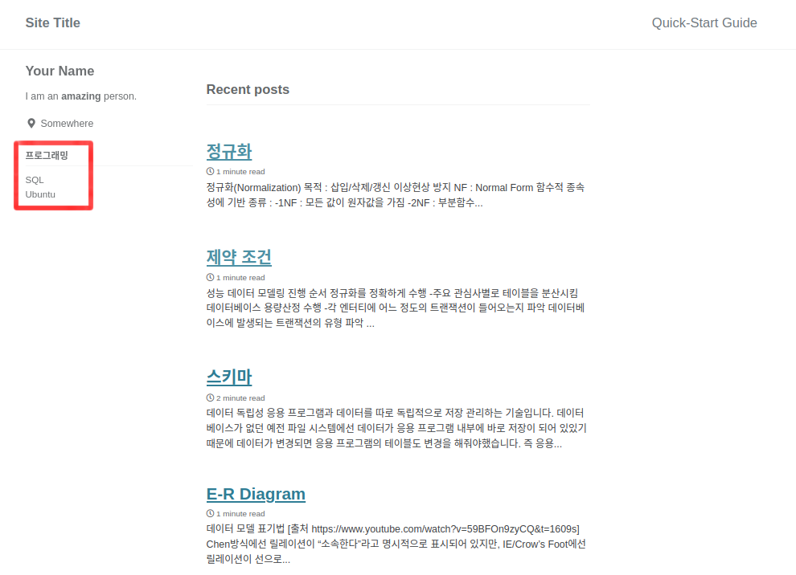

1. # 블로그 생성부터 우분투에 연결까지
   맥을 살 걸.. 개발 공부해야 되는데 그램을 사서;; 우분투와 윈도우11 멀티부팅하면서 블로그도 새로 깔았다. 기분좋게 크으   

   bundler로 실행할 서버는 설치되어있고 jekyll 테마의 minimal-mistake를 fork 한 것에서부터 시작. 페이지 상단의 YAML Front Matter에서 값을 가져오기 때문에 파일이름은 영향을 안 줍니다.   

   grenola2022.github.io란 블로그 생성   
      

   우분투랑 깃허브랑 연결할 ssh생성   
   ```
      $ ssh-keygen -t rsa -b 4096 -C "grenola2022@naver.com"
   ```   
   처음 공개키 설치할 디렉토리 물어보는데 기본으로 할 거니 엔터   
   비밀번호 정하라고 하는데 필요없으니 엔터   
   한번 더 확인하라고 하니 엔터   

   ```
      khj2023@khj2023-linuxUbuntu:~/.ssh2$ cat id_rsa.pub
      ssh-rsa 5HA5HH5HAQtHqL1pNCfpqnt9Rd5dJ86Qp1GNAb/8g7vHcQE5HOeoTmhvZ8k7oqOkG4f45gfIGAoh+lsc70G+daZS+N2pUcHKCHw7aFtHGVdA99h80gGlSO8FJwWp6Nnr+inyM8zSKhU/XCa2wG
      ...
      ...
      +Or2DnminotHtu5H54+aMEFmFx8HJYdOKfUd6J9lP0qtXPnA/rUs/CEP1pPg2IhUWhQAs9X+n72XqYdZhOXq9TTEiprjsygGJ64wZ43J6+NKr/FKD0btaLhGJ6+kSZ0BgX3aOgwnJ6JtsFWUQ== grenola2022@naver.com
   ```   
   생성된 공개키를 복사   

   깃허브의 setting → SSH and GPG Keys → New SSH key입력   
      

   터미널로 접속해서 grenola2022 파일을 가져옵니다.   
   ```
      $ git clone https://github.com/grenola2022/grenola2022.github.io/
   ```   

   다운 받은 블로그 디렉토리로 이동 후 bundler실행   
   ```
      $ bundler exec jekyll serve
   ```   

   블로그 실행   
      

   확인하기 위해서 임시로 SQL파일과 우분투 파일을 넣음   
      

   여기까지 준비, 이제 사이드바 생성   

1. # 사이드바 생성 
   _pages란 디렉토를 생성하고 그 안에 SQL과 Ubuntu의 목차를 생성할 md파일을 만듭니다. jekyll은 posts의 md 파일 안에 YAML Front Matter에 의해서 범주가 갈리기 때문에 디렉토리 위치와 파일이름은 상관 없습니다.   
       

   해당 SQL.md파일에 다음을 붙여넣습니다.   
   ```s
      ---
      title: "SQL"
      layout: archive
      permalink: /sql
      author_profile: true
      types: posts
      ---
      
      
      
      
      
      
   ```   
   - layout: archive   
   다양한 레이아웃이 있는데 일반적으로 포스팅 파일은 single레이아웃을 선택하게 되고 single레이아웃과 비슷하지만 모듈을 제거해서 간소한 레이아웃으로 카테고리나 태그와 같이 부분적으로 삽입할 레이아웃에 archive가 사용됩니다.   
   - permalink: /sql   
   페르마링크는 static한 특수한 링크로 앞서 yaml 페이지에서 url을 클릭하면 해당 페르마주소로 로딩이 되어 해당 md파일이 실행됩니다.   
   - autor_profile: true   
   해당 명령어가 없으면 왼쪽 사이드바 블로그 주인의 정보가 보이지 않습니다.   
   - types: posts   

   
   - ``   
   site는 해당 블로그의 모든 페이지가 됩니다. 페이지에서 YAML Front Matter의 categories가 'SQL'이 파일만 뽑아서 배열로 posts에 할당합니다.   
   - ``   
   ``   
   ``   
   
   

   for문을 돌면서 archive-single.html을 include로 불러오고 posts배열의 각 원소값을 post란 변수로 넘겨주면 archive-single.html에서 post.title , post.url, post.link 이런 식으로 사용. 신기하게 for문 안에 있다는 이유로 archive-single.html에서 post값을 사용할 수 있음   

   _data/navigation.yml 파일에 붙여넣기   
   ```s
      sidebar_category_list:
      - title: 프로그래밍
         children:
            - title: "SQL"
            url: /sql
            - title: "Ubuntu"
            url: /Ubuntu          
   ```   
       
   띠워쓰기와 앞 줄 간격 맞추는 걸 주의해야합니다. url: /sql은 _pages디렉토리 안에서 permalink가 /sql인 페이지로 연결되게 됩니다.   

   _config.yml파일 수정합니다. 가장 밑에 default: 안에 추가합니다.   
   ```s
      sidebar:
        nav: "sidebar_category_list"
   ```   
      
   'sidebar_category_list'은 navigation.yml에 있는 이름입니다.   

   여기까지하면 해당 목록을 클릭했을 때 목차가 나오게 됩니다.   
      
   왼쪽에 '프로그래밍'이란 목차 밑에 'SQL'과 'Ubuntu'가 보입니다.   

   글을 클릭하고 안에 내용을 볼 때는 옆에 사이드바가 있는데 홈에선 보이지가 않습니다.   

 1. # 홈에서 목차 보이기  
   index.html파일에 sidebar설정을 붙여넣습니다.   
   ```
      sidebar:
         nav: "sidebar_category_list"
   ```   

   index.html에 사이드바를 보여주는 옵션입니다.   
      

   홈에서도 목록이 보입니다.   
      