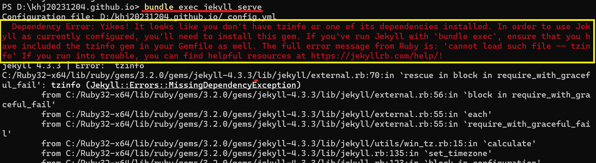
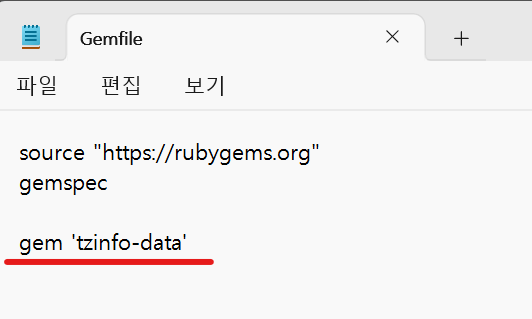

1. #  Dependency Error: Yikes! It looks like you don't have tzinfo or one of its dependencies installed.
   
      
   
   해결책 : 

   ```s
      gem install jekyll #시간 좀 걸림
      gem install tzinfo
      gem install tzinfo-data
   ```
   
   Gemfile에 gem 'tzinfo-data' 추가
      
