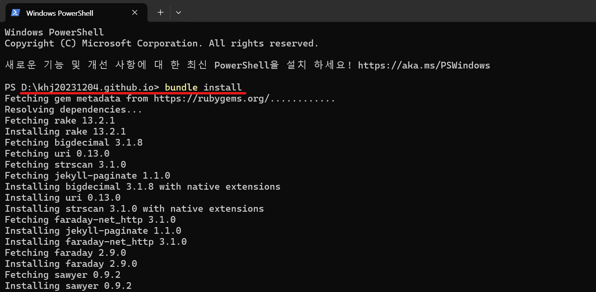

1. # Windows
   1. # ruby 설치
      <a href="https://rubyinstaller.org/downloads">https://rubyinstaller.org/downloads</a>   
      여기서 WITH DEVKIT 3.2.4-1을 다운 받습니다.   

         
      조건 2개를 모두 선택합니다.   

   1. # jekyll과 번들러 설치

      2. jekyll번들러 설치   
      ```s
         gem install jekyll bundler
      ```   
         

      2. gem 번들러 설치   
      ```s
         gem install bundler
      ```   
         

      2. powershell로 이동   
         
      블로그 디렉토리에서 powershell로 이동 후   

      2. 번들 설치   
         
      ```s
         bundle install
      ```

      2. 서버 실행   
      ```s
         bundle exec jekyll serve
         또는
         jekyll s
      ```   

      2. 블로그 연결   
      http://localhost:4000/

1. # Ubuntu
   <a href="https://jekyllrb-ko.github.io/docs/installation/ubuntu/">https://jekyllrb-ko.github.io/docs/installation/ubuntu/</a>
      
   1)루비 설치   
   ```s
      sudo apt-get install ruby-full build-essential zlib1g-dev
   ```   
   *루비 버전확인 : ruby --version   

   2)path설정   
   밑에 한꺼번에 복사해서 쉘 창에 붙여넣기   
   ```s
      echo '# Install Ruby Gems to ~/gems' >> ~/.bashrc
      echo 'export GEM_HOME="$HOME/gems"' >> ~/.bashrc
      echo 'export PATH="$HOME/gems/bin:$PATH"' >> ~/.bashrc
      source ~/.bashrc   
   ```   

   #여기서부터는 블로그 해당 디렉토리로 이동   
   3)jekyll 설치   
   ```s
      gem install jekyll bundler   
   ```   

   4)bundle 설치
   ```s
      sudo bundle install   
   ```   
   *bundle이 설치되면 jekyll 서버 실행 가능   

   5)서버 실행   
   ```s
      sudo bundle exec jekyll serve   
      또는   
      sudo jekyll s   
   ```   

   
