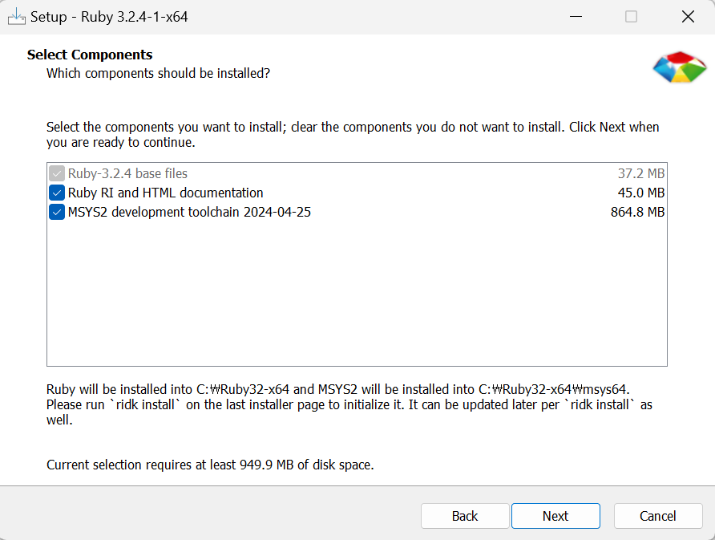

1. # ruby 설치
   <a href="https://rubyinstaller.org/downloads">https://rubyinstaller.org/downloads</a>   
   여기서 WITH DEVKIT 3.2.4-1을 다운 받습니다.   

      
   조건 2개를 모두 선택합니다.   

1. # jekyll과 번들러 설치

   2. jekyll번들러 설치
   ```s
      gem install jekyll bundler
   ```   
      

   2. gem 번들러 설치
   ```s
      gem install bundler
   ```
      

   2. powershell로 이동
      
   블로그 디렉토리에서 powershell로 이동 후   

   2. 번들 설치   
      
   ```s
      bundle install
   ```

   2. 서버 실행   
   ```s
      bundle exec jekyll serve
      또는
      jekyll s
   ```

   2. 블로그 연결
   http://localhost:4000/


