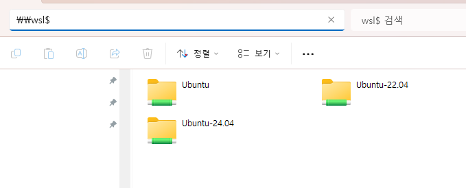

1. # WSL
   1.WSL는 Windows Subsystem for Linux의 줄임말로, 윈도우의 가상화기능을 활용해서 윈도우 위에서 리눅스를 사용할 수 있게 해줍니다.   
   2.이제 가상머신을 따로 구성하지 않고도, 윈도우에서 리눅스를 사용할 수 있습니다.   
   3.나아가 단순히 가상머신으로 리눅스를 사용할 수 있는것이 아니라, 윈도우 시스템과 통합되어 마치 하나의 머신처럼 자연스럽게 리눅스를 활용하는 것이 가능합니다.   
   4.개발자가 기존가상머신(virtual machine)의 오버헤드 또는 듀얼부팅 설정없이 대부분의 명령줄도구, 유틸리티 및 애플리케이션을 비롯한 GNU/Linux 환경을 수정하지않고 Windows에서 직접 실행할 수 있다.   

1. # WSL2
   1.WSL2는W SL1과 다르게 Hyper-V를 사용해서 경량 VM기술을 사용한다.
   2.WSL1에서는 Windows의NT Kernel 위에 WSL을 올리고 리눅스용 애플리케이션을 돌렸다면, WSL2에서는H ypervisor 위에 윈도우NT Kernel과Linux Kernel을 각각 올리는 방식이다.
   3.Docker를 설치할 때도 WSL2를 설치해야한다.

1. # WSL2 설치
   1.윈도우10 버전2004(빌드19041 이상) 이상이나 윈도우11에서는 wsl명령어 하나로 WSL2를 설치할 수 있다.   
   PowerShell이나 CMD 창을 관리자 권한으로 실행해서 설치한다.   
   ```yml
      wsl --install
   ```

   2.설치가 끝나고 다음 명령어를 실행해, WSL버전 기본값을 2로 변경해준다.   
   ```yml
      wsl --set-default-version 2
   ```

   3.wsl업데이트를 진행한다.   
   ```yml
      wsl--update 
   ```

   이후 windows를 리부팅한다.   

1. # Ubuntu Linux 설치
   1.컴퓨터의 하단에 위치한 윈도우 아이콘을 눌러서 Microsoft Store에 접속한다.   
   2.Ubuntu 검색 후 Ubuntu 20.04.6 LTS 버전을 다운로드 및 설치한다.   
   3.컴퓨터 하단에 위치한 윈도우 아이콘눌러서 설치한 Ubuntu Linux를 실행한다.   

1. # WSL(Ubuntu)와 window 폴더공유

   WSL과 window가 서로 공유하는 폴더를 만들 수 있다.   

   1.윈도우 탐색기에서 `\\wsl$`  입력한다.   

      

   2.공유된 Ubuntu-20.04 폴더를 클릭해서 파일을 복사해보자.   