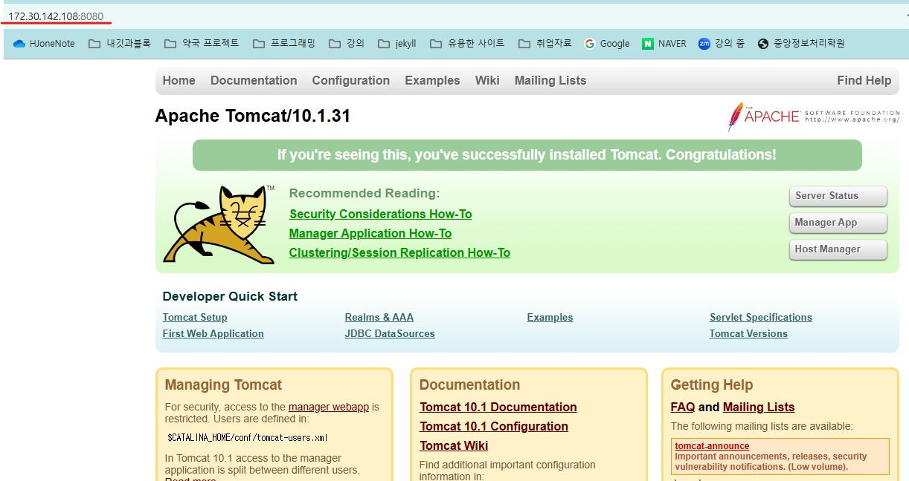
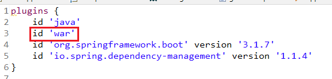
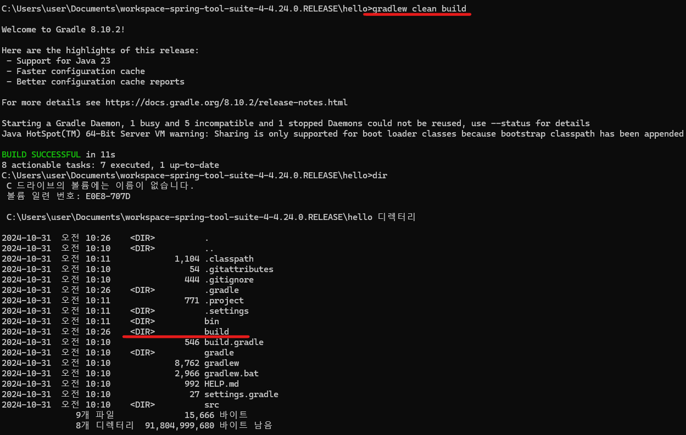
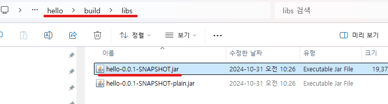

1. # 리눅스에 java설치
   ```
      sudo apt-get update
      sudo apt-get install openjdk17-jdk
   ```   
   윈도우는 path를 설정해줘야 하지만, 리눅스는 path가 자동으로 잡힙니다.   

   ```
      khj@a:~$ javac -version
      javac 17.0.12
      khj@a:~$ whereis java
      java: /usr/bin/java /usr/share/java /usr/share/man/man1/java.1.gz
   ```

   path는 기본적으로 /etc/profile 안에 저장됩니다.   

   자바 실행   
   ```
      khj@a:~/exmy$ javac hello.java
      khj@a:~/exmy$ java hello
   ```

1. # 톰캣 설치
   톰캣 사이트에서 tar.gz 파일 다운받기   
   오른쪽 마우스 -> 링크 주소 복사   

   wet [복사 주소]    
   ```
      khj@a:~$ wget https://dlcdn.apache.org/tomcat/tomcat-10/v10.1.31/bin/apache-tomcat-10.1.31.tar.gz
   ```

   압축 풀기   
   ```
      khj@a:~$ tar -zxvf apache-tomcat-10.1.31.tar.gz
   ```

   실행하기   
   bin디렉토리까지 와서 startup실행   
   ```
      khj@a:~/apache-tomcat-10.1.31/bin$ ./startup.h
   ```

   중지하기
   ```
      khj@a:~/apache-tomcat-10.1.31/bin$ ./shutdown.sh
   ```

   ifconfig로 ip주소 알아오기
   ```cs
      khj@a:~/apache-tomcat-10.1.31/bin$ ifconfig
      eth0: flags=4163<UP,BROADCAST,RUNNING,MULTICAST>  mtu 1500
        inet 172.30.142.108  netmask 255.255.240.0  broadcast 172.30.143.255
        inet6 fe80::215:5dff:fe50:1be1  prefixlen 64  scopeid 0x20<link>
        ether 00:15:5d:50:1b:e1  txqueuelen 1000  (Ethernet)
        RX packets 11631  bytes 15369435 (15.3 MB)
        RX errors 0  dropped 0  overruns 0  frame 0
        TX packets 4457  bytes 296913 (296.9 KB)
        TX errors 0  dropped 0 overruns 0  carrier 0  collisions 0
   ```
   172.30.142.108 복사   

   ```
      172.30.142.108:8080 
   ```

      

   jar - 내장톰캣만 서버 구동, 아파치 톰캣이 필요 없음   
   war - 내장톰캣, 아파치 톰캣에서 구동   

1. # war 구동
   기존에 있던 ROOT 디렉토리는 지워버리고 프로젝트명을 ROOT로 변경 후 'ROOT.war'로 만듭니다.   
   실행을 하면 ROOT.war 파일이 압축이 자동으로 풀리면서 ROOT 디렉토리를 새로 생성합니다.   

   프로젝트 생성
   ```
      C:\Users\user\Documents\workspace-spring-tool-suite-4-4.24.0.RELEASE\hello
   ```
   
   war와 jar 구별
      
1. # jar 구동


   프로젝트 생성

   프로젝트 위에서 오른쪽 마우스 -> Properties -> Resource 에서 경로 가져오기 gradlew clean build    
   ```
      C:\Users\user\Documents\workspace-spring-tool-suite-4-4.24.0.RELEASE\hello>gradlew clean build
   ```

   build 디렉토리가 만들어집니다.   
     

   libs폴더에서 ~ SNAPSHOT.jar 파일을 복사합니다   
     

   우분투 리눅스로 보냅니다.    
   ```
      \\wsl$
   ```

   ifconfig로 ip주소를 가져옵니다.   

   방화벽을 열어줍니다.   
   ```cs
       sudo ufw allow 80 //80포트만 허용
       sudo ufw disable //모든 방화벽을 중지
   ```

   내부톰캣으로 구동
   ```
      sudo java -jar hello-0.0.1-SNAPSHOT.jar
   ```

   브라우저 주소창에서   
   ```cs
      http://172.30.142.108/80 //포트는 생략 가능
   ```