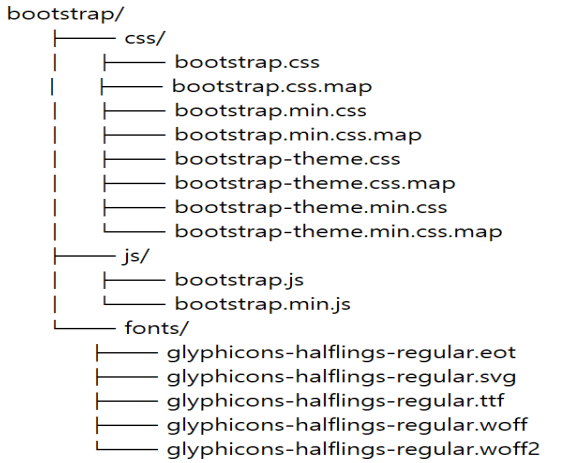
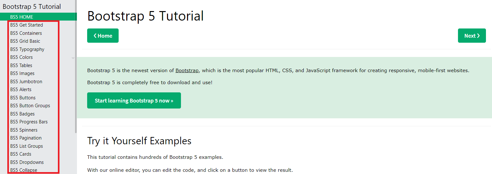
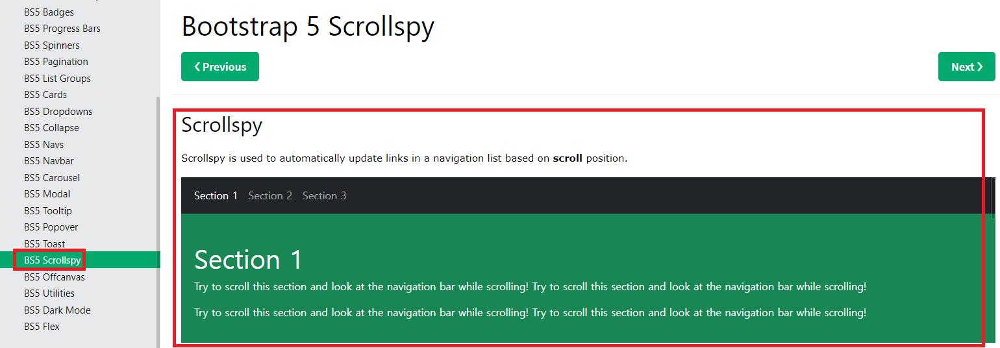
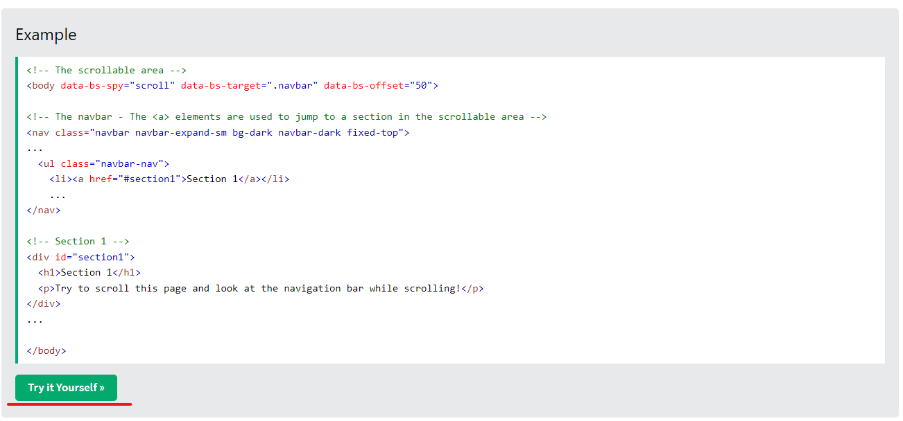
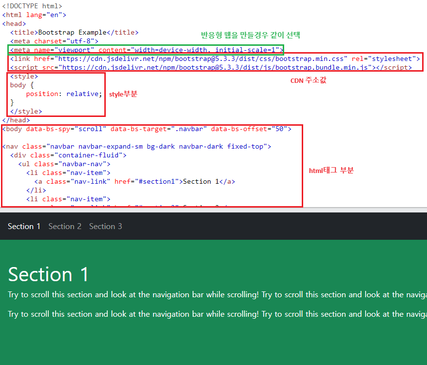
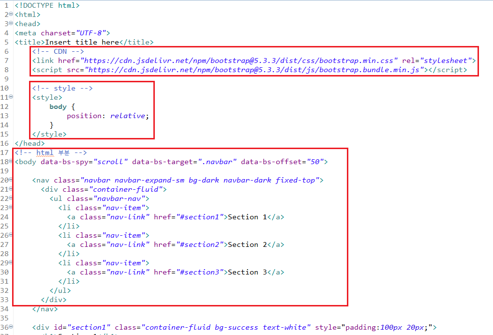

1. # BootStrap
   BootStrap은 2010년 중반에 트위터 개발자 @mdo와 @fat을 사용하는 개발자가 만든 오픈소스 프레임워크입니다. 부트스트랩은 HTML,CSS,JavaScript 및 다양한 UI 컴퍼넌트로 구성되어 있습니다.   

1. # 구조
      

   css와 js와 fonts등의 구조는 다음과 같습니다.   

1. # 사용방법
   <a href="https://www.w3schools.com/bootstrap/bootstrap_ver.asp">https://www.w3schools.com/bootstrap/bootstrap_ver.asp</a>   

   BS버전이 3과 4와 5 버전이 보입니다. 원하는 버전을 클릭하고 들어갑니다.   

   왼쪽에 BootStrap이 제공하는 메뉴가 있습니다.   
      

   왼쪽 메뉴에서 BS5 Scrollspy를 예제로 선택했습니다. 오른쪽에 Scrollspy가 어떻게 동작하는지 예제 실행 화면이 보입니다.   
      

   밑으로 스크롤을 이동시켜 Try it yourself 버튼을 클릭합니다.   
      

   상단 CDN주소가 있습니다. 이 부분을 가져와야 스타일과 자바스크립트가 적용됩니다. 가운데 style부분이 있는데 이 부분은 있는 UI가 있고 없는 UI가 있습니다. 마지막으로 밑에 HTML 부분이 화면에 보여지는 태그들입니다. 이부분을 모두 복사해서 가져옵니다.   
      

   다음과 같이 가져와서 원하는 기능들을 추가하면 됩니다.      
      