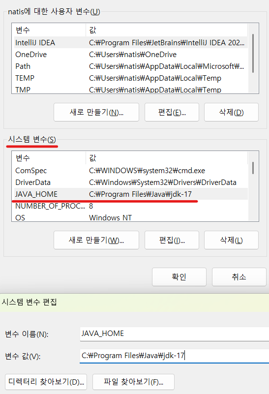
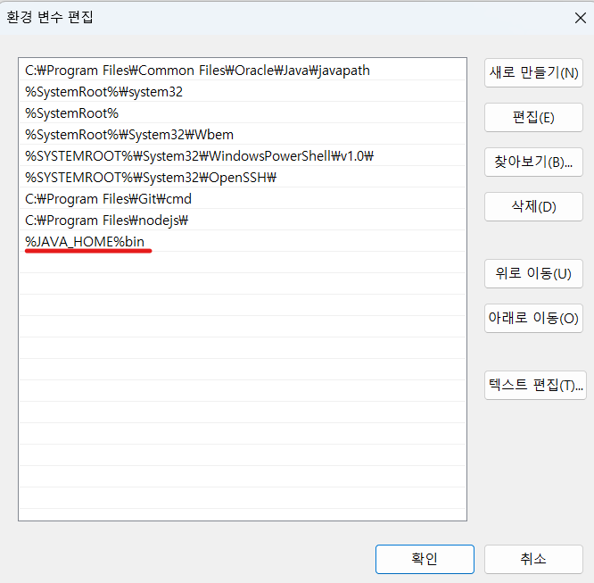

1. # 자바 설명

   <a href="https://www.oracle.com/kr/java/technologies/downloads/#jdk17-windows">https://www.oracle.com/kr/java/technologies/downloads/#jdk17-windows</a>   
   jdk17 설치파일   

   이클립스 삭제   
   eclipse(`c:\`나 Program Files에 위치)   
   eclipse-workspace(또는 이클립스를 사용하는 각자 지정한 경로)   
   .eclipse(사용자에 숨김 파일)   
   .p2(사용자에 숨김 파일)   
   4개 파일을 삭제   

   Java Standard Edition : JavaSE   
   Java Enterprise Edition : JavaEE   

   JavsSE 설치 시   
   JDK : 컴파일러와 JVM   
   JRE : 클래스 모음집   

   test.java -> javac(컴파일러에 의해 실행) -> test.class -> java(JVM에 의해 실행)   

   IDE(Integrated Development Enviroment) : 컴파일, 실행, 디버깅 가능   

   이클립스는 압축된 파일인데 압축을 풀면 바로 실행. 설치하는 게 아니다.

   workspace-project
   src : 소스 코드
   bin : 바이트 코드

   project layout - create spearate folders for sources ..   
   소스코드(src)와 바이트코드(bin)를 분리    
   Use project foler as root .. 소스코드와 바이트코드를 분리

   Module
   체크 해제

   Default output folder
   하단 javaproject/bin에 바이트코드가 저장

   perspective   
   개발환경에 따라 매니져, 뷰, 윈도우 창을 템플릿 형태로 저장해 둔 옵션   

   java - 자바개발시 사용   
   java EE - 웹개발시 사용   

   package - 폴더

   Basic - Text Font

   main() 메소드는 자바가상머신(JVM, java.exec)이 가장 먼저 호출하는 메소드이다
	개발자가 직접 호출 불가
   1개의 클래스가 독립적으로 실행되기 위해서는 반드시 main메소드가 필요    

   모듈   
   외부에서 재사용할 수 있는 패키지들의 묶음   
   이클립스의 프로젝트는 하나의 모듈을 개발하는 것   

1. # 환경 설정
   실행 창에서 sysdm.cpl 입력   

   고급 -> 환경 변수    

   시스템 변수 -> 새로 만들기   
   
   변수 이름   
   ```
      변수 이름 : JAVA_HOME
      변수 값 : C:\Program Files\Java\jdk-17
   ```   
      

   path설정   
   ```
      %JAVA_HOME%bin
   ```   
      