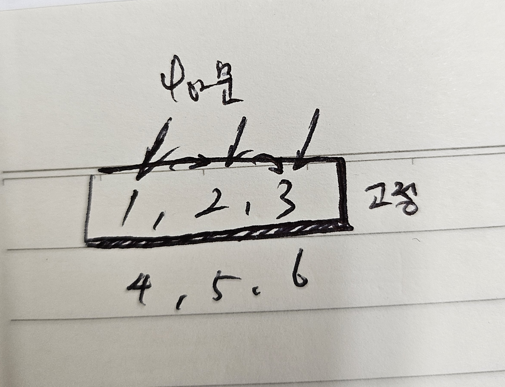
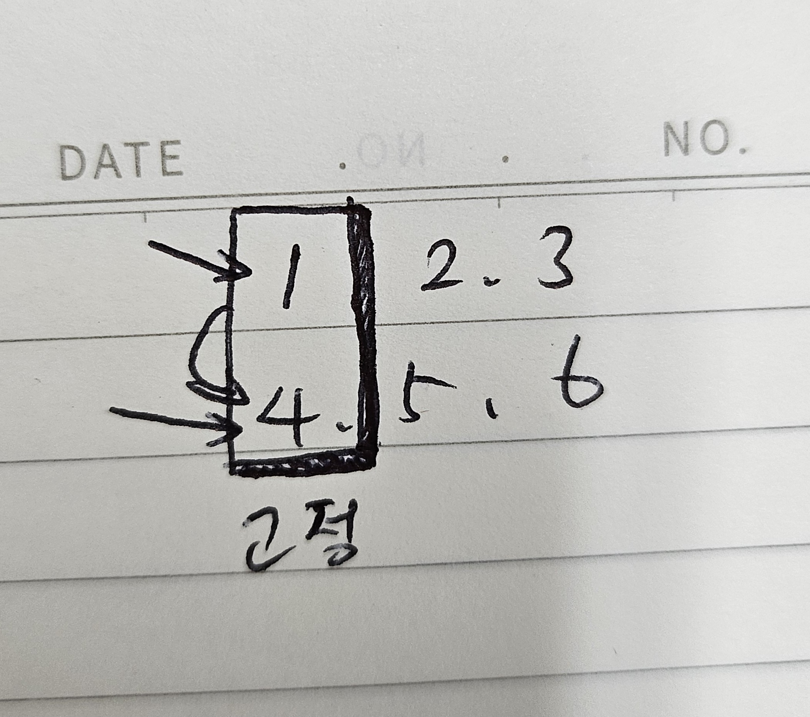
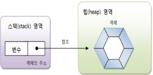

1. # 2차원 배열

   2. new 연산자로 배열 생성   
      배열에 저장될 값이 정해져 있지 않는 경우에 주로 사용하는 형식   
      
      정의
      ```java
      int[][] score = new int[행의 수][열의 수]   
      ```   
      대괄호 2개로 크기를 지정   

      ```java
         int[][] score = new int[5][3]; //5 - 행의 수, 3 - 열의 수   
      ```   
      0 1 2   
      0   
      1   
      2   
      3   
      4   
      행은 학생이 5명, 열은 과목이 3개   

   2. 값 목록으로 배열 생성   
      정의   
       ```java
         int[][] socre = {
                           {45,65,97}, //0행
                           {5,97,12}, //1행
                           {33,49,9}, //2행
                           {94,66,12}, //3행   
                           {3,34,83}  //4행
                        }
      ```   

      2차원 배열 for문   
      ```java
         int[][] temp = {{1,2,3},{4,5,6}};

         /*
         1,2,3
         4,5,6
         */

		   for(int i=0 ; i<temp.length ; i++) { //행 고정
			   for(int j=0 ; j<temp[0].length ; j++) {
				   System.out.print(temp[i][j]);
			   }
         //123
         //456
		 
		   for(int j=0 ; j<temp[0].length ; j++) { //열 고정
			   for(int i=0 ; i<temp.length ; i++) {
				   System.out.print(temp[i][j]);
			   }
		   }
         //14
         //25
         //36
      ```   
      행 고정   
         

      열 고정   
         

1. # 객체
   현실세계 : 설계도 -> 객체   
   자바 : 클래스 -> 객체   
   클래스로부터 만들어진 객체를 해당 클래스의 인스턴스라고 한다.   
   메모리 상에 할당된 것 : 인스턴스   

1. # 객체 생성
   클래스를 이용해서 객체를 생성   
   new 연사자로 힙(heap) 메모리 영역에 객체를 저장하기 위한 공간을 할당 - 명시적으로 공간을 할당받기 위한 방법   

   ```
      //2줄로 선언
      글래스 변수;
      변수 = new 클래스();

      //1줄로 선언
      클래스 변수 = new 클래스();
   ```   
      
   스택영역에 "변수" 저장 / "변수:객체의 주소"형태로 저장   
   힙영역에 "객체" 저장   

1. # 클래스 멤버들
   필드 = 멤버변수 = 전역변수   
   필드 : 객체의 속성을 heap메모리에 저장하는 역할(멤버변수)   

   멤버 함수 - 생성자 + 메소드   
   생성자 : 객체를 생성할 때 호출되면서 __필드를 초기화__ 시켜주는 역할   
   메소드 : 객체의 동작에 해당하는 실행 역할   

1. # 변수 사용 범위
   1. 지역 변수   
   2. 멤버 변수(field, 전역 변수)
   3. 정적 멤버변수(정적 필드)