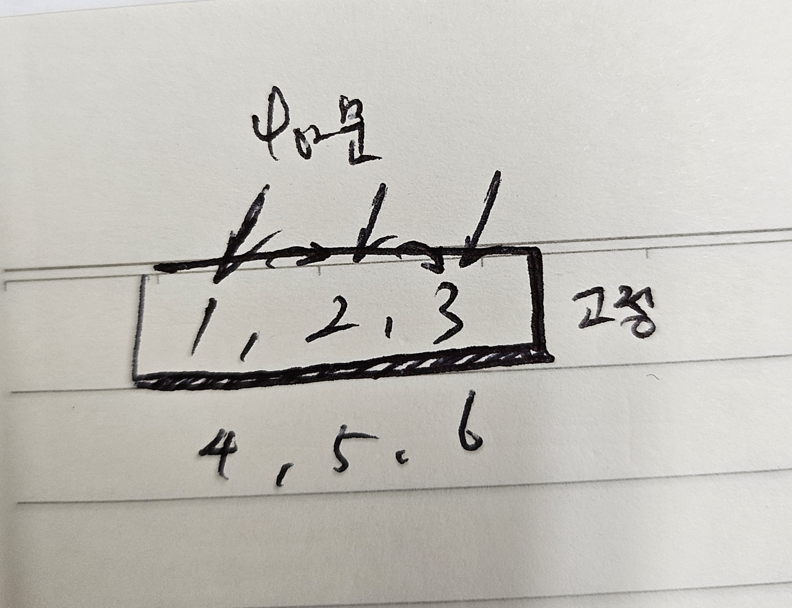
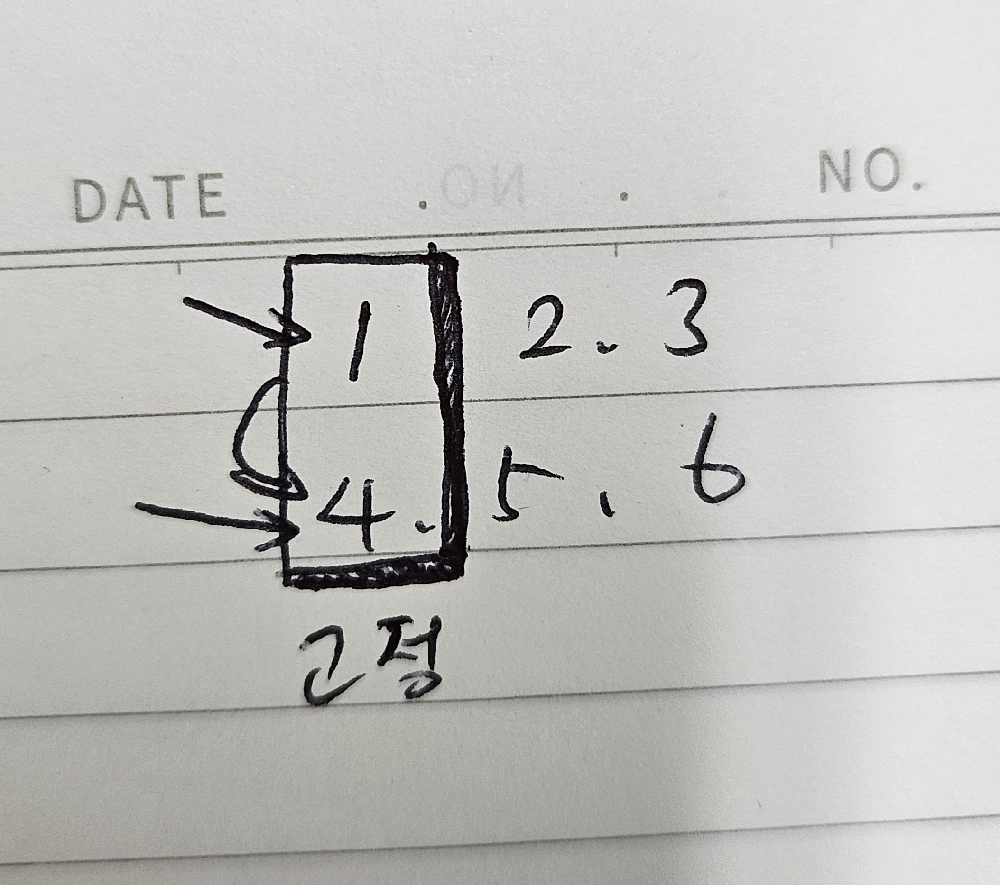

1. # 2차원 배열

   2. new 연산자로 배열 생성   
      배열에 저장될 값이 정해져 있지 않는 경우에 주로 사용하는 형식   
      
      정의
      ```java
      int[][] score = new int[행의 수][열의 수]   
      ```   
      대괄호 2개로 크기를 지정   

      ```java
         int[][] score = new int[5][3]; //5 - 행의 수, 3 - 열의 수   
      ```   
      0 1 2   
      0   
      1   
      2   
      3   
      4   
      행은 학생이 5명, 열은 과목이 3개   

   2. 값 목록으로 배열 생성   
      정의   
       ```java
         int[][] socre = {
                           {45,65,97}, //0행
                           {5,97,12}, //1행
                           {33,49,9}, //2행
                           {94,66,12}, //3행   
                           {3,34,83}  //4행
                        };
      ```   

      2차원 배열 for문   
      ```java
         int[][] temp = {
                     {1,2,3},
                     {4,5,6}
                  };

         /*
         1,2,3
         4,5,6
         */

		   for(int i=0 ; i<temp.length ; i++) { //행 고정
			   for(int j=0 ; j<temp[0].length ; j++) {
				   System.out.print(temp[i][j]);
			   }
         //123
         //456
		 
		   for(int j=0 ; j<temp[0].length ; j++) { //열 고정
			   for(int i=0 ; i<temp.length ; i++) {
				   System.out.print(temp[i][j]);
			   }
		   }
         //14
         //25
         //36
      ```   
      행 고정   
         

      열 고정   
         

1. # 클래스
   public class는 반드시 소문자   

   한 파일의 공간 안에 클래스를 같이 생성해도 나중에 컴파일 후 생성되는 바이트 코드 파일은 클래스를 선언한 개수만큼 생깁니다.   
   __=> 소스 파일은 클래스 선언을 담고 있는 저장 단위일 뿐, 클래스 자체가 아닙니다.__   

1. # new 연산자
   new는 클래스로부터 객체를 생성시키는 연산자. new 연산자로 생성된 객체는 메모리 힙(heap) 영역에 생성  

1. # 객체
   현실세계 : 설계도 -> 객체   
   자바 : 클래스 -> 객체   
   클래스로부터 만들어진 객체를 해당 클래스의 인스턴스라고 한다.   
   메모리 상에 할당된 것 : 인스턴스   

1. # 객체 생성
   클래스를 이용해서 객체를 생성   
   new 연산자는 힙(heap) 메모리 영역에 객체를 저장하기 위한 공간을 할당 - 명시적으로 공간을 할당받기 위한 방법   

   ```
      //2줄로 선언
      글래스 변수;
      변수 = new 클래스();

      //1줄로 선언
      클래스 변수 = new 클래스();
   ```   
      
   스택영역에 "변수" 저장 / "변수:객체의 주소"형태로 저장   
   힙영역에 "객체" 저장   

1. # 클래스 멤버들
   2. 클래스 멤버들 : 필드, 생성자, 메소드

   2. 필드(멤버변수,전역변수)
      필드 : 객체의 속성을 heap메모리에 저장하는 역할(멤버변수)   
      필드는 생성자와 메소드 전체에서 사용되며, 객체가 소멸되지 않는 한 객체와 함께 존재   

   2. 멤버 함수 - 생성자 + 메소드   
      생성자 : 객체를 생성할 때 호출되면서 __필드를 초기화__ 시켜주는 역할   
      메소드 : 객체의 동작에 해당하는 실행 역할   

1. # 변수 사용 범위
   1. 지역 변수   
   2. 필드(멤버 변수, 전역 변수)   
   3. 정적 필드(정적 멤버 변수)   

1. # 클래스명
   main메소드를 가진 클래스명이 파일이름과 일치해야 함   
   main메서드를 가진 클래스만 앞에 public가능   

1. # 필드 생성   
   ```java
      Car mycar = new Car();
   ```   
   Car : 클래스명   
   mycar : 주소값을받는변수(레퍼런스변수)   
   new : 연산자   
   Car() : 생성자를호출하란명령어   

   new연산자로 객체를 생성해 공간을 heap에 할당 받는 순간 필드도 초기화 됨   
   선언 형태는 변수와 비슷하지만 필드를 변수라고 부르지 않음   
   클래스 멤버 변수라고도 부르는데 그냥 "필드"라고 부르는 것이 제일 자연스러움   

   초기값이 지정되지 않은 필드는 객체 생성 시 자동으로 기본 초기값으로 설정   

   클래스 내부의 생성자나 메소드에서 필드를 사용할 경우 바로 이름으로 변경이 가능하지만, 외부에서 사용할 경우 우선 클래스로부터 객체를 생성한 뒤 필드를 사용   

   필드를 초기화 하는 방법 2가지   
   1)선언할 때 초기화   
   2)생성자를 통해 초기화   

1. # 도트(.) 연산자
   도트 연산자는 객체 접근 연산자로 객체가 가지고 있는 필드나 메소드를 사용하고자 할 때 사용   

1. # 생성자
   생성자는 클래스명과 동일한 이름으로 생성해야 함   
   생성자는 객체가 생성될 때 호출되며, 필드를 초기화하는 시키는 역할을 한다   

   ```java
      public class Animal {

         int age;  //필드(field), 멤버변수, 전역변수 : heap 영역에 저장 
               //메소드 바깥쪽에 정의되는 변수
         
         //기본 생성자(Default Constructor)
         //매개변수가 없는 생성자
         public Animal() {
            System.out.println("생성자 호출 성공");
         }
         
         public static void main(String[] args) {
            
            int a = 10; //지역 변수 : stack 영영에 저장   
            
            String str = new String("자바");
            Animal  a1   =   new   Animal();
         // 클래스 레퍼런스변수 = 연산자 생성자호출;
         }
      }
   ```   
   생성자 Animal()이 호출되면 생성자 Animal()이 호출되면서 heap영역에 공간이 만들어지고, 생성자가 호출될 때 age필드가 초기화된다.   

   클래스가 public class로 선언되면 기본 생성자도 public이 붙지만, 클래스가 public 없이 class로만 선언되면 기본 생성자도 public이 붙지 않음   


   스택영역&nbsp;&nbsp;&nbsp;&nbsp;&nbsp;힙영역   
   al(주소값 저장) ----> int age=0;   

   생성자 바로 만들기   
      

   this() : 같은 클래스 안에 생성자를 호출할 때 사용   

1. # 오버로딩
   생성자 오버로딩, 메소드 오버로딩
   매개변수의 타입(자료형), 개수, 순서 중 적어도 1가지가 달라야 가능   

   생성자 오버로딩 : 한개의 클래스 안에 생성자를 여러개 정의하는 것   
	생성자 오버로딩 조건 : 매개변수의 자료형, 갯수, 순서   
	기본 생성자는 컴파일러가 자동으로 생성해주지만, 예외적으로 매개변수를 가진 생성자가 있을 경우에는 더이상 기본 생성자를 자등으로 생성 해주지 않음   
