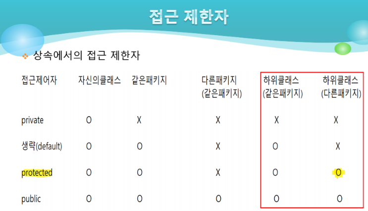

1. # 상속
   부모 클래스의 멤버 중에서 __필드__ 와 __메소드__ 만 자식 클래스로 상속   
   부모 클래스의 멤버 중에서 생성자는 자식 클래스에 상속되지 않는다.
   자바는 1개의 클래스만 상속받는 클래스의 단일 상속만 가능   
   인터페이스는 다중 상속 가능
   extends로 상속
   부모나 조부모, 모든 조상의 클래스들을 자식이 상속 받음   

   자식이 부모를 선택해서 자식이 상속을 받는다.

1. # 객체 지향 프로그래밍의 특징
   1.캡슐화   
   private, public, protected같은 접근제어자   
      

   2.상속   

   3.다형성   
   
1. # super
   부모 클래스를 의미하는 내부 레퍼런스 변수   
   부모 클래스의 은닉된 필드와 은닉된 메소드를 호출할 때 사용   
   ```
      super.x   
      super.func();
   ```   

   super.x는 자식 클래스의 메소드 안에서 사용할 수 있다.   
   ```java
      class Point3D extends Point2D{	//자식 클래스
        
         public void print() {
            System.out.println(super.x); //메소드 안에서 super.x사용
         }
         
         //System.out.println(super.x); error발생. 메소드 밖에서 사용했기 때문 
         
         int a = super.x; //메소드 밖이라도 변수에 받는 건 가능
      }
   ```

1. # super()   
   super()는 부모클래스의 매개변수를 가진 __생성자__ 를 호출할 때 사용   
   super()는 자식클래스의 __생성자 안의 첫번째 라인__ 에서 사용   
   super()를 이용해서 부모클래스의 매개변수를 가진 생성자를 호출하면, 더이상 부모클래스의 기본 생성자를 호출해주지 않음.   

1. # 메소드 재정의(오버라이딩)
   부모 클래스에서 __상속받은 메소드__ 를 자식 클래스에서 __재정의__ 해서 사용하는 것   
   자식 클래스로 객체를 생성한 다음에 메소드를 호출하면, 메소드 오버라이딩된 메소드만 호출된다.   

   1.부모 클래스의 메소드 이름과 형식을 동일하게 사용   
   2.접근 제한자를 더 강하게 정의 할 수 없다.   
      :public을 default나 private으로 수정 불가   
      :반대로 default는 public으로 수정 가능   
   3.새로운 예외를 throws 할 수 없다.   
   4.자식 클래스에서 부모 클래스의 메소드를 재정의하면, 자식 클래스에서 메소드를 호출하면 재정의된 메소드만 호출되며 부모 클래스의 메소도는 은닉 되어서 더 이상 사용할 수 없다.   
   5.자식 클래스에서 은닉 메소드를 사용하기 위해서는 super를 이용   
   6.super는 자식 클래스의 메소드 안에서 사용가능   
   7.super()는 자식 클래스의 생성자 안에서 사용가능   

1. # 상속에서 생성자  
   1.생성자는 기본적으로 상속되지 않음   
   2.자식 클래스를 이용해서 객체를 생성할 때 자식 클래스의 생성자(기본생성자, 매개변수가 있는 생성자 모두)가 호출되며, 부모 클래스의 기본생성자가 자동으로 호출된다.   
   *부모 클래스의 기본 생성자만 자동으로 호출, 매개변수가 있는 생성자는 자동 호출이 아님   
   3.매개변수가 있는 생성자가 있을 경우에는 더이상 컴파일러가 기본 생성자를 자동으로 생성해 주지 않음   
   4.부모 클래스의 매개변수가 있는 생성자를 자식 클래스에서 호출하때 super()를 이용해서 호출.   
   단, super()는 자식 클래스의 생성자 안에서만 사용 가능   

   생성자   
   1.생성자는 기본적으로 상속되지 않음   
   2.자식 클래스로 객체를 생성할 때 자식 클래스의 생성자(기본 생성자, 매개변수가 있는 생성자 모두)가 호출되면, 부모 클래스의 기본 생성자가 자동으로 호출   
   3.부모 클래스의 매개변수가 있는 생성자를 호출할때는 super()를 이용해서 호출할 수 있다.   
   4.자식 클래스에서 super()를 사용할 때는 자식 클래스의 생성자 첫번째 라인에서 사용.(super()의 위치는 정해져 있음)   

   자바 상속에서 부모 클래스에 기본 생성자가 없는 경우, 두 가지 상황이 발생합니다.   

	__1.자식 클래스에 기본 생성자만 있는 경우:__   
      문제 없이 정상적으로 작동합니다.   
      자식 클래스 생성 시, 컴파일러가 자동으로 부모 클래스의 기본 생성자를 호출합니다.   
      즉, 명시적으로 코드를 작성하지 않아도 부모 클래스의 필드가 초기화됩니다.   

	__2.자식 클래스에 매개변수 있는 생성자만 있는 경우:__   
      컴파일 오류가 발생합니다.   
      자식 클래스 생성 시, 반드시 부모 클래스의 생성자를 명시적으로 호출해야 합니다.   
      이는 super() 키워드를 사용하여 수행됩니다.   

   해결 방법:   
      부모 클래스에 명시적으로 기본 생성자를 추가합니다.   
      자식 클래스 생성자에서 super() 키워드를 사용하여 부모 클래스의 특정 생성자를 호출합니다.   

   주의 사항:   
      부모 클래스에 생성자가 하나라도 존재하면, 자식 클래스에서 생성자를 만들 때 반드시 부모 클래스 생성자를 호출해야 합니다.   
      명시적으로 호출하지 않으면 컴파일 오류가 발생합니다.   

      ```java
         class Parent{

            public Parent() {
               System.out.println("Parent 기본 생성자");
            }
            
            public Parent(int a) {
               System.out.println("Parent 매개변수가 있는 생성자");
            }
         }

         class Child extends Parent{
            
            public Child() {
               super(4);
               System.out.println("Child 기본 생성자");
            }
            
            public Child(int a) {
               super(8);
               System.out.println("Child 매개변수가 있는 생성자");
            }
         }

         public class inherit_constructor {

            public static void main(String[] args) {

            }
         }        
      ```

      main에서 
      ```java
            public static void main(String[] args) {
               Child c = new Child();
               //Parent 기본 생성자
               //Child 기본 생성자
            }
      ```
      를 호출하면 자식 객체를 생성하면 부모 생성자와 자식 생성자가 호출 됨. 이게 기본 값

      __1.Child에 기본 생성자가 없는 경우__     
      ```java
         public static void main(String[] args) {
            Child c2 = new Child(4);
            //Parent 기본 생성자
            //Child 매개변수가 있는 생성자
         }
      ```   
      Child에 기본 생성자가 없고 매개변수를 가진 생성자만 있기 때문에   
      ```
      Child c2 = new Child(4);
      ```   
      로 호출했음. 이때 Parent의 기본 생성자가 암묵적으로 호출 됨

      __2.Parent에 기본 생성자가 없는 경우__   
      ```java
         public static void main(String[] args) {
            Child c3 = new Child();  //error발생
         }
      ```   
      Parnet에 생성자가 없는 경우 기본 생성자가 자동 호출 되지만, 매개변수를 가진 생성자만 있는 경우 
      자동으로 Parent의 기본 생성자를 호출 할 수 없기 때문에 error 발생
      즉, Parent에 아무런 생성자가 없으면 기본 생성자가 호출 되어 error 없음
      하지만 매개변수가 있는 생성자가 있으면 error 발생
      
      __해결 방안__   
      자식 생셩자에서 super(12)로 Parent 생성자를 명시적으로 호출
      ```java
         class Child extends Parent{
         
         public Child() {
            super(4);  //super()를 명시적으로 호출, 가장 상단에서 super호출
            System.out.println("Child 기본 생성자");
         }
         
         public Child(int a) {
            super(8); //super()를 명시적으로 호출, 가장 상단에서 super호출
            System.out.println("Child 매개변수가 있는 생성자");
         }
      }
      ```

1. # 레퍼런스 형변환
   상속 관계에 있을 때만 적용되는 변환   
    
   -자동 형변환(업 캐스팅)   
   1.자식 클래스에서 부모 클래스로 형변환을 하는 것   
   2.참조 가능한 영역이 축소된다.   
   3.컴파일에 의해 자동 형변환이 된다.   

   자식 클래스 → 부모 클래스 : 업 캐스팅   

   -강제 형변환(다운 캐스팅)   
   1.부모 클래스에서 자식 클래스로 형변환   
   2.참조 가능한 영역이 확대   
   3.개발자가 직접 강제 형변환을 해야 함. 이때 강제 형변환시 자료형을 생략할 수 없음     

   부모 클래스 → 자식 클래스 : 다운 캐스팅   

   ```java
      class Parent{
         public void parentPrn() {
            System.out.print("parentPrn");
         }
      }

      class Child extends Parent{
         public void childPrn() {
            System.out.println("childPrn");
         }
      }

      public class ex01 {

         public static void main(String[] args) {
            // TODO Auto-generated method stub
            
            Parent p;
            p = new Child(); 			//업캐스팅
            
            Parent p2 = new Child();//업캐스팅
            
            p2.parentPrn();
            //p2.childPrn(); //업캐스팅이 되면 참조 가능 영역 축소
            
            Child c;
            c = (Child)p;			//다운캐스팅
            
            Child c2 = (Child)p;	//다운캐스팅
            
            c2.parentPrn();
            c2.childPrn();
            //다운 캐스팅이 되면 참조 가능 영역 확대
         }
      }
   ```