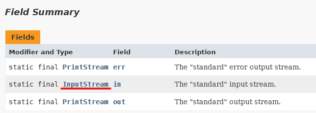
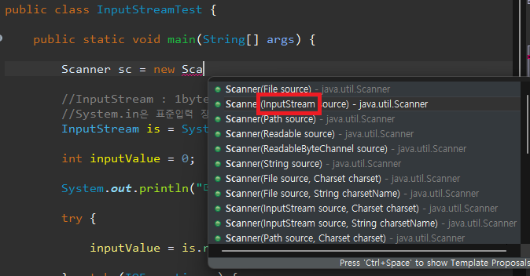

1. # 스트림 이란?
   스트림은 단일 방향으로 연속적으로 흐르는 데이터의 흐름을 의미합니다.   

   입력 스트림 : 키보드, 파일, 프로그램 등   
   출력 스트림 : 모니터, 파일, 프로그램 등   

1. # 입출력 스트림의 종류
   1)바이트 기반 스트림   
   1Byte 단위로 데이터를 전송하는 스트림   
   그림, 멀티미디어 등의 바이너리 데이터를 읽고 출력할 때 사용   

   2)문자 기반 스트림   
   2Byte 단위로 데이터를 전송하는 스트림(한글 가능)   
   문자 데이터를 읽고 출력할 때 사용   

   |     구분   |바이트 기반<br>입력 스트림|바이트 기반<br>출력 스트림|문자 기반<br>입력 스트림|문자 기반<br>출력 스트림|
   |:----------:|:----------------------:|:----------------------:|:---------------------:|:--------------------:|
   |최상위 클래스|       InputStream      |       OutputStream       |       Reader       |       Writer       |
   | 하위 클래스 |XXXInputStream<br>(FileInputStream)|XXXOutputStream<br>(FileOutputStream)|XXXXReader<br>(FileReader)|XXXWriter<br>(FileWriter)|

1. # 입력 예제
   ```java
      public class InputStreamTest {
         public static void main(String[] args) {
            //InputStream : 1byte 데이터를 입력 받을 수 있는 입력 스트림
            //System.in은 표준입력 장치인 키보드로 입력 받는다는 의미
            InputStream is = System.in;
            
            int inputValue = 0;
            
            System.out.print("데이터 입력 : ");
            
            try {
               inputValue = is.read();
            } catch (IOException e) {
               e.printStackTrace();
            }
            
            System.out.println("입력한 데이터 :" + inputValue);
            System.out.println("입력한 문자 :" + (char)inputValue);
         }
      }

      출력값
      데이터 입력 : a
      입력한 데이터 :97
      입력한 문자 :a
   ```   
   1바이트만 입력을 받는 예제입니다. 입력 받은 값은 byte로 받기 때문에 10진수 아스키코드로 출력됩니다. 이를 char로 강제 형변환하여 다시 한번 출력합니다.   
   System의 필드 in의 리턴타입이 InputStream인 것을 확인 할 수 있습니다.   
      

   Scanner를 사용할 때 new Scanner(System.in);을 사용하게 되는데 이때 Scanner가 InputStream을 매개변수로 받기 때문에 System의 in필드를 사용합니다.   
      

1. # BufferedReader
   BufferedReader로 한줄 입력받기   

   ```java
      public static void main(String[] args) {
         //3줄로 입력
         InputStream is = System.in;
         InputStreamReader isr = new InputStreamReader(is);
         BufferedReader br = new BufferedReader(isr);
         
         //1줄로 입력
         BufferedReader br2 = new BufferedReader(new InputStreamReader(System.in));
         
         System.out.println("Input Data : ");
         
         String s = "";
         try {
            s = br.readLine();
            System.out.println(s);
         }catch(IOException io) {
            io.printStackTrace();
         }
      }
   ```   
   
1. # 파일 입출력
   1)바이트 스트림(1byte)   
   ```js
      FileInputStream file = new FileInputStream("test.txt");
      FileOutputStream file = new FileOutputStream("test.txt");
   ```   

   2)문자 스트림(2byte)
   ```js
      FileReader file = new FileReader("test.txt");
      FileWriter file = new FileWriter("test.txt");
   ```

1. # 바이트 읽어오기 예제
   ```java
      public class FileInputStreamTest {

         public static void main(String[] args) throws FileNotFoundException {
            int inputValue = 0;
            FileInputStream fis = null;
            
            try {
               //fis = new FileInputStream("read.txt");
               //fis = new FileInputStream("C:\\Users\\user\\git\\JavaEclipse\\javaproject\\read.txt"); 절대경로
               //fis = new FileInputStream("C:/Users/user/git/JavaEclipse/javaproject/read.txt"); 절대경로
               
               while((inputValue = fis.read())!= -1) {
                  System.out.print((char)inputValue);
                  inputValue = fis.read();            //read메소드는 파일의 끝을 만나면 -1을 리턴
               }
            }catch(Exception e) {
               e.printStackTrace();
            }finally {
               try {
                  //fis가 애초에 생성되지 않았으면 null이기 때문에 생성되지 않은 상태에선 close를 할 수 없다. 그렇기 때문에 null이 아닌 경우만 닫을 수 있다
                  if(fis != null) fis.close(); 
               }catch(Exception e) {
                  System.out.println(e.toString());
               }
            }
         }
      }
   ```

1. # 문자 읽어오기 예제
   ```java
      public class FilReaderTest {

         public static void main(String[] args) {
            int inputValue = 0;
            FileReader fr = null;
            
            try {
               fr = new FileReader("read.txt");
               
               while((inputValue = fr.read()) != -1) {
                  System.out.print((char)inputValue);
               }
               
            }catch(Exception e) {
               System.out.println(e.toString());
            }finally {
               try {
                  if(fr != null) fr.close();
               }catch(Exception e) {
                  System.out.println(e.toString());
               }
            }
         }
      }
   ```

1. # 이미지 등(1바이트)를 읽어와서 기록하기 예제
   ```java
      public class FileOutputStreamTest {

         public static void main(String[] args) {
            try {
               FileInputStream fis = new FileInputStream("read.txt");      //InputStream 읽어오기
               FileOutputStream fos = new FileOutputStream("output.txt");  //OutputStream 기록하기
               
               int input = 0;
               while((input = fis.read()) != -1) {    //InputStream의 read메소드로 읽어오기
                  System.out.print((char)input);
                  fos.write((char)input);             //OutputStream의 write메소드로 기록하기
               }
               
               fos.close();
               fis.close();
            }catch(Exception e) {
               System.out.println(e.toString());
            }
         }
      }
   ```

1. # 문자(2바이트)를 읽어와서 기록하기 예제
   ```java
      public class FileWriterTest {

         public static void main(String[] args) {
            try {
               FileReader fr = new FileReader("read.txt");     //Reader로 읽어오기
               FileWriter fw = new FileWriter("output.txt");   //Writer로 기록하기
               
               int input = 0;
               while((input = fr.read()) != -1) {     //Reader메소드의 read로 읽어오기
                  System.out.print((char)input);      
                  fw.write((char)input);              //Writer메소드의 write로 기록하기
               }
               
               fr.close();
               fw.close();
            }catch(Exception e) {
               System.out.println(e.toString());
            }
         }
      }
   ```   

1. # 기본 타입 입출력 스트림
   ```java   
      //DataInputStream, DataOutputStream
      //기본 자료형값을 유지 하면서 데이터 입,출력을 처리해주는 클래스
      public class DataIOTest {

         public static void main(String[] args) {
            
            try {
               FileOutputStream fos = new FileOutputStream("output.txt");
               DataOutputStream dos = new DataOutputStream(fos);
               dos.writeBoolean(true);
               dos.writeChar('a');
               dos.writeInt(343);
               dos.writeDouble(23.435);
               dos.writeFloat(2.345f);
               dos.writeUTF("자바");
               
               FileInputStream fis = new FileInputStream("output.txt");
               DataInputStream dis = new DataInputStream(fis);
               //위에 입력한 순서에 맞춰서 출력을 해야함
               System.out.println(dis.readBoolean());
               System.out.println(dis.readChar());
               System.out.println(dis.readInt());
               System.out.println(dis.readDouble());
               System.out.println(dis.readFloat());
               System.out.println(dis.readUTF());
               
            }catch(Exception e) {
               System.out.println(e.toString());
            }
         }
      }
   ```   

1. # 파일과 디렉토리 생성및 삭제   
   파일이나 디렉토리를 관리하는 클래스 : 폴더 생성, 폴더 삭제, 파일 삭제   
   ```java
      public class FileTest {
         //File 클래스
         //파일이나 디렉토리를 관리하는 클래스 : 폴더 생성, 폴더 삭제, 파일 삭제
         public static void main(String[] args) {
            File temp = new File("c:/java01","temp");
            File tempFile = new File("test");
            
            try {
               //1.mkdirs() : 디렉토리를 생성하고 true를 리턴
               System.out.println("create temp directory "+ temp.mkdirs());
               System.out.println("create tempFile directory "+ tempFile.mkdirs());
               
               //2.비어 있는 디렉토리 삭제 : 비어있는 디렉토리
               //tempFile.delete(); 	//test디렉토리가 삭제된다.
               
               //3.비어있지 않는 디렉토리 삭제(과제)
               File[] files = tempFile.listFiles();
               for(int i=0 ; i<files.length ; i++) {
                  files[i].delete();
               }
               tempFile.delete();

               //4.부모 디렉토리 지우기
               temp.delete(); //자식 디렉토리만 지워진다.
               File parentFile = temp.getParentFile();
               parentFile.delete();
               
            }catch(Exception e) {
               System.out.println(e.toString());
            }
         }
      }
   ```   
