1. # 톰캣 설치
   톰캣을 다운 받습니다.   
   <a href="https://tomcat.apache.org/download-10.cgi">https://tomcat.apache.org/download-10.cgi</a>   

   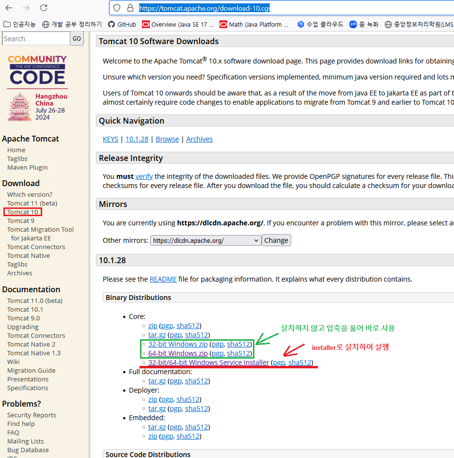   
   Core목록에 있는 파일들을 다운받습니다. zip파일은 압축을 풀고 설치없이 환경 설정을 하고 사용하는 방식이고, installer는 설치 후 사용을 하는 파일입니다.   

   포트를 설정합니다.   
   Server Shutdown Port는 서버를 다운시키기 위해 사용되는 포트입니다. 서버에 문제가 생겼거나, 오류가 발생한 경우 임의로 외부에서 다운 시키기위해서 사용되는 포트입니다. 예약 포트가 아니면 어떤 포트는 사용할 수 있지만 8009로 설정을 했습니다.   
   Connector Port는 외부에서 톰캣 서버에 접속하기 위하 포트입니다. 8080은 오라클이 사용하는 포트기 때문에 80으로 설정했습니다.    
   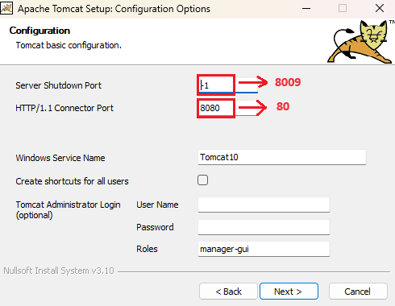   
   
   Server Shutdown Port에서 설정한 포트가 이후 
   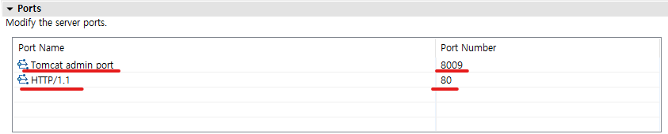   
   Tomcat admin port가 됩니다.   
   
1. # 이클립스에서 web프로젝트 만들기
   Perspective를 JavaEE로 선택합니다. JavaEE로 선택해야 HTML, CSS 등 웹 파일 목록들이 나타납니다.   
   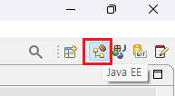   

   File에서 Dynamic Web Project를 선택합니다.   
   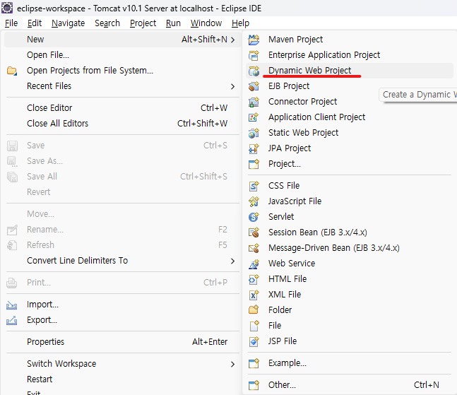   

   New Runtime버튼을 눌러 톰캣 설정을 시작합니다.      
   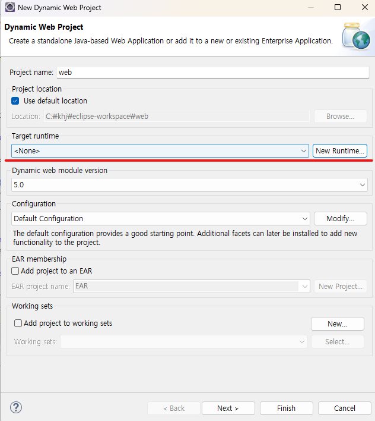   

   톰캣 10.1 버전을 선택합니다.   
   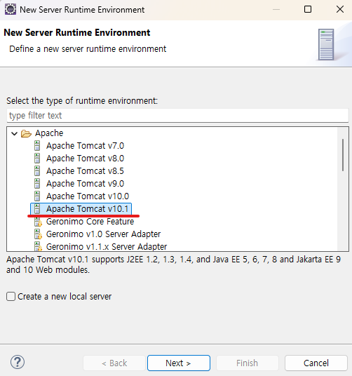

   Browser를 선택합니다.   
   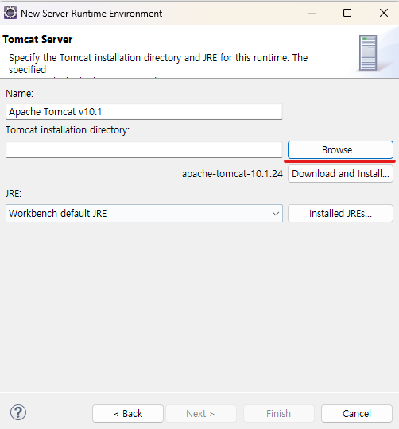   

   톰캣 경로를 찾아서 디렉토리를 설정해줍니다.   
   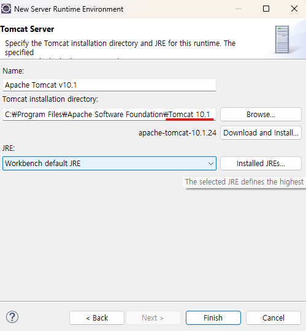   

   java파일이 입력될 디렉토리 경로입니다.   
   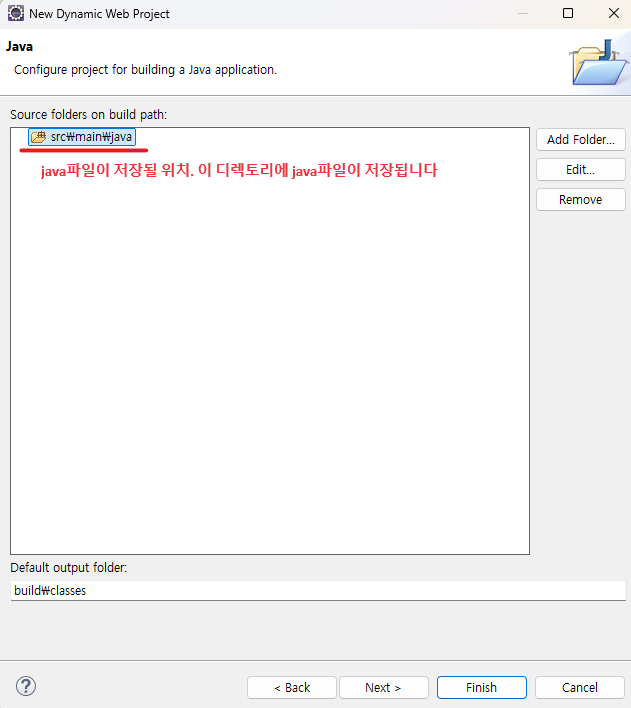   

   html, css, js 등 웹파일들이 입력될 디렉토리 경로입니다.   
   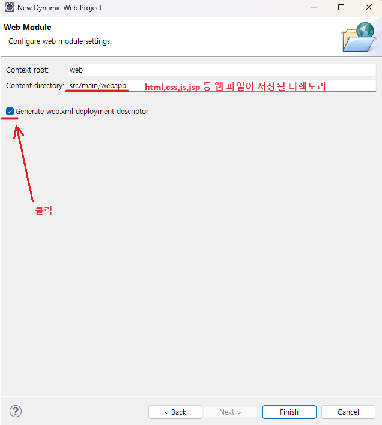   

   main/java에는 모든 java파일들이, main/webapp에는 모든 웹 파일들이 저장됩니다.   
   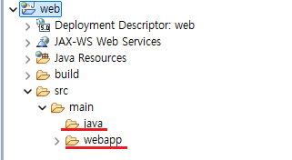   

1. # index.html 파일 만들기

   서버에서 webapp디렉토리에 가장 먼저 접근하는 파일은 index.html 이름을 가진 파일입니다. 최초 실행 파일 이름은 무조건 'index.html'이여합니다.   
   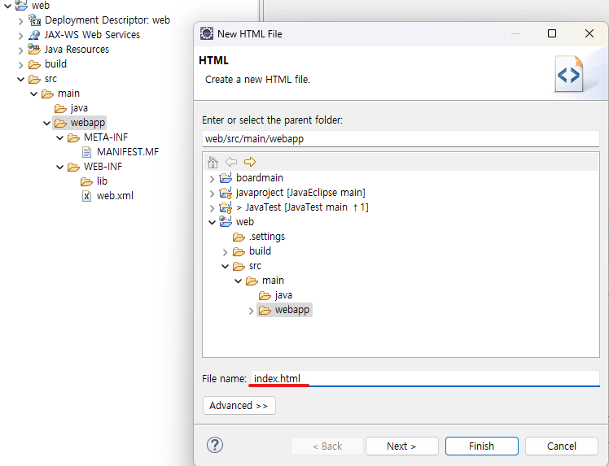   

   next를 눌러 html 버전을 선택합니다.   
   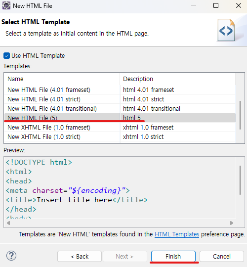   

   이제 파일을 실행합니다. 에러가 발생합니다.   
   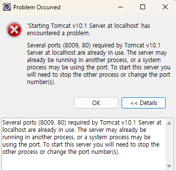   
   
   톰캣을 최초 설치 후 바로 실행하면, 톰캣은 이미 실행이 되어 있는 상태입니다. 이클립스가 모든 권한을 가지고 있어야 하는데 이미 톰캣 자체적으로 실행이 되어 있기 때문에 "alrealy in use"메시지가 타나납니다. cmd창에서 services.msc를 입력해 서비스에서 톰캣을 중지 시킵니다.   
   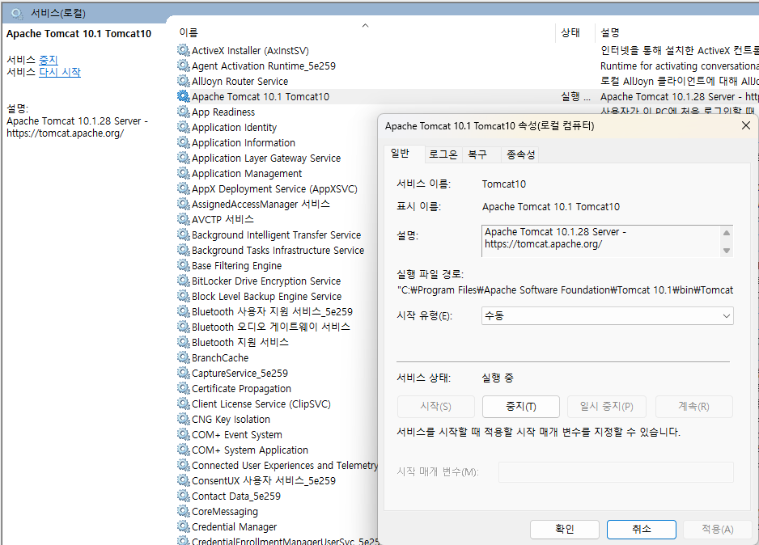   

   이후 다시 실행하면 제대로 작동을 하게됩니다.   

1. # 이클립스에서 포트 설정   
   Servers 디렉토리에 톰캣에 대한 설정파일들이 있습니다. server.xml파일에 port를 입력하는 구문이 있습니다.   
   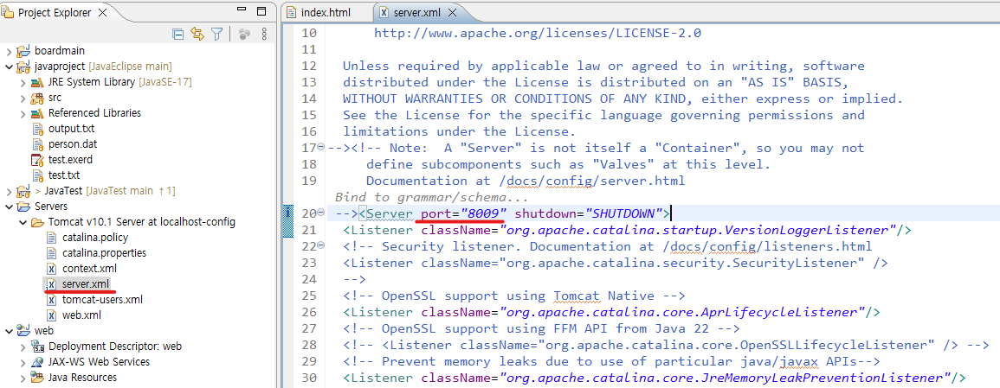   
   ```
      20line :  --><Server port="8009" shutdown="SHUTDOWN">
      64line : <Connector connectionTimeout="20000" maxParameterCount="1000" port="80" protocol="HTTP/1.1" redirectPort="8443"/>
   ```  
   server.xml에서 설정한 포트 번호와 이클리스 하단의 server에 있는 Tomcat v10.1 Server at localhost를 클릭했을 때 나타나는 설정파일은 같은 파일을 참조하고 있습니다.   
   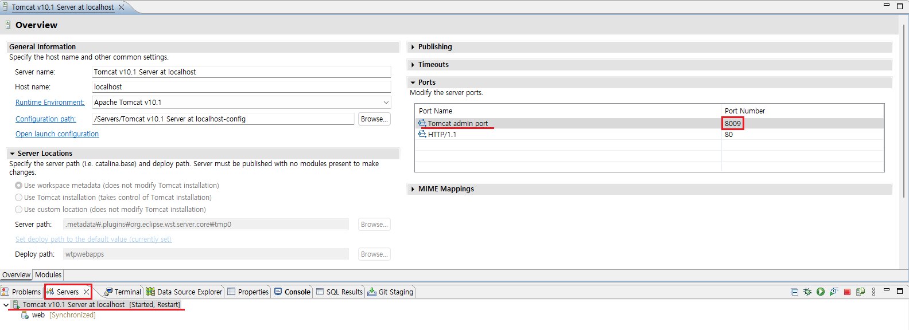   


