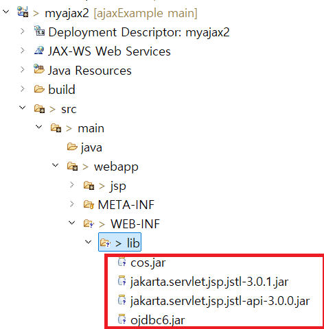

1. # ajax2
   1.src/main/webapp/jsp/memeber/memeber_join.jsp 가입 메인 화면   

   memeber_join.jsp의 자바스크립트에서 ajax를 이용해서   

   src/main/webapp/jsp/memeber/memeber_idcheck.jsp 에 데이터를 넘기고 다시 받아온다.   

   memeber_idcheck.jsp 파일에서 db를 연결하고 그 결과값을 memeber_join.jsp로 돌려주면 memeber_join.jsp는 ajax의 success:function (data){} 의 data로 받게 된다.   
   
   jsp를 실행시키기 위해서 라이브러리를 추가해 준다.   
      
