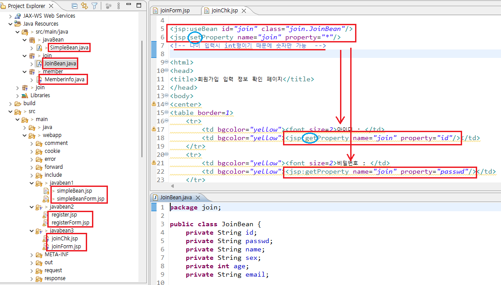

1. # JavaBean
   자바빈은 자바로 작성된 컴포넌트 클래스를 의미

   자바빈의 장점   
   1.폼데이터 처리에 용이   
   -폼에서 넘어오는 많은 데이터를 자바빈에 저장하고, 전달할 수 있다.   

   2.재사용성   
   -자바빈은 여러 JSP파일에 사용할 수 있다.   

   3.컴포넌트 기반 구현   
   -JSP,JavaBean(DTO 또는 VO), DAO클래스가 분리되어서, 각 컴포넌트로 별도 기능을 수행한다.   

1. # 자바빈 관련 액션 태그

   폼 태그에서 데이터를 입력받고 jsp페이지로 전송시 jsp에서 값을 받을 때 사용   

   | 자바빈 관련 액션 태그 |  내용  |
   |:-------------------:|:-----:|
   |<jsp:useBean id="" class="" scope="" />|자바빈 객체를 생성|
   |<jsp:setProperty name="" property="" value="" />|생성된 자바빈 객체에 프로퍼티 값을 저장|
   |<jsp:getProperty name="" property="" />|생성된 자바빈 객체에서 저장된 프로퍼티 값을 가져옴|

   studentForm.jsp
   ```html
      <form method="get" action="studentList.jsp">
         학번 : <input type="text" name="no"> <br>
         이름 : <input type="text" name="name"> <br>
         전공 : <input type="text" name="major"> <br>
         학년 : <input type="text" name="grade"> <br>
         E-Mail : <input type="text" name="email"> <br>
         연락처 : <input type="text" name="phone"> <br>
         주소 : <input type="text" name="address"> <br>
         <input type="submit" value="등록">
      </form>
   ```   

   sutdentList.jsp   
   studentForm에서 넘어오는 데이터를 받을 때 useBean과 setProperty사용   
   ```jsp
      <%@ page language="java" contentType="text/html; charset=UTF-8"
         pageEncoding="UTF-8"%>

      <% request.setCharacterEncoding("utf-8"); %>   

      <jsp:useBean id="student" class="model.Student"/> 
      <jsp:setProperty property="*" name="student"/>

      <h3>getProperty 액션태그로 출력</h3>
      학번 : <jsp:getProperty property="no" name="student"/><br>
      이름 : <jsp:getProperty property="name" name="student"/><br>
      전공 : <jsp:getProperty property="major" name="student"/><br>
      학년 : <jsp:getProperty property="grade" name="student"/><br>
      E-Mail : <jsp:getProperty property="email" name="student"/><br>
      연락처 : <jsp:getProperty property="phone" name="student"/><br>
      주소 : <jsp:getProperty property="address" name="student"/><br><br>

      <h3>표현식 태그로 출력</h3>
      학번 : <%=student.getNo() %><br>
      이름 : <%=student.getName() %><br>
      전공 : <%=student.getMajor() %><br>
      학년 : <%=student.getGrade() %><br>
      E-Mail : <%=student.getEmail() %><br>
      연락처 : <%=student.getPhone() %><br>
      주소 : <%=student.getAddress() %><br><br>

      <h3>표현언어(EL)로 출력</h3>
      <!-- ${student.getNo()}로 사용해도 오류는 나지 않지만 이렇게 사용하지 않는다 
      표기법만 필드명으로 사용 -->
      학번 : ${student.no }<br>
      이름 : ${student.name }<br>
      전공 : ${student.major }<br>
      학년 : ${student.grade }<br>
      E-Mail : ${student.email }<br>
      연락처 : ${student.phone }<br>
      주소 : ${student.address }<br>
   ```
   
1. # 액션태그에 접근

   html의 name명   
   class의 필드명   
   jsp:setProperty의 property명   
   3개가 일치해야 합니다.   

   액션태그에 name은 클래스의 객체명   
   property가 필드, 변수명   
   
   ```html
      <input type="text" name="msg" size="20" maxlength="30">

      <!-- 자바빈 객체를 생성하는 역할 -->
      <jsp:useBean id="sb" class="javaBean.SimpleBean" />
      <!-- class는 클래스명, id는 클래스 객체 이름 -->

      <jsp:setProperty name="sb" property="msg" />
      <!-- 자바빈 클래스의 setter메소드를 호출해서 값을 heap메모리에 저장 시켜주는 역할 -->
      <!-- name=>useBean의 id, property=>필드변수명으로 앞쪽 html파일의 name과 이름이 같아야함 -->
      <!-- 앞쪽 html name도 msg, class필드명도 msg, setProperty의 property도 msg -->
      <!-- <input type="text" name="msg" size="20" maxlength="30"> -->

      <input type="text" name="myname">
      <jsp:setProperty name="sb" property="myname" />

      <!-- 간결하게 처리 -->
      <!--property="*" 이면 sb클래스를 가져와서 자동으로 필드명과 html의 name일치하는 곳에 저장  -->
      <jsp:setProperty property="*" name="sb"/>
   ```

   값 가져오기
   ```html
      메세지: <%= sb.getMsg() %>
      <br>
      메세지: <jsp:getProperty name="sb" property="msg" />
      <br><br>
      <!-- 화면에 출력하는 기능까지 내장 -->
      이름 : <%= sb.getMyname() %><br>
      이름 : <jsp:getProperty property="myname" name="sb"/>
   ```

1. # 사용법
   *빨간줄 없애기
   <jsp:useBean id="join" class="join.JoinBean"/> 
   패키지에 join이란 패키지를 생성하고 JoinBean이란 클래스를 만들었는데 빨간줄이 뜨는 경우 - error는 안나고 작동은 하는 경우   
   :class앞에 커서 놓고 스페이스 -> 백스페이스 -> 저장   

   java클래스에 int형으로 정의된 경우 입력도 숫자만 가능   

      

   join.java
   ```java
      <!-- 자바파일 Timestamp로 선언 -->
      private int age;
      //int로 선언시 html에서 입력값은 숫자만 허용
      private Timestamp registerDate;
   ```

   join.jsp
   ```html
      <!-- 패스워드 강제 전송 -->
      <jsp:setProperty name="memberInfo" property="password"
                     value="<%= memberInfo.getId() %>" />
      <!-- value, 자동으로 값이 안넘어 왔기 때문에 getId()로 직접 값가져오기 -->

      <!-- 날짜 강제 전송 -->
      <jsp:setProperty name="memberInfo" property="registerDate"
                     value="<%= new Timestamp(System.currentTimeMillis()) %>" />
      <!-- value, 자동으로 값이 안넘어 왔기 때문에 직접 값 입력 -->

      <%
         SimpleDateFormat sd = new SimpleDateFormat("yyyy-MM-dd HH:mm:ss EEE요일");
      %>
   ```

   joinForm.jsp
   ```html
      <tr>
         <td><jsp:getProperty name="memberInfo" property="password" /></td>
         <td colspan="3">
         <%= sd.format(memberInfo.getRegisterDate()) %>
         </td>
      </tr>
   ```

1. # password가져오기
   ```jsp
      <jsp:useBean id="member" class="member.MemberDataBean"></jsp:useBean>

      <jsp:setProperty property="*" name="member"/>

      <!-- getProperty로 passwd를 가져오는 경우 value로 값을 직접가져와야 함, 밑에 코드는 getProperty로 passwd를 가져올 경우만 필요  -->
      <jsp:setProperty property="passwd" name="member" value="<%= member.getPasswd() %>"/>

      PW : <jsp:getProperty property="passwd" name="member"/> 

      <!-- <%= %>로 비번을 가져올 경우 setProperty에서 value를 설정하는 코드 필요 없음  -->
      PW : <%= member.getPasswd() %>
   ```