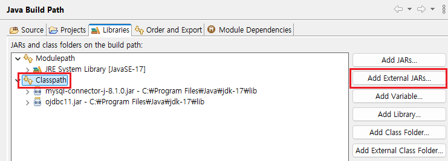
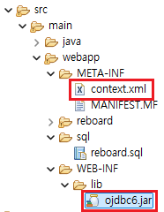

1. # sql연결 방식
   1.JDBC(Java DataBase Connectivity) 방식   
   2.DBCP(DataBase Connection Pool) 방식   
   3.ORM(Object Relational Mapping) 프레임워크   
   ex) iBatis, MyBatis, hibernate, JPA etc   

1. # JDBC방식

     
   빌드패스로 ojdbc파일 추가   

   *Java Project로 project를 생성한 경우 Build Path로 라이브러리를 추가해야 합니다.   
   Dynamic Web Project로 project를 생성한 경우 WEB-INF/lib에 라이브러리를 추가해도 됩니다.   

   ```java
   public class JDBC_Connection {

      public static void main(String[] args) {
         String driver = "com.mysql.cj.jdbc.Driver";
         String url = "jdbc:mysql://localhost:3306/jsptest";
         
         Connection con = null;
         
         try {
            Class.forName(driver);	// JDBC Driver Loading
            con = DriverManager.getConnection(url, "jspid", "jsppass");
            
            System.out.println("데이터베이스 연결 성공~!!");
         }catch(Exception e) {
            e.printStackTrace();
         }finally {
            try {
               if(con != null) con.close();
            }catch(Exception e) {
               e.printStackTrace();
            }
         }
      }
   ```

1. # DBCP방식
      
   ojdbc6.jar파일 -> WEB-INF/lib 폴더 안에 저장   
   context.xml -> META-INF 폴더 안에 저장   

   context.xml파일
   ```xml
      <Context> 
      <Resource name="jdbc/orcl"  /* 여기 name과 dbcpAPITest.jsp파일의 init.lookup("java:comp/env/ 이부분부터 => jdbc/orcl" 일치해야한다.) */
         auth="Container"
         type="javax.sql.DataSource" 
         username="totoro" 
         password="totoro123"
         driverClassName="oracle.jdbc.driver.OracleDriver"
         factory="org.apache.tomcat.dbcp.dbcp2.BasicDataSourceFactory"
         url="jdbc:oracle:thin:@localhost:1521:xe"
         maxActive="500"  
         maxIdle="100"/>  
      </Context>
   ```

   이 후에 dbcpAPITest.jsp파일로 테스트   
   dbcpAPITest.jsp   
   ```java
      <%@ page language="java" contentType="text/html; charset=utf-8"%>
      <%@ page import="java.sql.*"%>
      <%@ page import="javax.sql.*" %>
      <%@ page import="javax.naming.*" %>
      <%
         Connection conn = null; 
         
         try {
            Context init = new InitialContext();
            DataSource ds = (DataSource) init.lookup("java:comp/env/jdbc/orcl");
            conn = ds.getConnection();
            
            out.println("<h3>연결되었습니다.</h3>");
         }catch(Exception e){
            out.println("<h3>연결에 실패하였습니다.</h3>");
            e.printStackTrace();
         }
      %>
   ```
1. # page
   ```
   String nowPage = request.getParameter("page"); //page는 예약어라 변수로 사용 못함
   ```

1. # 따옴표
   
1. # sql
   insert into reboard values(reboard_seq.nextval, ?,?,?,?,sysdate,?,reboard_seq.nextval,)

   reboard_seq.nextval로 시퀀스를 사용하면 증가된 값이 들어가지만 하나의 명령어 안에서 시퀀스.nextval을 사용하면 같은 값이 저장됩니다.